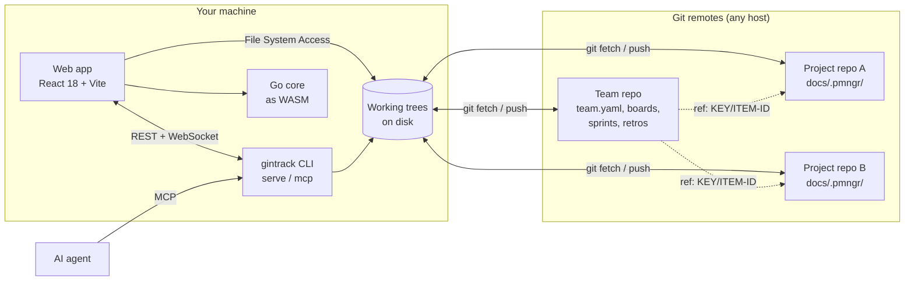

# git-in-track

> Git-native, Markdown-first project management for teams — and for their AI agents.

[](https://github.com/digiogithub/git-in-track/actions/workflows/ci.yml)
[](https://github.com/digiogithub/git-in-track/releases)
[](LICENSE)

## What is git-in-track

git-in-track is a project management tool with no central server and no database.
Every artifact — epics, user stories, tasks, milestones, comments, boards,
sprints, retrospectives and knowledge base pages — is a plain Markdown file with
YAML front matter stored inside a git repository. If you can clone the repo, you
have the whole backlog, its full history, and the ability to work offline.

Humans work through a web UI that feels like an Obsidian or Logseq vault crossed
with a Kanban board: browse the knowledge base, edit stories in a rich Markdown
editor, drag cards across columns. AI agents work on exactly the same files,
either directly on disk or through a local MCP server, so an agent that picks up
a story and a developer that reviews it are looking at the same bytes.

Sync is git and nothing else. Any host works — GitHub, GitLab, Gitea, Bitbucket
or a bare repository on your own machine — because git-in-track only ever speaks
standard git. There is no SaaS to sign up for, no export format to worry about,
and no vendor that can take your backlog away.

## Key features

- **Plain files, no lock-in.** Markdown + YAML front matter, readable and
  editable with any text editor.
- **Git is the only sync mechanism.** No server, no database, no accounts.
  Multi-user collaboration is just multiple people pushing to the same repos.
- **Browser-only mode.** Open local folders straight from a Chromium-based
  browser; parsing and indexing run in WebAssembly compiled from the shared Go
  core.
- **Companion CLI.** `gintrack serve` runs a local server that embeds the same
  web app, watches the file system for instant updates, and indexes natively.
- **Team boards across projects.** Kanban and Scrum boards live in a team
  repository and *reference* items in project repositories — never copies.
- **Knowledge base included.** Any docs folder becomes a rendered KB with GFM
  tables, task lists, footnotes, callouts, wikilinks and Mermaid diagrams.
- **Agent-native.** An MCP server exposes the backlog as compact, paginated
  tools designed for LLM agents.
- **One core, two runtimes.** The same Go code powers the CLI and the browser
  WASM module, so behavior never drifts between them.

## How it works

There are two kinds of repositories.

A **project repository** is any git repository you already have. You mark one
folder as its documentation folder (for example `docs/`); that folder becomes the
project knowledge base. Inside it, a `.pmngr/` directory holds the project
backlog: `project.yaml`, `epics/`, `stories/`, `tasks/`, `milestones/` and
`comments/`. A project's full backlog lives only in the project repository, next
to the code it describes.

A **team repository** — one per team — holds `team.yaml` (members plus the list
of project repositories), a team-wide `knowledge/` folder, and a `.pmngr/`
directory with `boards/`, `sprints/` and `retros/`. Boards aggregate work from
every project by reference (`ref: <projectKey>/<itemId>`). If a project repo is
not cloned locally, its cards are rendered as read-only remote references from
the index snapshot committed under `.pmngr/index/<projectKey>.json`.

You can use git-in-track in **browser-only mode** (pick folders with the File
System Access API; the shared Go core runs as WebAssembly in a Web Worker; git
operations via isomorphic-git) or in **companion mode**, where the `gintrack`
CLI serves the same web app locally, watches files with fsnotify and performs git
operations natively. The web app detects the companion and upgrades itself
automatically. Agents connect through `gintrack mcp` over stdio, or over
streamable HTTP on the local server.



## What an item looks like

`docs/.pmngr/stories/ACME-US-0042-login-with-sso.md`:

```markdown
---
id: ACME-US-0042
type: story
title: Login with SSO
status: in_progress
created: 2026-02-10
updated: 2026-02-18
author: jane.doe
assignees: [john.roe]
labels: [auth, security]
priority: high
parent: ACME-EP-0003
milestone: ACME-MS-0001
estimate: 5
due: 2026-03-01
links:
  - type: blocked_by
    ref: ACME-US-0031
---

## Description

As a user, I want to sign in with my corporate identity provider so that I do
not need a separate password for this application.

## Acceptance Criteria

- [x] SAML metadata is configurable per tenant
- [ ] Failed assertions show an actionable error
- [ ] Session is created with the same claims as password login

## Notes

See [[Identity Provider Setup]] in the knowledge base.
```

Tasks live in `.pmngr/tasks/` with `parent` pointing at a story; comments live in
`.pmngr/comments/<ITEM-ID>/<timestamp>-<author>.md`. See
[docs/03-data-model.md](docs/03-data-model.md) for the full schema.

## Quick start

> **Early development.** Phases 0 to 2 are implemented: the shared Go core, the
> `gintrack` binary with the embedded web app, the browser-only workflow (open a
> folder, browse the knowledge base, browse and edit the backlog) and the
> companion CLI (`gintrack serve` with the REST API, live file watching and the
> event stream). Git sync, team boards and the MCP server arrive in later
> phases. Until the first release is tagged, build from source with `make build`.

```bash
# 1. Download the gintrack release binary for your platform and put it on PATH
#    (GitHub Releases: archives + checksums, unsigned)

# 2. Register a project repository you already have cloned
gintrack add ./my-repo

# 3. Start the local companion and open the web app
gintrack serve   # http://127.0.0.1:7317
```

Browser-only alternative: open the hosted web app in a Chromium-based browser,
click *Open folder* and pick your repository. Indexing runs in WebAssembly and the
index is cached in IndexedDB; no binary and no installation are required. Other
browsers get a read-only fallback.

## Project status

**Phase 3 (team repository and boards) delivered; Phase 4 (git sync) next.**
Delivery is organized in seven phases (Phase 0 Foundations → Phase 6
Retrospectives, metrics and 1.0); see [docs/11-roadmap.md](docs/11-roadmap.md).
The live status of every epic and story is in [docs/.pmngr/](docs/.pmngr/),
this repository's own backlog.

| Phase | Milestone | Status |
|-------|-----------|--------|
| 0 | Foundations (core model, parser, validation, IDs, CI, WASM build) | done |
| 1 | Browser-only MVP (folder access, WASM index, KB viewer, backlog, editor) | done, one story in review |
| 2 | Companion CLI (`gintrack serve`, watcher, native index, REST/WS) | done |
| 3 | Team repository and boards (kanban, scrum, sprints, remote references) | done, in review |
| 4 | Git sync (commit on save, fetch/rebase/push, conflicts, credentials) | next |
| 5–6 | MCP server, retrospectives, metrics and 1.0 | planned |

## Repository layout

```
cmd/gintrack/            # CLI entry point
internal/core/           # shared core (model, frontmatter, index, query, ids) -> also WASM
internal/server/         # HTTP/WS API, embeds web/dist
internal/watcher/        # fsnotify file watching
internal/gitops/         # go-git wrapper
internal/mcp/            # MCP server
wasm/                    # WASM entry point (main_js.go) + JS glue
web/                     # React + Vite + TypeScript app
docs/                    # planning docs, ADRs, and this project's own .pmngr backlog
.github/workflows/       # ci.yml, release.yml
Makefile, go.mod, .goreleaser.yaml
```

## Documentation

| Document | What it covers |
| --- | --- |
| [docs/01-vision-and-scope.md](docs/01-vision-and-scope.md) | Problem, principles, target users, and what is explicitly out of scope. |
| [docs/02-architecture.md](docs/02-architecture.md) | Components, shared Go core, WASM and companion modes, data flow. |
| [docs/03-data-model.md](docs/03-data-model.md) | File naming, IDs, front matter fields, statuses, relations, comments. |
| [docs/04-team-repository.md](docs/04-team-repository.md) | `team.yaml`, boards, sprints, retros, cross-project references, index snapshots. |
| [docs/05-web-app.md](docs/05-web-app.md) | React app structure, routing, editor, KB rendering, browser-only mode. |
| [docs/06-git-sync.md](docs/06-git-sync.md) | Commit-on-save, fetch/rebase/push, conflicts, credentials, CORS proxy. |
| [docs/07-cli-and-api.md](docs/07-cli-and-api.md) | `gintrack` commands, REST + WebSocket API, `rev` optimistic locking. |
| [docs/08-mcp-server.md](docs/08-mcp-server.md) | MCP tools for agents, transports, payload shapes, pagination. |
| [docs/09-ci-cd-and-releases.md](docs/09-ci-cd-and-releases.md) | CI pipelines, GoReleaser, build matrix, release artifacts. |
| [docs/10-development-guidelines.md](docs/10-development-guidelines.md) | Coding standards, testing, commit conventions, review process. |
| [docs/11-roadmap.md](docs/11-roadmap.md) | Phases 0–6 with scope and exit criteria for each. |
| [docs/adr/](docs/adr/) | Architecture decision records. |
| [docs/.pmngr/](docs/.pmngr/) | This project's own backlog, dogfooding the format. |
| [AGENTS.md](AGENTS.md) | Working instructions for AI coding agents on this repository. |

## Contributing

Contributions are welcome. Start with
[docs/10-development-guidelines.md](docs/10-development-guidelines.md) for
coding standards, commit conventions (Conventional Commits) and the definition
of done, then pick an item from [docs/.pmngr/](docs/.pmngr/). All code, comments,
documentation and commit messages are written in English.

## License

MIT (placeholder — to be confirmed by the repository owner). See [LICENSE](LICENSE).
