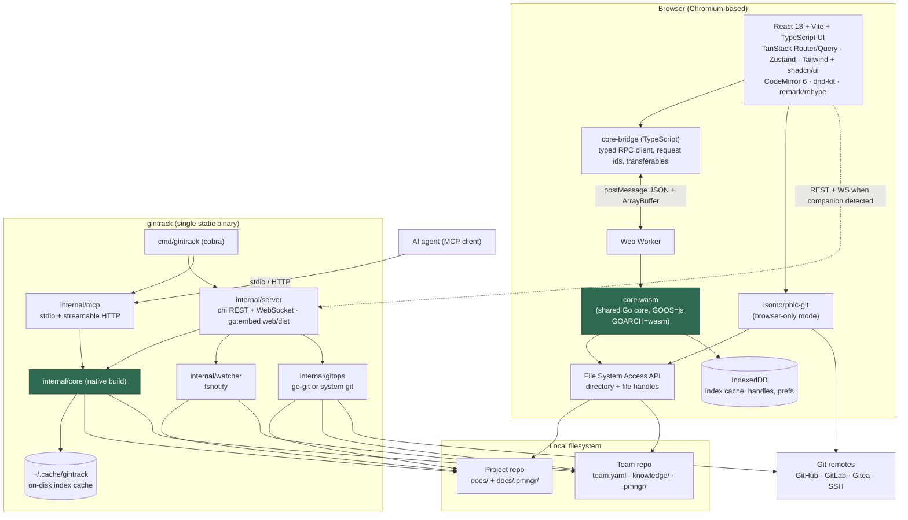
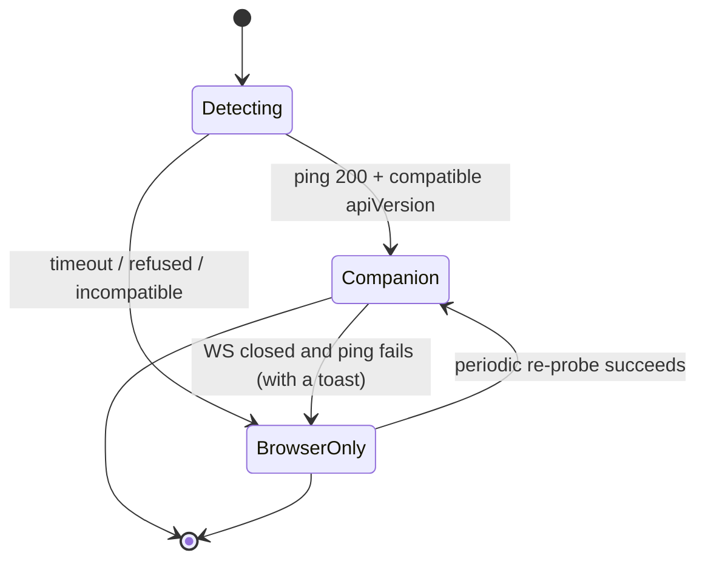
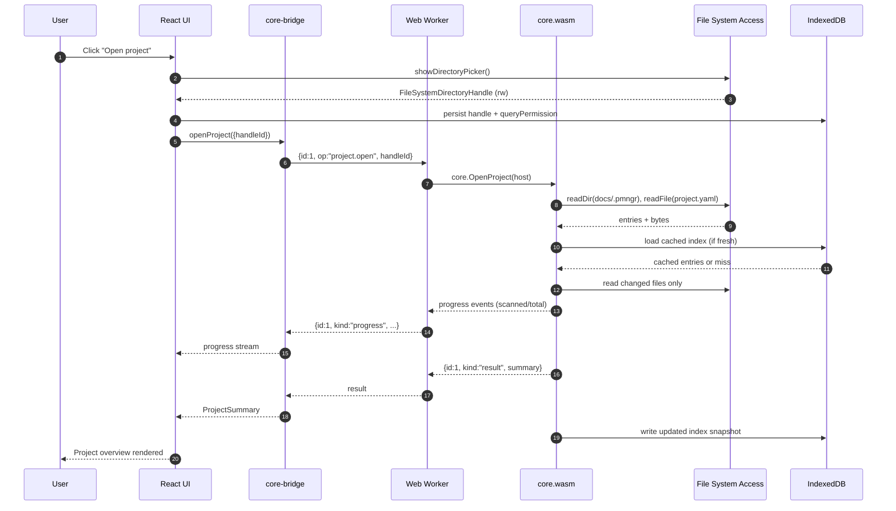
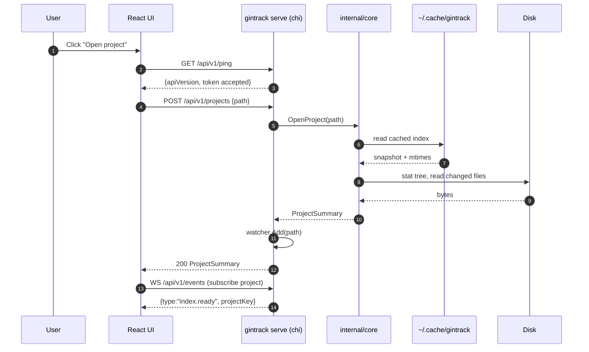
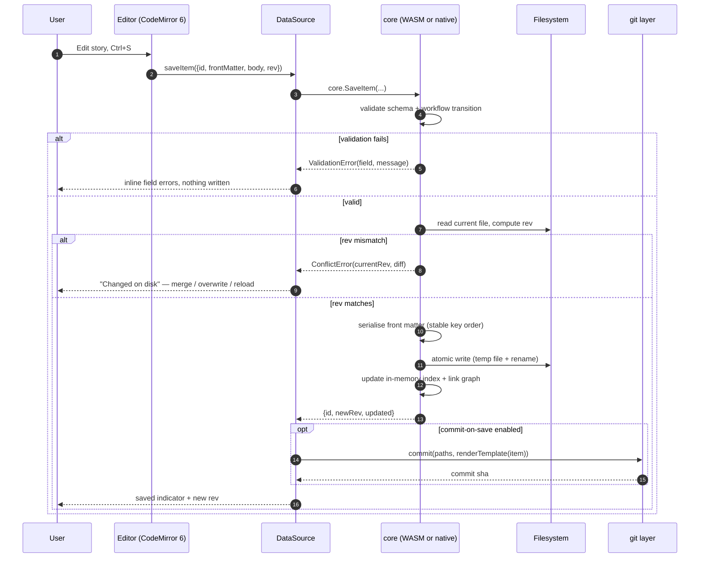
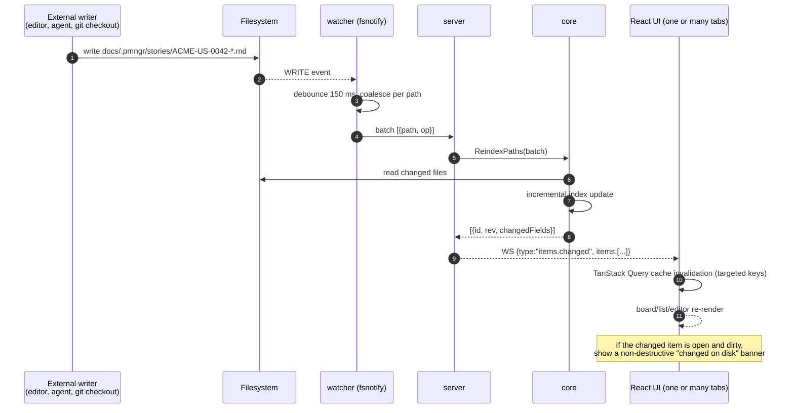
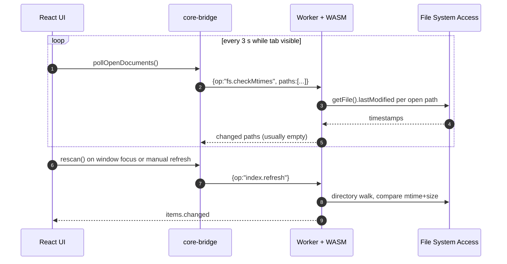
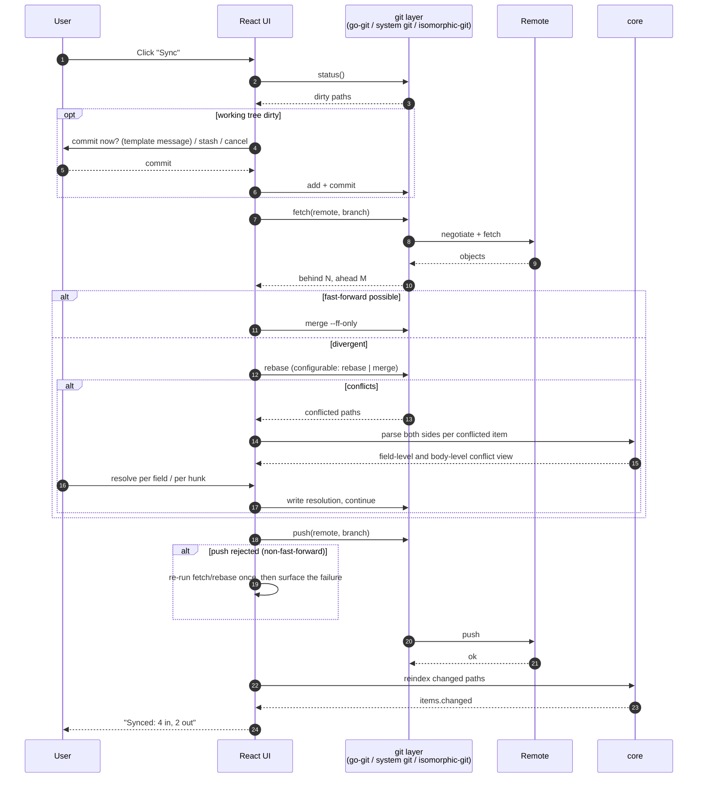

# git-in-track — Architecture

Status: draft (Phase 0 planning)
Audience: contributors implementing the system
Related: [01-vision-and-scope.md](01-vision-and-scope.md), [Architecture Decision Records](adr/README.md)

---

## 1. Design tenets

Everything below follows from four constraints established in the vision document:

1. **The repository is the state.** Every derived structure (index, search
   postings, link graph, board ordering cache) must be reconstructable from a clean
   checkout. Nothing is authoritative unless it is a file.
2. **One implementation of the model.** Parsing, validation, ID allocation,
   indexing and querying live in a single Go package compiled twice — natively for
   the CLI and to `GOOS=js GOARCH=wasm` for the browser. The TypeScript layer
   renders and edits; it never re-implements semantics.
3. **The browser is a first-class runtime, not a degraded one.** Browser-only mode
   is a complete product (Phase 1), not a demo. The companion CLI adds speed,
   filesystem watching and native git — it does not unlock core features.
4. **Boundaries are explicit and narrow.** The core has no I/O; a small host
   interface supplies file access. That single seam is what makes the same code run
   behind `os` and behind File System Access handles.

---

## 2. Component diagram



The two green nodes are the *same source code*. That is the central architectural
bet of the project; see [ADR-003](adr/ADR-003-shared-go-core-wasm.md).

---

## 3. Operating modes

### 3.1 Browser-only mode (Phase 1)

| Aspect | Implementation |
|--------|----------------|
| File access | File System Access API (`showDirectoryPicker`), handles persisted in IndexedDB, permission re-prompted per session as the browser requires |
| Fallback | Non-Chromium browsers get read-only import via `<input webkitdirectory>`; the UI degrades to a viewer and says so explicitly |
| Parsing / indexing | `core.wasm` inside a dedicated Web Worker |
| Index cache | IndexedDB, keyed by a folder identity hash |
| Change detection | Polling of `getFile().lastModified` for open documents plus explicit refresh; no filesystem events exist in the browser |
| Git | `isomorphic-git` over the same handles; some remotes need a CORS proxy ([ADR-006](adr/ADR-006-isomorphic-git-vs-go-git.md)) |
| Distribution | Static site; can be self-hosted or opened from the companion |

### 3.2 Companion mode (Phase 2)

| Aspect | Implementation |
|--------|----------------|
| File access | Native `os` calls from `internal/core` |
| Serving | `gintrack serve` binds `127.0.0.1:7317`, serves `web/dist` embedded with `go:embed` |
| API | chi REST for CRUD/query + a WebSocket channel for events |
| Change detection | fsnotify with debouncing, pushed to clients over WebSocket |
| Index cache | `~/.cache/gintrack/<repo-id>/index.bin` (XDG-respecting) |
| Git | `go-git`, or shelling out to system `git` when present (configurable — needed for SSH agents, credential helpers, LFS, signed commits) |
| MCP | `gintrack mcp` over stdio, and a streamable HTTP endpoint on the local server |

### 3.3 Auto-detection and upgrade

The web app probes `http://127.0.0.1:7317/api/v1/ping` on startup (and on an
interval while running). If the companion answers with a compatible API version,
the app switches its data-access strategy from the WASM bridge to the REST/WS
client at runtime. The UI is written against a single `DataSource` interface with
two implementations, so nothing above the data layer knows which mode is active.



Downgrade is non-destructive: unsaved editor buffers are held in Zustand state and
re-flushed through whichever data source is active.

---

## 4. Sequence diagrams

### 4.1 Opening a project

**Browser-only mode**



**Companion mode**



### 4.2 Saving an item



Round-trip stability is a hard requirement: unchanged front-matter keys keep their
original order and scalar style, and the body is written back byte-identical unless
the user edited it. This keeps diffs reviewable ([ADR-001](adr/ADR-001-markdown-yaml-storage.md)).

### 4.3 Real-time change propagation

**Companion mode — filesystem events**



**Browser-only mode — no filesystem events**



Polling is deliberately scoped to open documents plus a full rescan on focus and on
explicit refresh; walking a large vault every three seconds is not acceptable. This
asymmetry is the single most visible reason to install the companion.

### 4.4 Sync with a remote



Conflict presentation is item-aware: when both sides changed only distinct
front-matter fields, the UI offers a field-level merge; when bodies diverge it falls
back to a three-way text view. We never auto-resolve silently.

---

## 5. Shared Go core

### 5.1 What goes in the core

`internal/core` (with a thin re-export at `pkg/core` if we choose to make it a
public Go API) contains everything that defines *meaning* and nothing that performs
I/O directly:

| Package | Responsibility |
|---------|----------------|
| `core/model` | Types: `Item`, `Epic`, `Story`, `Task`, `Milestone`, `Comment`, `Board`, `Sprint`, `Retro`, `Project`, `Team`; enums for `type`, `status`, `priority`, link kinds |
| `core/frontmatter` | YAML front-matter split, decode, and **stable re-encode** (key-order and style preserving) |
| `core/validate` | Schema validation, workflow transition legality, referential checks (`parent`, `milestone`, `links[]`, board refs) |
| `core/ids` | ID parsing and allocation (`<KEY>-<TYPE>-<NNNN>`), slug generation, filename construction ([ADR-008](adr/ADR-008-id-scheme.md)) |
| `core/index` | Scan, incremental update, in-memory structures, snapshot serialisation |
| `core/query` | Filter/sort/paginate over the index; the single query language shared by UI, REST and MCP |
| `core/search` | Tokenisation, inverted index, ranking |
| `core/linkgraph` | Wikilinks `[[Page]]`, Markdown links, typed `links[]` relations; forward and backlinks |
| `core/mdmeta` | Body section extraction (`## Acceptance Criteria` task lists, checkbox counts) without full rendering |
| `core/host` | The **only** I/O seam: interfaces implemented per platform |

Explicitly **not** in the core: HTTP, WebSocket, git, fsnotify, MCP framing, HTML
rendering. Those are host concerns.

### 5.2 The host seam

```go
// core/host: the entire I/O surface the core depends on.
type FS interface {
    ReadFile(path string) ([]byte, error)
    WriteFile(path string, data []byte) error   // must be atomic where possible
    Remove(path string) error
    Stat(path string) (FileInfo, error)
    ReadDir(path string) ([]DirEntry, error)
}

type Cache interface {
    Load(key string) ([]byte, bool, error)
    Store(key string, data []byte) error
}

type Clock interface{ Now() time.Time }

type Host struct {
    FS       FS
    Cache    Cache
    Clock    Clock
    Progress func(Progress) // optional, for long scans
}
```

Native builds supply `os`-backed implementations; the WASM build supplies
implementations backed by File System Access handles and IndexedDB, marshalled
through the JS bridge. Because the core never imports `os` or `net`, the WASM
binary stays small and the two builds cannot diverge in behaviour.

### 5.3 WASM entry point and Web Worker

`wasm/main_js.go` is the WASM entry. It:

1. Registers a single global function, `__gintrack_call(requestJSON, transfer)`,
   returning a `Promise`.
2. Bridges `core/host` calls back into JS through callbacks the worker installs.
3. Runs the Go scheduler on the worker thread — never on the main thread, so a
   10,000-item scan cannot freeze the UI.

`wasm/glue.ts` (shipped into `web/src/core-bridge/`) owns:

- Loading `wasm_exec.js` and instantiating `web/public/core.wasm` (streaming
  compile, cached by the browser).
- Implementing the host callbacks against File System Access handles and IndexedDB.
- Translating between JS values and the JSON protocol.

The main thread only ever talks to the worker:

```
React UI  ──(typed methods)──▶  core-bridge  ──postMessage──▶  Worker  ──▶  core.wasm
```

### 5.4 Message protocol sketch

Requests and responses are JSON objects with a monotonically increasing `id`.
Large payloads (index snapshots, file bodies) travel as transferable
`ArrayBuffer`s alongside the JSON to avoid structured-clone copies.

```jsonc
// → request
{ "id": 42, "op": "items.query",
  "params": { "project": "ACME", "type": ["story","task"],
              "status": ["todo","in_progress"], "labels": ["backend"],
              "sort": [{"field":"priority","dir":"asc"}],
              "limit": 50, "cursor": null, "fields": "frontmatter" } }

// ← streaming progress (zero or more)
{ "id": 42, "kind": "progress", "scanned": 3200, "total": 10000 }

// ← success
{ "id": 42, "kind": "result",
  "data": { "items": [ { "id":"ACME-US-0042", "type":"story",
                         "title":"Login with SSO", "status":"in_progress",
                         "rev":"sha256:9f2c…", "updated":"2026-09-01T10:22:11Z" } ],
            "nextCursor": "eyJvIjo1MH0" } }

// ← failure
{ "id": 42, "kind": "error",
  "error": { "code": "VALIDATION", "message": "unknown status \"reviewing\"",
             "path": "docs/.pmngr/stories/ACME-US-0042-login-with-sso.md",
             "field": "status" } }
```

Operation namespaces: `project.*`, `team.*`, `items.*`, `kb.*`, `board.*`,
`search.*`, `index.*`, `fs.*`. **The same operation names and payload shapes are
used by the REST API** (`POST /api/v1/rpc` accepts the identical envelope, in
addition to the resource-style routes) **and by the MCP tools**, so a behaviour is
specified once and tested once.

Cancellation: the client sends `{ "id": 43, "op": "cancel", "params": {"target": 42} }`;
long-running core operations poll a cancellation flag between files.

### 5.5 Why not implement the model in TypeScript

Rejected because it guarantees drift: two parsers, two validators, two ID
allocators, two definitions of `rev`. A subtle disagreement between the CLI and the
browser about, say, whether an empty `assignees:` list is `null` or `[]` produces
spurious diffs on every save. One core, two build targets, one behaviour. Full
reasoning in [ADR-003](adr/ADR-003-shared-go-core-wasm.md).

---

## 6. Repository layout

```
cmd/gintrack/            # CLI entry point (cobra): serve, mcp, index, snapshot, doctor
internal/core/           # shared core (model, frontmatter, index, query, ids) -> also WASM
internal/vault/          # the CoreApi contract over a core.FS, one implementation for both hosts
internal/server/         # HTTP/WS API, embeds web/dist
internal/watcher/        # fsnotify
internal/gitops/         # go-git wrapper
internal/mcp/            # MCP server
wasm/                    # WASM entry (main_js.go) + JS glue
web/                     # React + Vite app
docs/                    # planning + KB (this repo also dogfoods .pmngr)
.github/workflows/       # ci.yml, release.yml
Makefile, go.mod, .goreleaser.yaml
```

| Path | Contents and constraints |
|------|--------------------------|
| `cmd/gintrack/` | Cobra command tree and flag parsing only. No business logic; every command is a thin call into `internal/*`. Subcommands: `serve`, `mcp`, `index`, `snapshot`, `init`, `doctor`, `version`. |
| `internal/core/` | The shared core described in §5. **Must not import** `os`, `net`, `net/http`, `os/exec`, or any package that breaks the `js/wasm` build. Enforced by a lint rule and a `GOOS=js GOARCH=wasm go build` step in CI. |
| `internal/vault/` | The CoreApi contract of `web/src/core-bridge/api.ts` implemented once, over a `core.FS` the host injects: `NewInMemory()` for the browser (files pushed in with `vault.load`), `Open(fsys, root)` for the companion process (files read through `internal/core/osfs`). Exposes `Call` (JSON envelope, for the WASM glue) and `Dispatch` (typed result and error, for the REST layer). **Must not import** `os`, `path/filepath` or `syscall/js`. |
| `internal/server/` | chi router, REST handlers, WebSocket hub, static file serving of the embedded `web/dist`, localhost binding, token middleware, origin checks. Translates core errors into HTTP status codes. |
| `internal/watcher/` | fsnotify wrapper: recursive watch registration, ignore rules (`.git/`, `node_modules/`, editor swap files), debouncing, event coalescing, and rename detection. |
| `internal/gitops/` | Status, add, commit, fetch, merge/rebase, push, conflict enumeration, credential resolution. Two backends behind one interface: `go-git` (pure Go, always available) and `system-git` (`os/exec`, used when present and configured). A `Backend` is bound to one working tree; a `Committer` batches writes so one logical edit is one commit. Native-only: it uses `os/exec` and the filesystem, so nothing here may be imported from `internal/core`. Implemented for commit-on-save in GIT-US-0020; fetch/integrate/push follow in GIT-US-0021. |
| `internal/mcp/` | MCP tool definitions, JSON schemas, stdio transport, and the streamable HTTP handler mounted by `internal/server`. Tools delegate to `internal/core`. |
| `wasm/` | `main_js.go` (WASM entry, `//go:build js && wasm`) and nothing else: it marshals strings in and out of JavaScript and delegates every method to `internal/vault`. The TypeScript glue copied into the web build lives here too. Built to `web/public/core.wasm`. |
| `web/` | The React application. `web/src/core-bridge/` is the only place that talks to the worker or the REST client; `web/src/datasource/` exposes the mode-agnostic interface; feature folders sit above it. Built to `web/dist`, embedded by `internal/server`. |
| `docs/` | Planning documents (this file), ADRs, the format specification, and the project's own knowledge base. `docs/.pmngr/` holds git-in-track's own backlog — the project dogfoods itself from Phase 1. |
| `.github/workflows/` | `ci.yml` (go vet/test, golangci-lint, wasm build check, web lint/typecheck/test, Playwright) and `release.yml` (GoReleaser on tag `v*`). |

Build targets in the `Makefile`: `make web` (Vite build → `web/dist`),
`make wasm` (`GOOS=js GOARCH=wasm` → `web/public/core.wasm`), `make build`
(`go build` with embed), `make test`, `make lint`.

---

## 7. Indexing design

### 7.1 Scan

A scan walks the project's docs folder and its `.pmngr/` subtree (and, for team
repos, `knowledge/` and `.pmngr/`), skipping `.git/`, `node_modules/`, dotfiles
other than `.pmngr`, and files above a size threshold. For each `.md` file it:

1. Reads the file (bounded concurrency: `min(8, NumCPU)` natively; sequential in
   WASM, where worker-level parallelism is not worth the complexity in v1).
2. Splits the YAML front matter from the body without parsing the whole body.
3. Decodes front matter into the typed model; unknown keys are **preserved
   verbatim** so hand-added fields survive a round trip.
4. Computes `rev` as `sha256` over the normalised file bytes.
5. Extracts lightweight body metadata: headings, checkbox counts per section,
   wikilinks and Markdown links.
6. Validates and records diagnostics (missing `parent`, unknown `status`, duplicate
   `id`) without failing the scan — a broken file must not prevent the app opening.

### 7.2 In-memory index

```go
type Index struct {
    Items      map[ItemID]*Entry        // primary store, front matter + metadata
    ByPath     map[string]ItemID        // filesystem path -> id
    ByType     map[ItemType][]ItemID
    ByStatus   map[Status][]ItemID
    ByLabel    map[string][]ItemID
    ByAssignee map[string][]ItemID
    Children   map[ItemID][]ItemID      // parent -> children (epic->stories, story->tasks)
    Comments   map[ItemID][]CommentRef  // item -> comment files, sorted by timestamp
    Links      LinkGraph                // typed relations + wikilink forward/back edges
    Search     *search.Index            // inverted index (§8)
    Diagnostics []Diagnostic
    Meta       IndexMeta                // schema version, scanned at, file mtimes/sizes
}
```

Bodies are **not** held in memory. `Entry` stores front matter, extracted metadata,
`rev`, path, mtime and size. Bodies are read on demand and cached with a small LRU
(default 64 documents). This is what keeps a 10,000-item index in the low tens of
megabytes and makes it viable in WASM.

### 7.3 Incremental updates

Given a set of changed paths (from fsnotify, from polling, or from a git operation
that reports touched files), the core:

1. Removes the old entry from every secondary map and from the search postings.
2. Re-reads and re-parses only those files.
3. Reinserts, recomputing only the affected link-graph edges.
4. Emits a change list `[{id, rev, changedFields}]` so the UI can invalidate
   precisely the affected query caches rather than refetching everything.

Renames are handled as delete + insert, with `id` continuity detected from front
matter so a card does not disappear from a board when a file is renamed.

### 7.4 Cache

The index snapshot is a compact binary encoding of the `Index` struct plus
`IndexMeta` (schema version, core version, per-file mtime and size).

- **CLI:** `~/.cache/gintrack/<repo-id>/index.bin`, where `<repo-id>` is a hash of
  the absolute repository path plus the docs folder. Honours `XDG_CACHE_HOME`; a
  `--no-cache` flag and `gintrack index --rebuild` force a cold scan.
- **Browser:** IndexedDB database `gintrack`, object store `index`, keyed by a hash
  of the folder handle identity. Snapshots are stored as a single `ArrayBuffer`
  value; typical size is well under browser quota for realistic repositories.

On open, the cache is loaded and then **validated**: every known path is stat'ed and
compared by mtime and size; mismatches and unknown files are re-read. A mismatched
schema or core version discards the cache entirely. The cache is an optimisation
only — deleting it changes nothing but startup time.

### 7.5 Team index snapshots

The team repo commits `.pmngr/index/<projectKey>.json` for each project: a
human-readable JSON array of `{id, type, title, status, assignees, labels, updated,
url}`. It exists so a team board can render cards for projects the current user has
not cloned ([ADR-007](adr/ADR-007-team-repo-references.md)). It is generated by
`gintrack snapshot` (or a CI job in the project repo), is explicitly a *stale
cache*, and is never used when a local clone of the project is available.

---

## 8. Search design

Search runs entirely locally, over the same index, in both modes.

- **Corpus.** Two fields per document: front-matter text (title, labels,
  assignees, id) and body text. Bodies are read once during the scan, tokenised,
  then discarded — only postings are retained.
- **Tokenisation.** Unicode-aware word splitting, lowercasing, `NFKC`
  normalisation, diacritic folding, and camelCase/snake_case splitting so
  `loginWithSSO` matches `login`, `with`, and `sso`. No stemming in v1 (stemming is
  language-specific and English-only stemming would silently degrade other
  languages); a configurable stopword list is applied to bodies only.
- **Structure.** An in-memory inverted index: `term -> []Posting{docID, fieldMask,
  positions}`. Positions enable phrase queries and snippet extraction.
- **Query language.** A small, documented grammar shared by the UI search bar, the
  REST API and the MCP `search_items` tool:
  `status:in_progress assignee:@dana label:backend "single sign-on" -label:spike`.
  Bare terms are full text; `field:value` filters go straight to the secondary
  index maps rather than the postings, so filter-heavy queries stay cheap.
- **Ranking.** BM25 over the two fields with a title boost, plus a small recency
  boost from `updated`. Exact-ID matches short-circuit to the top.
- **Prefix search.** A term-dictionary prefix scan powers as-you-type suggestions;
  results are capped and debounced (120 ms).
- **Snippets.** Generated on demand by re-reading the matching document and using
  stored positions — bodies are not kept in memory for this.
- **bleve.** Deliberately not used in v1: it would be a large dependency that does
  not compile comfortably to WASM, and it would create exactly the native/browser
  divergence [ADR-003](adr/ADR-003-shared-go-core-wasm.md) exists to prevent. If
  native corpora outgrow the in-memory index, bleve becomes an *optional native
  accelerator* behind the same `core/search` interface, never the only backend.

---

## 9. Performance targets

Reference hardware: a 2023-class laptop (8 performance cores, NVMe SSD, 16 GB RAM),
Chromium stable for WASM figures. Corpora: `S` = 500 items / 200 KB pages,
`M` = 2,000 items, `L` = 10,000 items / 3,000 KB pages.

| Operation | Corpus | Native (CLI) | WASM (browser) |
|-----------|--------|--------------|----------------|
| Cold index (full scan + parse) | L | **< 2.0 s** | **< 8.0 s** |
| Cold index | M | < 500 ms | < 2.0 s |
| Warm open from cache (stat validation only) | L | < 300 ms | < 1.0 s |
| Incremental reindex of 1 changed file | L | < 15 ms | < 40 ms |
| Filtered query (`items.query`, indexed fields) | L | < 10 ms p95 | < 25 ms p95 |
| Full-text search, 2 terms, top 50 with snippets | L | < 50 ms p95 | < 150 ms p95 |
| Save item (validate + atomic write + index update) | L | < 30 ms | < 80 ms |
| Board render, 300 cards, first paint after data | — | < 100 ms | < 100 ms |
| Drag-and-drop card move to persisted write | — | < 150 ms | < 250 ms |
| WS event to UI update (companion) | L | < 200 ms p95 end to end | n/a |
| Peak resident index memory | L | < 120 MB | < 200 MB |
| `core.wasm` transfer size (Brotli) | — | n/a | **< 3 MB** |

Non-negotiables regardless of corpus size: the main thread is never blocked for
more than 50 ms by core work (everything heavy is in the worker or the server), and
long operations stream progress rather than showing an indeterminate spinner.

These targets are enforced by benchmarks in CI: Go benchmarks for the native path,
and a Playwright-driven measurement against a generated fixture repository for the
WASM path. Regressions beyond 20% fail the build.

---

## 10. Security and privacy model

### 10.1 Threat model in one paragraph

git-in-track is a local application handling a user's own repositories. The assets
worth protecting are (a) the contents of those repositories, (b) git credentials,
and (c) the integrity of the local API. The realistic adversaries are a malicious
web page in another browser tab, a malicious process on the same machine belonging
to another user, and a malicious or compromised repository whose content we parse
and render. We do **not** attempt to defend against an attacker who already has the
user's OS account.

### 10.2 Data locality

- No account, no telemetry, no analytics, no crash reporting to a third party. The
  app makes exactly three categories of network request: (1) git remote operations
  the user triggered or configured, (2) an optional CORS proxy for in-browser git if
  configured, (3) loading its own static assets.
- Nothing is written outside the opened repositories and the local cache
  (`~/.cache/gintrack` or IndexedDB).
- An offline build must be fully functional for everything except remote sync.

### 10.3 Credentials

| Mode | Mechanism |
|------|-----------|
| Companion + system git | Preferred. Credentials never touch git-in-track: the OS credential helper, SSH agent, or `~/.gitconfig` handles them. Signed commits and LFS also keep working. |
| Companion + go-git | HTTPS tokens are read from the git credential helper via `git credential fill` when available; otherwise the user is prompted per session and the value is kept in memory only. SSH uses keys from the agent or an explicit key path. |
| Browser-only | A personal access token entered by the user. Stored in IndexedDB **only** if the user opts in with an explicit checkbox; otherwise session memory. Tokens are never logged, never included in error reports, and are redacted from any diagnostic bundle. The UI states plainly that browser storage is not encrypted. |

We never invent our own credential storage format, and we never write a token into
a repository file. `.pmngr/` files are checked for accidental secrets by
`gintrack doctor` as a courtesy, not as a guarantee.

### 10.4 Local server hardening

- **Binding.** `127.0.0.1:7317` by default, never `0.0.0.0`. Binding to a non-loopback
  address requires an explicit `--listen` flag and prints a warning.
- **Bearer token.** On start, the server generates a random 256-bit token, writes it
  to `~/.cache/gintrack/session/<port>.token` with mode `0600`, and requires it on
  every `/api/**` request. When the user opens the UI from the server's own origin,
  the token is injected into the served HTML; when the UI is loaded from a different
  origin (a static deployment upgrading to companion mode), the user pastes the
  token once, or runs `gintrack serve --print-token`.
- **Origin and CSRF.** Every request is checked against an allowlist of origins
  (`http://127.0.0.1:7317`, `http://localhost:7317`, plus any origin the user
  configured). Cross-origin requests without a valid `Origin` match are rejected.
  CORS responses are explicit and narrow; credentials are carried by the bearer
  header, not by cookies, so classic CSRF does not apply.
- **DNS rebinding.** The `Host` header must be `127.0.0.1:<port>` or
  `localhost:<port>`; anything else is refused.
- **WebSocket.** The same origin allowlist and the same token (passed in the
  subprotocol or a one-time ticket, never in a query string that could be logged).
- **Path confinement.** Every filesystem path from a request is resolved,
  symlink-evaluated and required to be inside a registered project or team root.
  Path traversal is rejected before any read. The API cannot be used as a general
  file browser.
- **MCP over stdio** inherits the trust of the process that spawned it; the HTTP MCP
  endpoint is behind the same token and origin checks.

### 10.5 Untrusted repository content

Repository content is untrusted input. Consequences:

- Markdown rendering sanitises HTML (`rehype-sanitize` with an explicit allowlist).
  Raw `<script>`, event handlers, and `javascript:` URLs never survive rendering.
- A Content Security Policy is served with the app: no inline scripts, no remote
  script origins, `frame-ancestors 'none'`.
- Mermaid diagrams are rendered in a sandboxed context with `securityLevel: 'strict'`.
- Images and links to remote URLs are shown but external images are not loaded by
  default in the KB viewer (a per-project setting), because a remote image is a
  read receipt.
- Wikilink resolution is confined to the vault; `[[../../../etc/passwd]]` does not
  resolve.
- The YAML decoder is configured for plain data only: no custom tags, no aliases
  that can expand quadratically (billion-laughs), and bounded document size.
- Parser panics are recovered per file and surfaced as diagnostics; one malformed
  file never takes down a scan.

---

## 11. Cross-cutting concerns

### 11.1 Error handling

- **Core.** Typed errors with a stable machine-readable `code`
  (`NOT_FOUND`, `VALIDATION`, `CONFLICT`, `PARSE`, `PERMISSION`, `IO`,
  `UNSUPPORTED`), a human message, and context (`path`, `field`, `itemID`). Wrapped
  with `%w`; never `panic` across the API boundary.
- **Transport mapping.** `VALIDATION → 422`, `CONFLICT → 409`, `NOT_FOUND → 404`,
  `PERMISSION → 403`, `IO → 500`. The WASM bridge and the MCP layer emit the same
  `code` values, so the UI has one error taxonomy regardless of mode.
- **Degradation.** Broken files become diagnostics, not failures. The UI surfaces a
  "problems" panel listing every diagnostic with a link to the offending file and
  line. A project with 12 unparseable files still opens.
- **Conflicts are first-class.** `CONFLICT` from a `rev` mismatch always carries the
  current `rev` and enough information to render a comparison; the UI never
  silently overwrites and never silently discards.
- **UI boundaries.** React error boundaries per route and per panel, so a failing
  board does not blank the KB.

### 11.2 Logging

- Structured logging with `log/slog` in Go; JSON when not attached to a TTY,
  human-readable when it is. Levels: `error`, `warn`, `info`, `debug`.
- Default level `info`; `--verbose` for `debug`; `GINTRACK_LOG_LEVEL` honoured.
- Every request gets a correlation id, propagated to WebSocket events and included
  in error responses so a user-reported error can be found in the log.
- **Never logged:** tokens, credentials, remote URLs containing credentials, or file
  bodies. Paths are logged relative to the project root.
- In the browser, a ring buffer of the last N structured log records is kept in
  memory and can be exported by the user as a diagnostics bundle — explicitly, with
  a preview of what it contains.
- `gintrack doctor` prints an environment report (versions, detected git, permissions,
  cache state, index health) suitable for pasting into a bug report.

### 11.3 Internationalisation

- All source code, comments, identifiers, documentation and commit messages are in
  **English**. This is a project rule, not a preference.
- UI strings ship English-first but are externalised from day one: no string
  literals in components, all copy through a typed message catalogue with stable
  keys. Adding a locale must never require touching a component.
- Formatting of dates, numbers and relative times uses `Intl` with the user's locale
  even while the UI language is English; date input is ISO-8601 in files, always.
- Content in repositories may be in any language; search normalisation is
  Unicode-aware and does not assume English (see §8 on why we skip stemming in v1).
- Layout is prepared for text expansion (no fixed-width buttons sized to English)
  and RTL is not blocked by design decisions, though no RTL locale ships in v1.

### 11.4 Accessibility

- Target: **WCAG 2.2 level AA**.
- shadcn/ui on Radix primitives gives correct roles, focus management and
  dismissal semantics for dialogs, menus, popovers and tooltips; we do not
  hand-roll these.
- Full keyboard operation is a requirement, including the board: dnd-kit is
  configured with its keyboard sensor so cards can be picked up, moved between
  columns and dropped without a pointer, with live-region announcements for each
  step. A card move must never be pointer-only.
- Visible focus indicators everywhere; no `outline: none` without a replacement.
- Colour contrast ≥ 4.5:1 for text; status is never conveyed by colour alone —
  every status and priority carries a label or icon.
- `prefers-reduced-motion` disables board and panel animations.
- The Markdown editor (CodeMirror 6) ships with its accessible defaults intact, an
  escape hatch from the tab trap, and a plain-textarea fallback mode.
- Rendered KB content gets a skip link, correct heading order, and required `alt`
  text prompts when authoring images through the UI. Mermaid diagrams render with
  an accessible title and description derived from the diagram's caption.
- Automated checks (`axe` in Playwright) run in CI on the main routes; automated
  checks are a floor, not a substitute for manual keyboard and screen-reader passes
  before each release.

---

## 12. Build, test and release

- **Build.** `make wasm` → `web/public/core.wasm`; `make web` → `web/dist`;
  `make build` → `gintrack` binary with `web/dist` embedded. The WASM artifact is
  built before the web bundle so Vite can fingerprint it.
- **Test layers.** Go unit tests for the core (table-driven, with a golden-file
  corpus for front-matter round-tripping); Go integration tests for server, watcher
  and gitops against temporary repositories; Vitest + Testing Library for the web
  units; Playwright end-to-end tests that exercise both operating modes against a
  generated fixture repository.
- **The parity suite.** A single corpus of fixture repositories with expected
  index/query/search outputs, executed against both the native core and the WASM
  core. Any divergence fails CI. This is the concrete mechanism that keeps
  [ADR-003](adr/ADR-003-shared-go-core-wasm.md) honest.
- **CI on PR.** `go vet`, `go test ./...`, `golangci-lint`, a `GOOS=js GOARCH=wasm`
  build to catch core dependencies that break WASM, web lint/typecheck/test, and the
  performance benchmarks from §9.
- **Release.** GitHub Actions on tag `v*` runs GoReleaser: linux/darwin/windows ×
  amd64/arm64, archives plus checksums attached to the GitHub Release, unsigned in
  v1 ([ADR-011](adr/ADR-011-goreleaser-unsigned-artifacts.md)).

---

## 13. Open architectural questions

Each of these becomes an ADR when decided; none blocks Phase 0.

1. **Index snapshot format.** Hand-rolled binary encoding versus a schema-based
   codec. Decide with size and decode-time measurements in WASM.
2. **WASM parallelism.** Whether a pool of workers each running their own core
   instance is worth the memory cost for cold scans of large vaults.
3. **`pkg/core` as a public Go API.** Committing to semantic versioning for third
   parties has a real maintenance cost; defer until after 1.0.
4. **CORS proxy story.** Document third-party proxies only, or ship
   `gintrack proxy` for teams whose remotes lack CORS headers.
5. ~~**Board ordering conflicts.**~~ **Decided** in
   [ADR-013](./adr/ADR-013-board-card-ordering.md): `order:` stays a plain
   ordered list written one reference per line. A fractional index would move
   the conflict rather than remove it, and would cost the readability ADR-001
   exists to protect.
6. **Search backend escalation.** Threshold at which an optional native bleve
   backend earns its keep behind the `core/search` interface.
