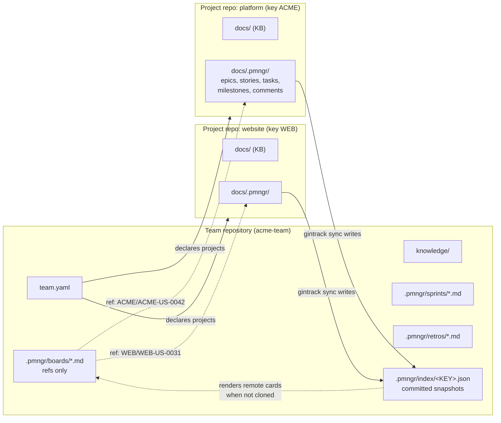
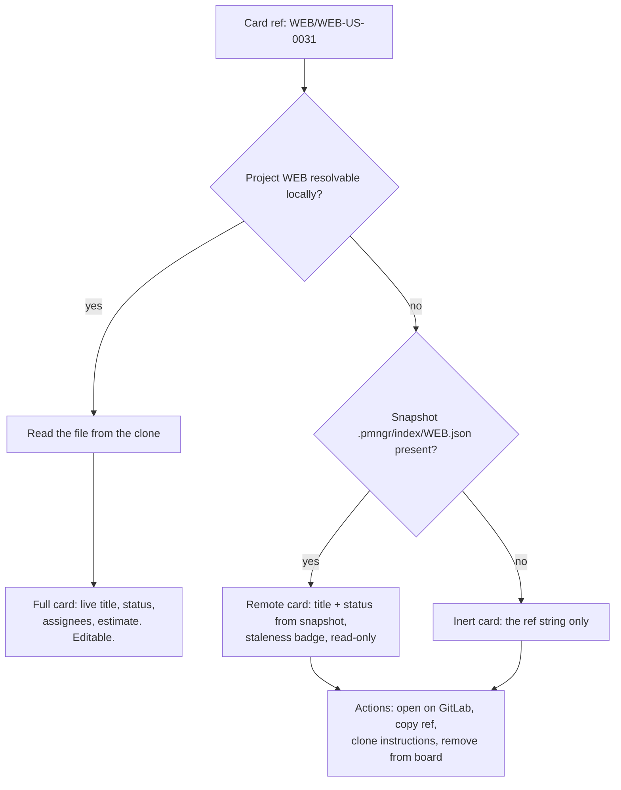
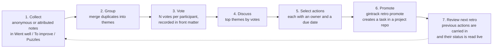
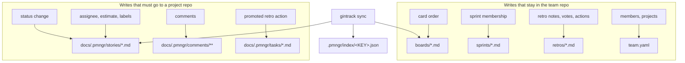

# 04 — The Team Repository

**Status:** planning specification (normative for Phase 3, extended by Phase 6).
**Applies to:** the team repository only. The per-project backlog model is specified in
[`03-data-model.md`](./03-data-model.md) and is *not* repeated here.
**Implementation home:** `internal/core/` (team model, board/sprint/retro parsing, snapshot
reader/writer), `internal/server/` (multi-project resolution), `web/` (board UI, retro UI).

The key words **MUST**, **MUST NOT**, **SHOULD**, **SHOULD NOT**, **MAY** are to be interpreted as
described in RFC 2119.

---

## 1. Purpose and the single hard rule

A team works across several project repositories. Somebody has to hold the things that are *about
the team* rather than about one codebase: who is on it, which repositories it owns, the shared
boards, the sprints, the retrospectives, and the team-wide knowledge base. That is the team
repository — one git repo per team, cloned by everyone.

> **The hard rule: backlogs never leave their project repository.**
> The team repository contains **references** to items, never copies of them. A card on a team board
> is the string `ACME/ACME-US-0042`, not a duplicate of the story. Titles and statuses shown next to
> that card come either from a local clone of the project (authoritative) or from a committed
> snapshot (advisory, possibly stale, clearly marked as such).

Everything in this document follows from that rule. It is what keeps the model free of two-way sync,
of write conflicts between repos, and of the question "which copy is right?".



---

## 2. Repository layout

```
<team-repo-root>/
  team.yaml                          # team metadata, members, projects  (discovery marker)
  README.md                          # free
  knowledge/                         # team-wide KB (Markdown, same renderer as project KBs)
    index.md
    ways-of-working/
      definition-of-done.md
      code-review.md
      oncall.md
    decisions/
      0001-one-team-repo-per-team.md
    people/
      onboarding.md
  .pmngr/
    boards/
      delivery.md                    # kanban board across all projects
      platform-scrum.md              # scrum board for the ACME project only
    sprints/
      ACME-TEAM-S-0007.md
      ACME-TEAM-S-0008.md
    retros/
      ACME-TEAM-R-0007-sprint-7.md
    index/
      ACME.json                      # committed snapshot of project ACME's backlog
      WEB.json
    templates/                       # optional; used by `gintrack new`
      retro.md
      sprint.md
  .gitignore
```

- **R-TEAM-LOC-1** `team.yaml` MUST be at the repository root. Its presence is the discovery marker
  for "this is a team repository".
- **R-TEAM-LOC-2** `.pmngr/` at the team-repo root holds only team artefacts: `boards/`, `sprints/`,
  `retros/`, `index/`, `templates/`. It MUST NOT contain `epics/`, `stories/`, `tasks/`,
  `milestones/`, or `comments/`. Such a folder is error `E-TEAM-BACKLOG-IN-TEAM-REPO` — it is the
  hard rule of §1 expressed as a validation.
- **R-TEAM-LOC-3** `.pmngr/index/*.json` **is committed** (unlike the project-local `index.json`,
  which is git-ignored). See [§6](#6-index-snapshots).
- **R-TEAM-LOC-4** `knowledge/` is a plain KB folder: any nesting, any filenames, wikilinks enabled.
  It has no `.pmngr/` of its own.
- **R-TEAM-LOC-5** A repository MAY be *both* a team repository and a project repository (a team that
  works on a single codebase). In that case `team.yaml` sits at the root and the project backlog
  lives at `docs/.pmngr/` as usual; the two `.pmngr/` folders are at different paths and are
  distinguished by their contents.

---

## 3. `team.yaml`

Plain YAML at the repository root. It is the routing table of the whole product: everything the app
knows about *other* repositories comes from here.

### 3.1 Fields

| Key | Type | Req. | Default | Notes |
|---|---|---|---|---|
| `schema` | integer | yes | `1` | Team-repo schema version; independent of a project's `schema`. |
| `key` | string `[A-Z][A-Z0-9-]{1,15}` | yes | — | Team key; prefix of sprint and retro IDs. Hyphens allowed. |
| `name` | string | yes | — | Display name, e.g. `ACME Delivery Team`. |
| `description` | string | no | — | One paragraph. |
| `timezone` | IANA tz | no | `UTC` | Used for sprint boundaries and retro scheduling display. |
| `knowledge` | mapping | no | `{path: knowledge}` | KB folder and rendering flags (same keys as a project's `docs`). |
| `members` | list of mappings | yes | — | See [§3.2](#32-members). |
| `projects` | list of mappings | yes | — | See [§3.3](#33-projects). |
| `defaults` | mapping | no | `{}` | `board`, `sprint_length_days`, `capacity_hours_per_day`. |
| `cadence` | mapping | no | — | `sprint_length_days`, `sprint_start_weekday`, `retro_after_sprint` (bool). |
| `policies` | mapping | no | — | Free key/value the UI surfaces on boards (e.g. `definition_of_done: knowledge/ways-of-working/definition-of-done.md`). |
| `snapshots` | mapping | no | see [§6](#6-index-snapshots) | Snapshot policy: `enabled`, `max_age_days`, `include_closed`. |

### 3.2 Members

```yaml
members:
  - handle: jose
    name: Jose Ruiz
    role: lead                 # free string; `lead`, `dev`, `design`, `qa`, `pm`, `bot` by convention
    emails: [jose@digio.es, jose.ruiz@acme.example]   # git identities, first is primary
    git_names: ["Jose Ruiz", "jruiz"]                  # optional: names seen in git history
    handles:                                           # optional: identities on other systems
      github: joseruiz
      gitlab: jruiz
      slack: "@jose"
    capacity: 1.0              # FTE, used for sprint capacity hints
    active: true
```

- **R-MEM-1** `handle` is the identity used everywhere in item front matter across every project
  (`assignees`, `author`, retro `participants`). It MUST match `[a-z0-9][a-z0-9-]{0,31}` and MUST be
  unique in the file.
- **R-MEM-2** `emails` maps git commit identities to handles. This is how the app attributes commits,
  pre-fills `author`, and decides "is this me?" — the local user is identified by
  `git config user.email`. An email MUST NOT appear under two members (`E-TEAM-EMAIL-DUP`).
- **R-MEM-3** A member with `active: false` is kept for historical attribution but is excluded from
  assignee pickers and capacity maths.
- **R-MEM-4** `handles.<system>` is used only to build outbound links (mention a user on the git
  host, open their profile). It is never used for authorisation.
- **R-MEM-5** Bots (CI, agents) are ordinary members with `role: bot`. Giving an agent a handle makes
  its writes attributable in exactly the same way as a human's.

### 3.3 Projects

```yaml
projects:
  - key: ACME                                   # MUST equal project.yaml:key in that repo
    name: ACME Platform
    repo: https://github.com/acme/platform.git  # canonical remote URL (https form preferred)
    default_branch: main
    docs_path: docs                             # folder containing .pmngr/, relative to repo root
    host: github                                # github | gitlab | gitea | bitbucket | bitbucket-server | generic
    web_url: https://github.com/acme/platform   # base URL for building blob links (no .git)
    color: "#2563eb"                            # swimlane / card accent
    archived: false
    local_hints:                                # OPTIONAL, best-effort, machine-specific
      - ~/src/acme/platform
      - /Users/marta/work/platform
      - C:\src\platform
```

| Key | Type | Req. | Notes |
|---|---|---|---|
| `key` | project key | yes | Must match the project's own `project.yaml:key`; mismatch is `E-TEAM-KEY-MISMATCH` (detected only when the repo is cloned locally). |
| `name` | string | yes | Display name. |
| `repo` | URL | yes | Canonical remote. `https://…`, `ssh://…`, or `git@host:owner/repo.git`. |
| `default_branch` | string | no (`main`) | Branch used for snapshot links and remote blob URLs. |
| `docs_path` | path | yes | Where the documentation folder (and thus `.pmngr/`) lives inside that repo. |
| `host` | enum | no | Drives blob-URL construction ([§7.3](#73-building-links-to-a-remote-file)). Inferred from `web_url`/`repo` host when absent. |
| `web_url` | URL | no | Browse root. Inferred from `repo` when it is an https URL. |
| `color` | hex | no | UI accent. |
| `archived` | bool | no | Hidden from pickers, still resolvable for old references. |
| `local_hints` | list of paths | no | Candidate local clone paths tried in order ([§7.1](#71-resolving-a-project-locally)). |

- **R-PROJ-1** `key` MUST be unique across `projects` (`E-TEAM-KEY-DUP`).
- **R-PROJ-2** Two entries MAY share `repo` with different `docs_path` (a monorepo with two projects,
  doc 03 §3.5).
- **R-PROJ-3** `local_hints` are hints, never truth. They exist so a new laptop finds clones without
  configuration; they are per-machine and often wrong for other members, which is acceptable because
  a wrong hint just falls through to the next resolution step. Machine-specific paths that would
  clutter the shared file SHOULD instead go in the user's local settings
  (`~/.config/gintrack/config.yaml`), which overrides `local_hints`.

### 3.4 Complete example

```yaml
# team.yaml
schema: 1
key: ACME-TEAM
name: ACME Delivery Team
description: Squad owning the ACME platform, the marketing website and the mobile app.
timezone: Europe/Madrid

knowledge:
  path: knowledge
  wikilinks: true
  mermaid: true
  footnotes: true
  callouts: true

cadence:
  sprint_length_days: 14
  sprint_start_weekday: monday
  retro_after_sprint: true

defaults:
  board: delivery
  capacity_hours_per_day: 6

policies:
  definition_of_done: knowledge/ways-of-working/definition-of-done.md
  code_review: knowledge/ways-of-working/code-review.md

snapshots:
  enabled: true
  max_age_days: 7
  include_closed: false

members:
  - handle: jose
    name: Jose Ruiz
    role: lead
    emails: [jose@digio.es]
    handles: { github: joseruiz, slack: "@jose" }
    capacity: 1.0
    active: true
  - handle: marta
    name: Marta Alonso
    role: dev
    emails: [marta@example.com, marta.alonso@acme.example]
    git_names: ["Marta Alonso", "malonso"]
    handles: { github: malonso }
    capacity: 1.0
    active: true
  - handle: tomas
    name: Tomás Vela
    role: design
    emails: [tomas@example.com]
    capacity: 0.5
    active: true
  - handle: bot-ci
    name: CI Bot
    role: bot
    emails: [ci@acme.example]
    active: true
  - handle: laura
    name: Laura Prat
    role: dev
    emails: [laura@example.com]
    active: false

projects:
  - key: ACME
    name: ACME Platform
    repo: https://github.com/acme/platform.git
    default_branch: main
    docs_path: docs
    host: github
    web_url: https://github.com/acme/platform
    color: "#2563eb"
    local_hints: [~/src/acme/platform]
  - key: WEB
    name: Marketing Website
    repo: https://gitlab.com/acme/website.git
    default_branch: main
    docs_path: documentation
    host: gitlab
    web_url: https://gitlab.com/acme/website
    color: "#7c3aed"
  - key: MOB
    name: Mobile App
    repo: git@git.acme.example:mobile/app.git
    default_branch: develop
    docs_path: docs
    host: gitea
    web_url: https://git.acme.example/mobile/app
    color: "#0891b2"
  - key: LEGACY
    name: Legacy Billing
    repo: https://bitbucket.org/acme/legacy-billing.git
    default_branch: master
    docs_path: docs
    host: bitbucket
    web_url: https://bitbucket.org/acme/legacy-billing
    archived: true
```

### 3.5 Validation

| Code | Sev | Condition |
|---|---|---|
| `E-TEAM-SCHEMA` | E | `schema` missing or newer than supported (read-only fallback). |
| `E-TEAM-KEY` | E | `key` missing or not matching `[A-Z][A-Z0-9-]{1,15}`. |
| `E-TEAM-KEY-DUP` | E | Duplicate project `key`. |
| `E-TEAM-HANDLE-DUP` | E | Duplicate member `handle`. |
| `E-TEAM-EMAIL-DUP` | E | An email appears under two members. |
| `E-TEAM-MEMBER-FIELDS` | E | A member entry has a malformed `handle`, or no member is declared. |
| `E-TEAM-PROJECT-FIELDS` | E | A project entry lacks `key`, `name`, `repo`, or `docs_path`, or none is declared. |
| `E-TEAM-BACKLOG-IN-TEAM-REPO` | E | `.pmngr/{epics,stories,tasks,milestones,comments}` exists in the team repo. |
| `W-TEAM-KEY-MISMATCH` | W | Cloned project's `project.yaml:key` ≠ the declared `key`. |
| `W-TEAM-WEB-URL` | W | `web_url` absent and not inferable (blob links disabled for that project). |
| `W-TEAM-HINT-DEAD` | W | No `local_hints` path exists on this machine (informational). |

### 3.6 Loading a team repository — the workspace (implemented, GIT-US-0016)

`team.yaml` is parsed by `internal/core` (`core.LoadTeamConfig`, `core.DiscoverTeam`) and never
by an adapter, so the companion process and the WebAssembly build validate it identically.

A **workspace** (`internal/vault`, type `Workspace`) is several repositories open at once: the
project clones the user has, plus at most one team repository. It is what makes the cross-repository
half of this document possible without a second implementation of anything:

| Concern | Where it is answered |
|---|---|
| One repository: items, pages, comments, writes | the `Vault` of that repository, unchanged |
| Which repository answers a call | `Workspace.route`, by explicit `vaultId`, then `project`, then the project key embedded in an item `id`, then the project half of a `ref` |
| `ref: <KEY>/<ITEM-ID>` resolution | `Workspace.ResolveRef` — see below |
| Search over everything that is open | `Workspace.Search`, merging the per-repository rankings |
| The team surface of §3 | `Workspace.Team` |

The hosts differ only in how repositories get in: the browser worker calls `workspace.mount` and
pushes each folder's files with `vault.load` (both carry a `vaultId`); the companion attaches the
vaults it already opened over the registered repositories.

**Reference resolution.** `core.ParseRef` decodes `<projectKey>/<itemId>` and rejects a reference
that disagrees with itself (`WEB/ACME-US-0042`). Resolution never fails on a reference into a
project nobody cloned — that is the normal state of a team board (§7) — and answers instead with:

| Field | Meaning |
|---|---|
| `declared` | `team.yaml` lists the project. |
| `cloned` | A repository exposing the project is open in this workspace. |
| `vaultId` | The repository the item was resolved in. |
| `found` | The item, without its body; absent when the reference is remote. |
| `reason` | One sentence explaining an unresolved reference, for the UI. |

**Unique project keys.** `E-TEAM-KEY-DUP` covers a `team.yaml` that declares a key twice. The
workspace raises the same code for the case only it can see: two *open repositories* serving the
same project key, which would make routing ambiguous.

**The team knowledge base** is indexed as a scope of the team repository's index, keyed by the team
key, so `knowledge/` is walked, searched, wikilinked and served by exactly the code that serves a
project's docs folder. It is addressed as `/api/v1/teams/<TEAMKEY>/kb/…` and, in the web app, at
`/p/<TEAMKEY>/kb/…`.

**Not cloned is a state, not an error.** Every project of `team.yaml` is listed with `cloned: true`
or `cloned: false`. Rendering a remote card's title and status from a committed snapshot (§6) is
GIT-US-0019; this build recognises and marks the project, and offers its `repo` URL as the way in.

The fixture `testdata/fixtures/team-basic` is the end-to-end case: a team repository declaring
`DEMO` (opened next to it from `testdata/fixtures/project-basic`) and `WEB` (never cloned).

---

## 4. `knowledge/` — the team knowledge base

Same renderer, same conventions, same wikilink syntax as a project KB (doc 03 §14): GFM tables, task
lists, footnotes, callouts, Mermaid, optional math.

Differences:

- **R-TKB-1** Wikilinks to backlog items MUST be **qualified**: `[[ACME/ACME-US-0042]]`. An
  unqualified `[[ACME-US-0042]]` in the team KB is resolved only if exactly one declared project has
  that key prefix; otherwise it is `W-LINK-AMBIGUOUS`. (Within a project repo the unqualified form is
  the norm — there is only one project there.)
- **R-TKB-2** Links to a project's KB pages use the `project:` scheme:
  `[[ACME:architecture/sso-overview]]`. Rendering depends on whether the project is cloned
  ([§7](#7-remote-references)).
- **R-TKB-3** Team KB pages MAY be referenced from project repos only as plain URLs (a project repo
  has no knowledge of the team repo's location beyond `project.yaml:team.repo`). Cross-repo wikilinks
  are deliberately one-directional: team → projects.

Recommended structure (convention, not enforced): `ways-of-working/`, `decisions/` (team-level ADRs),
`people/` (onboarding, roles, on-call), `meetings/`.

---

## 5. Boards — `.pmngr/boards/<slug>.md`

**Status: boards are implemented — kanban (GIT-US-0017), scrum ([§5.5](#55-scrum-boards),
GIT-US-0018) and snapshot-backed remote cards (GIT-US-0019).**

A board is a *view*: columns, ordering, filters, swimlanes. It holds no work item state. Moving a
card between columns changes the **status of the referenced item in its own project repository**,
which means moving a card on a board can require writing to a different git repository than the one
holding the board — a fact the UI must surface ([§5.7](#57-what-happens-when-a-card-moves)).

**Implementation home.** `internal/core/board.go` parses, validates and emits the file;
`internal/core/boardview.go` turns a board plus the items of the open repositories into the
columns the UI renders and decides what a move implies. `internal/vault/board.go` is the plumbing
— read the files, hand the pieces to the core, write the answer back — and answers `board.list`,
`board.get`, `board.move` and `board.update` for a workspace. `internal/server/boards.go` and
`internal/server/sprints.go` serve the same calls over HTTP ([doc 07 §5.5](./07-cli-and-api.md)).
The fixtures are `testdata/fixtures/team-basic/.pmngr/boards/delivery.md` (kanban) and
`demo-scrum.md` with `.pmngr/sprints/DEMO-TEAM-S-0001.md` (scrum).

### 5.1 Front matter

| Field | Type | Req. | Notes |
|---|---|---|---|
| `id` | slug `[a-z0-9][a-z0-9-]{0,47}` | yes | Equals the filename stem. Referenced by sprints and retros. |
| `type` | `board` | yes | |
| `kind` | `kanban` \| `scrum` | yes | Scrum boards are sprint-scoped ([§5.5](#55-scrum-boards)). |
| `title` | string | yes | |
| `description` | string | no | |
| `projects` | list of project keys | no | Projects in scope; absent/`[*]` means all non-archived. |
| `columns` | list of column objects | yes | [§5.2](#52-columns). |
| `filters` | mapping | no | [§5.3](#53-filters). |
| `swimlanes` | mapping | no | [§5.4](#54-swimlanes). |
| `card` | mapping | no | Display options: `show: [key, assignee, estimate, labels, project, due]`. |
| `order` | mapping column-id → list of refs | no | Manual card order ([§5.6](#56-card-order)). |
| `sprint` | sprint ID | no | Scrum only: the currently displayed sprint. |
| `backlog_column` | column id | no | Scrum only: where unplanned items appear. |
| `created`, `updated`, `author` | as doc 03 §3 | | |

### 5.2 Columns

```yaml
columns:
  - id: todo               # [a-z][a-z0-9_-]{0,31}, unique in the board
    name: To Do
    statuses:              # mapping to per-project statuses
      "*": [backlog, todo]           # default rule, applied to any project
      WEB: [inbox, ready]            # per-project override (WEB has a custom workflow)
    wip: 0                 # 0 or absent = unlimited
    collapsed: false
    color: "#94a3b8"
```

- **R-COL-1** `statuses` maps board columns to project status ids. The `"*"` key is the default; a
  project key overrides it entirely for that project (no merging — an override is a full
  replacement, so the intent is always readable in one place).
- **R-COL-2** Instead of status ids, a column MAY map to **categories**:
  `categories: [todo]` / `[in_progress]` / `[done]` / `[cancelled]`. This is the recommended default
  because it works for every project without knowing its workflow (doc 03 §6.1). A column MUST NOT
  declare both `statuses` and `categories` (`E-BOARD-COL-MAPPING`).
- **R-COL-3** A status that maps to two columns is `E-BOARD-STATUS-AMBIGUOUS` for that project.
- **R-COL-4** An item whose status maps to no column is not shown; the board header shows
  "3 items hidden (unmapped status)" with a link to list them.
- **R-COL-5** `wip` is advisory: it is never a stored constraint, and a column that is already over
  its limit renders every card it holds. Exceeding it colours the column header and shows a badge.
  A move that *would* put the column over its limit is refused **once**, with the code
  `wip_limit_exceeded` and a sentence naming the column and the limit; repeating the call with
  `force` (the "Move anyway" button) goes through. Advisory, but never silently exceeded — and a
  hard block would be unenforceable anyway, since the item lives in another repository.

### 5.3 Filters

```yaml
filters:
  projects: [ACME, WEB]           # redundant with top-level `projects`; the intersection applies
  types: [story, task]            # epic | story | task | milestone
  labels_any: [frontend, security]
  labels_all: []
  labels_none: [tech-debt]
  assignees: [jose, marta]        # empty/absent = everyone; `unassigned` is a valid pseudo-handle
  priorities: [critical, high, medium, low]
  milestone: ACME-M-0003          # single milestone, qualified or bare when unambiguous
  sprint: ACME-TEAM-S-0007        # scrum boards usually set this via `sprint:` instead
  due_before: 2026-10-01
  updated_since: 2026-08-01T00:00:00Z
  include_closed: false           # show items in terminal statuses outside the done column
  query: "sso"                    # free-text over title (and body when an index is available)
```

All filters are ANDed. Absent keys impose no constraint.

### 5.4 Swimlanes

```yaml
swimlanes:
  by: project            # project | assignee | epic | priority | milestone | none
  order: [ACME, WEB, MOB]   # optional explicit order; unlisted values follow, sorted
  collapse_empty: true
```

- `by: epic` groups by the item's epic (qualified with its project key); items without an epic land
  in a trailing "No epic" lane.
- `by: assignee` produces one lane per assignee plus an "Unassigned" lane; multi-assignee items
  appear in the lane of their first assignee only.

### 5.5 Scrum boards

A scrum board differs from a kanban board in three ways:

1. `kind: scrum` and `sprint: <SPRINT-ID>` — the board shows the items listed by that sprint file
   ([§8](#8-sprints)), not everything matching the filters.
2. A `backlog_column` shows sprint candidates: items matching the filters that are *not* in the
   sprint. Dragging from there into any other column adds the ref to the sprint file.
3. The board renders sprint metrics: committed vs. completed points, remaining days, burndown
   (Phase 6).

`kind: kanban` boards ignore `sprint`/`backlog_column`, and `sprint` on a kanban board is
`E-BOARD-SPRINT-KIND`.

**As built (GIT-US-0018).** `BuildBoardView` takes the sprint the board's `sprint:` names and:

- **R-SCRUM-1** The working columns hold the references the sprint lists, and nothing else. A
  reference the sprint dropped disappears from the board even while `order:` still names it — the
  order list is a position, never a membership.
- **R-SCRUM-2** A candidate appears in `backlog_column` when the board's filters keep it, it is not
  in a terminal status, and *that column's own* status mapping claims it. Mapping the backlog column
  to `categories: [todo]` therefore offers exactly the unstarted work, whatever each project's
  workflow calls it. A board that declares no `backlog_column` shows no candidates at all.
- **R-SCRUM-3** A column may be both: in [§5.9](#59-complete-example--scrum-board-for-one-project)
  `sprint_backlog` holds the sprint's own `todo` items *and* the candidates. Cards say which they
  are — `inSprint`, `committed` and `backlog` on the rendered card.
- **R-SCRUM-4** Dragging a candidate out of the backlog column commits it to the sprint: the
  reference is appended to the sprint file, and the status change and the order write follow as for
  any move (R-MOVE-1). Dragging a card *into* the backlog column changes no membership — leaving a
  sprint is an explicit act in the planning view, never a side effect of a drop.
- **R-SCRUM-5** A remote candidate may join the sprint (team-repo state, R-REM-1) but keeps its
  status, so it renders in whatever column its snapshot status maps to rather than where it was
  dropped.
- **R-SCRUM-6** The rendered board carries `sprintInfo`: the goal, the dates, the days remaining
  (both ends inclusive, 0 once the end has passed), and the metrics — items, resolved, done,
  points, committed points, done points, and how many references were added after the start.

### 5.6 Card order

```yaml
order:
  todo:
    - ACME/ACME-US-0043
    - WEB/WEB-US-0031
    - ACME/ACME-T-0108
  in_progress:
    - ACME/ACME-US-0042
    - MOB/MOB-T-0012
  done: []
```

- **R-ORD-1** A ref is `<projectKey>/<itemId>`. The project key MUST be declared in `team.yaml`
  (`W-REF-UNKNOWN-PROJECT` otherwise, and the card renders as inert text).
- **R-ORD-2** `order` is **advisory and partial**. Items present on the board but absent from `order`
  are appended after the listed ones, sorted by `priority` then `updated` descending. Refs in `order`
  that no longer belong to the column (status changed elsewhere) are ignored on read and pruned on
  the next write.
- **R-ORD-3** The list is stored one ref per line so that two people re-ordering different columns
  produce non-overlapping diffs; a fractional index was considered and rejected in
  [ADR-013](./adr/ADR-013-board-card-ordering.md). Concurrent re-ordering *of the same column* is a genuine text
  conflict; the conflict UI offers "take mine / take theirs / union (mine first)". This is accepted:
  card order is the least valuable state in the system.
- **R-ORD-4** Ordering is per column, not global, and is not stored per swimlane. When swimlanes are
  active, the column order is applied within each lane.

### 5.7 What happens when a card moves

```mermaid
sequenceDiagram
  autonumber
  actor U as User (browser)
  participant B as Board (team repo)
  participant R as Resolver
  participant P as Project repo (local clone)
  participant S as Snapshot .pmngr/index/ACME.json

  U->>B: drag ACME/ACME-US-0042 from "To Do" to "In Progress"
  B->>R: resolve ACME
  alt project cloned locally
    R->>P: read story, check rev
    P-->>R: rev sha256:9f2b…
    R->>P: write status=in_progress, updated=now (If-Match rev)
    R->>B: update order[in_progress] in board file
    Note over P,B: two working trees changed -> two commits
    R->>S: refresh snapshot entry (on next `gintrack sync`)
  else project not cloned
    R-->>U: read-only card; move refused with<br/>"Clone acme/platform to edit this item"
  end
```

- **R-MOVE-1** A move writes to two repositories: the item's status in the project repo, and the
  board's `order` in the team repo. Both writes are independent commits. If either write fails
  (dirty rev, no clone, read-only), the other MUST be rolled back so the board never shows a
  position that contradicts the item. The implementation writes the item first — it is the write
  that can be refused for a reason the caller has to see — and rolls the status back when the board
  write fails. The two repositories hold two independent optimistic locks: the board's revision and
  the item's, so a move carries both (`rev` and `itemRev`, or `If-Match` and `itemRev` over HTTP).
  A re-order inside one column changes no status and writes the board file only.
- **R-MOVE-2** The new status is the **first** status listed for the target column for that project
  (`statuses["*"]` or the project override), or, for a `categories:` column, the project's first
  status in that category. `project.yaml:workflow.transitions` is consulted; a disallowed transition
  prompts for confirmation rather than blocking.
- **R-MOVE-3** Moving into a `done`-category column sets `closed`; moving out of it clears `closed`.
  Moving into an `in_progress` category sets `started` if unset.

### 5.8 Complete example — Kanban across projects

```markdown
---
id: delivery
type: board
kind: kanban
title: Delivery
description: Everything the team is actually working on, across all projects.
projects: [ACME, WEB, MOB]
columns:
  - id: todo
    name: To Do
    categories: [todo]
    wip: 0
    color: "#94a3b8"
  - id: in_progress
    name: In Progress
    statuses:
      "*": [in_progress]
      WEB: [doing]
    wip: 5
    color: "#2563eb"
  - id: in_review
    name: In Review
    statuses:
      "*": [in_review]
      WEB: [review]
      MOB: [in_review, qa]
    wip: 4
    color: "#a16207"
  - id: done
    name: Done
    categories: [done]
    color: "#16a34a"
filters:
  types: [story, task]
  labels_none: [tech-debt]
  include_closed: false
swimlanes:
  by: project
  order: [ACME, WEB, MOB]
  collapse_empty: true
card:
  show: [key, project, assignee, estimate, labels, due]
order:
  todo:
    - ACME/ACME-US-0043
    - WEB/WEB-US-0031
  in_progress:
    - ACME/ACME-US-0042
    - ACME/ACME-T-0107
    - MOB/MOB-T-0012
  in_review:
    - ACME/ACME-T-0108
  done: []
created: 2026-07-01T09:00:00Z
updated: 2026-09-03T07:22:10Z
author: jose
---

## Notes

WIP limits are per column, not per person. If "In Progress" is full, help finish
something before starting new work — see [[ways-of-working/definition-of-done]].

Cards from **MOB** are read-only for anyone who has not cloned `mobile/app`;
they show the last snapshot state and link to the file on Gitea.
```

### 5.9 Complete example — Scrum board for one project

```markdown
---
id: platform-scrum
type: board
kind: scrum
title: ACME Platform — Sprint Board
projects: [ACME]
sprint: ACME-TEAM-S-0007
backlog_column: sprint_backlog
columns:
  - id: sprint_backlog
    name: Sprint Backlog
    categories: [todo]
    wip: 0
  - id: in_progress
    name: In Progress
    statuses: { "*": [in_progress] }
    wip: 3
  - id: in_review
    name: In Review
    statuses: { "*": [in_review] }
    wip: 3
  - id: done
    name: Done
    categories: [done]
filters:
  types: [story, task]
swimlanes:
  by: epic
  collapse_empty: true
card:
  show: [key, assignee, estimate]
order:
  in_progress:
    - ACME/ACME-US-0042
    - ACME/ACME-T-0107
created: 2026-08-25T08:00:00Z
updated: 2026-09-02T17:40:00Z
author: marta
---

## Notes

Capacity for this sprint is 2.5 FTE (Tomás is half-time). Daily at 09:45 CET.
```

### 5.10 Board validation

| Code | Sev | Condition |
|---|---|---|
| `E-BOARD-ID` | E | `id` missing or ≠ filename stem. |
| `E-BOARD-KIND` | E | `kind` not `kanban` or `scrum`. |
| `E-BOARD-COLUMNS` | E | `columns` empty, or duplicate column `id`. |
| `E-BOARD-COL-MAPPING` | E | A column declares both `statuses` and `categories`, or neither. |
| `E-BOARD-STATUS-AMBIGUOUS` | E | A project status maps to more than one column. |
| `E-BOARD-SPRINT-KIND` | E | `sprint` set on a `kanban` board. |
| `W-BOARD-UNKNOWN-PROJECT` | W | `projects` or a ref names an undeclared project key. |
| `W-BOARD-REF-FORMAT` | W | An `order` entry is not `<KEY>/<ITEM-ID>`. |
| `W-BOARD-REF-DEAD` | W | A ref resolves to an item that does not exist in the cloned project. |
| `W-BOARD-WIP-EXCEEDED` | W | Live condition, reported in the UI, not by `doctor`. |
| `W-BOARD-UNMAPPED-STATUS` | W | A project status maps to no column. |

**Writing a board back.** `SerializeBoard` is the only writer. It emits the front matter in the key
order of §5.1, one column per block entry, the `statuses` mapping with `"*"` first and the project
overrides sorted, and `order:` one ref per line — never in flow style, and `[]` for a column whose
list is deliberately empty. Emission is deterministic (no Go map iteration reaches the output) and
idempotent: parsing a board and serialising it again yields the same bytes. That is what makes a
concurrent move a mergeable diff, and `internal/core` pins it with a test that drives
`git merge-file` over two divergent moves.

Columns the board no longer declares are dropped from `order:` on the next write, and so are refs
the column no longer shows (R-ORD-2).

---

## 6. Index snapshots — `.pmngr/index/<projectKey>.json`

### 6.1 Why they exist

The team board must render a card for `WEB/WEB-US-0031` even for someone who has never cloned the
website repository. The card needs a title and a status. Those come from a **snapshot**: a small,
committed JSON file per project, written by whoever *does* have the project cloned.

Snapshots are a cache, not a source of truth. They are advisory, they go stale, and the UI says so.

### 6.2 Schema

```jsonc
// .pmngr/index/ACME.json
{
  "schema": 1,
  "project": {
    "key": "ACME",
    "name": "ACME Platform",
    "repo": "https://github.com/acme/platform.git",
    "default_branch": "main",
    "docs_path": "docs"
  },
  "generated": "2026-09-03T07:20:44Z",
  "generated_by": "jose",
  "generator": "gintrack/0.4.1",
  "source": {
    "commit": "9c1f0a2e8d3b41c05f77a2e1b9d4c6a80f3e2b11",
    "branch": "main",
    "dirty": false
  },
  "workflow": [
    { "id": "backlog",     "name": "Backlog",     "category": "todo" },
    { "id": "todo",        "name": "To Do",       "category": "todo" },
    { "id": "in_progress", "name": "In Progress", "category": "in_progress" },
    { "id": "in_review",   "name": "In Review",   "category": "in_progress" },
    { "id": "done",        "name": "Done",        "category": "done", "terminal": true },
    { "id": "cancelled",   "name": "Cancelled",   "category": "cancelled", "terminal": true }
  ],
  "labels": [
    { "name": "backend",  "color": "#2563eb" },
    { "name": "security", "color": "#dc2626" }
  ],
  "counts": { "epic": 2, "story": 43, "task": 108, "milestone": 3 },
  "items": [
    {
      "id": "ACME-US-0042",
      "type": "story",
      "title": "Login with SSO",
      "status": "in_progress",
      "category": "in_progress",
      "priority": "high",
      "parent": "ACME-EP-0001",
      "milestone": "ACME-M-0003",
      "sprint": "ACME-TEAM-S-0007",
      "assignees": ["marta", "jose"],
      "labels": ["frontend", "security"],
      "estimate": 8,
      "due": "2026-09-15",
      "updated": "2026-09-01T10:45:12Z",
      "path": "docs/.pmngr/stories/ACME-US-0042-login-with-sso.md",
      "rev": "sha256:9f2b1c7d0a4e5b31",
      "ac": { "total": 5, "done": 2 }
    },
    {
      "id": "ACME-T-0107",
      "type": "task",
      "title": "Add OIDC discovery client",
      "status": "in_review",
      "category": "in_progress",
      "priority": "high",
      "parent": "ACME-US-0042",
      "assignees": ["jose"],
      "labels": ["backend", "security"],
      "updated": "2026-09-02T16:03:19Z",
      "path": "docs/.pmngr/tasks/ACME-T-0107-add-oidc-discovery-client.md",
      "rev": "sha256:4c81ab00de19f7a2"
    }
  ]
}
```

- **R-SNAP-1** The snapshot carries **front-matter-derived fields only** — never bodies, never
  comments, never acceptance-criteria text (only the counts). It is a rendering aid, not a mirror.
  Keeping bodies out is what makes "backlogs never leave the project repo" true in practice as well
  as in principle.
- **R-SNAP-2** `items[]` is sorted by `id` so that regeneration produces a stable, minimal diff.
  JSON is written with 2-space indentation, keys in the fixed order shown, and a trailing newline.
- **R-SNAP-3** By default (`snapshots.include_closed: false`) items in a terminal status whose
  `updated` is older than 30 days are omitted, to bound file size. Cards referencing an omitted item
  render as "closed (details not in snapshot)".
- **R-SNAP-4** `source.commit` records what the snapshot was built from; `dirty: true` means it was
  built from a working tree with uncommitted changes and MUST be flagged in the UI.
- **R-SNAP-5** A snapshot MUST NOT be edited by hand. `gintrack doctor` reports hand edits it can
  detect (e.g. inconsistent counts) as `W-SNAP-INCONSISTENT`.

### 6.3 Who writes them and when

**Anyone who has the project cloned**, as part of `gintrack sync`:

```
$ gintrack sync
[1/4] team repo acme-team          fetch + rebase … up to date
[2/4] project ACME  (~/src/acme/platform)   fetch + rebase … 3 commits
[3/4] project WEB   not cloned              skipped (snapshot age 2d, still fresh)
[4/4] snapshots
      .pmngr/index/ACME.json  updated (43 stories, 108 tasks)  → staged
      commit "chore(pmngr): refresh ACME index snapshot" … done
      push acme-team … done
```

Rules:

- **R-SNAP-6** The snapshot for project `K` is refreshed when: (a) `gintrack sync` runs and `K` is
  resolvable locally; (b) the companion server's watcher sees a change under `K`'s `.pmngr/` and
  `snapshots.enabled` is true (debounced, default 30 s); (c) `gintrack snapshot [K]` is run
  explicitly, which is also how CI in the *project* repo publishes for a project few people clone;
  (d) a client calls `POST /api/v1/snapshots` (companion) or `snapshot.refresh` (browser).
- **R-SNAP-6a** *(as built, GIT-US-0019, extended by GIT-US-0021)* (a) is implemented: a
  `gintrack sync` run that pulled work refreshes the snapshots afterwards (skip it with
  `--no-snapshot`), and so does `POST /api/v1/sync/run` in the companion. (b) still arrives with
  the watcher phase. (c) and (d) are `gintrack snapshot [KEY...]` in the CLI, and the
  `snapshot.list` / `snapshot.refresh` pair of the core contract, served over HTTP as `GET` and
  `POST /api/v1/snapshots`. All three generate from the same `(*Index).ProjectSnapshot`, write only into
  the team repository, and skip — with a reason — every project no open repository serves. The
  `source` block is left out until the git backend of Phase 4 can fill it honestly.
- **R-SNAP-6b** A regenerated snapshot is compared with the file on disk **ignoring `generated`,
  `generated_by`, `generator` and `source`**. When only those differ, nothing is written. This is
  what makes a scheduled or CI refresh free of commits when the backlog did not move (ADR-014).
- **R-SNAP-7** Snapshot commits are written with a dedicated message prefix
  (`chore(pmngr): refresh <KEY> index snapshot`) and SHOULD contain nothing else, so they are easy to
  filter out of history and easy to auto-resolve.
- **R-SNAP-8** Merge conflicts on a snapshot are resolved by **regeneration, never by hand**:
  `gintrack doctor --fix-snapshots` takes the union of the local clone's truth and rewrites the file.
  A recommended `.gitattributes` entry keeps them out of noisy diffs:
  `.pmngr/index/*.json merge=ours linguist-generated=true` (with `merge.ours.driver = true`
  configured locally by `gintrack init --hooks`).
- **R-SNAP-9** Staleness display: fresh (< 24 h) no marker; 1–7 days a subtle "updated 3 days ago";
  older than `snapshots.max_age_days` an amber "stale snapshot" badge on every card of that project.
- **R-SNAP-10** If `snapshots.enabled` is `false`, remote cards show ID and nothing else. This is the
  right setting for teams whose members all clone everything, and it removes snapshot churn from the
  history entirely.

---

## 7. Remote references

A **remote reference** is a card, link, or mention pointing to an item in a project that is not
resolvable on this machine.

### 7.1 Resolving a project locally

For project key `K`, in order:

1. User configuration: `~/.config/gintrack/config.yaml` → `projects.K.path` (or the browser's
   remembered File System Access directory handle, keyed by project key).
2. Any folder already opened in this session whose `project.yaml:key == K`.
3. Sibling-directory heuristic: a directory next to the team repo whose name matches the repo's
   basename (`../platform`).
4. `team.yaml:projects[].local_hints`, in order.

The first candidate that contains `<docs_path>/.pmngr/project.yaml` with matching `key` wins. If
none matches, the project is **not cloned** and every reference to it is remote.



### 7.2 What a remote card shows and what is disabled

| Capability | Cloned | Remote (snapshot) | Remote (no snapshot) |
|---|---|---|---|
| Title, status, labels, assignees, estimate | live | from snapshot, may be stale | — (ID only) |
| Open item detail panel | yes | read-only summary | no |
| Edit any field | yes | no | no |
| Drag between columns | yes | no (tooltip: "clone the repo to move this item") | no |
| Re-order within a column | yes | **yes** (order lives in the team repo) | **yes** |
| Remove card from `order` | yes | yes | yes |
| Add to / remove from a sprint | yes | yes (sprint file lives in the team repo) | yes |
| Add a comment | yes | no | no |
| Open on the git host | yes | yes | yes, if `web_url` is known |
| Counts toward WIP limits | yes | yes | no (status unknown) |
| Appears in metrics/burndown | yes | yes, flagged as snapshot-derived | no |

- **R-REM-1** Anything whose state lives in the **team** repo (card order, sprint membership,
  retro actions) remains editable for remote items. Anything whose state lives in the **project**
  repo is read-only. This division is the user-visible consequence of §1 and MUST be explained in the
  UI with one sentence, not an error dialog.
- **R-REM-2** A remote card always offers a one-click "Clone this project" affordance: the companion
  CLI runs `git clone` into a chosen directory and registers the path in the user's local config; the
  browser-only mode shows the exact `git clone` command and then asks the user to pick the folder.
- **R-REM-3** Remote cards are visually distinct (dashed border, small cloud/host icon) and never
  silently pretend to be live.

### 7.3 Building links to a remote file

Given a project entry and an item `path` from the snapshot (path is repo-root-relative), the browse
URL is:

| `host` | Pattern |
|---|---|
| `github` | `{web_url}/blob/{branch}/{path}` |
| `gitlab` | `{web_url}/-/blob/{branch}/{path}` |
| `gitea` (and Forgejo) | `{web_url}/src/branch/{branch}/{path}` |
| `bitbucket` (Cloud) | `{web_url}/src/{branch}/{path}` |
| `bitbucket-server` (Data Center) | `{web_url}/browse/{path}?at=refs%2Fheads%2F{branch}` |
| `generic` | none — the UI shows the repo URL and the path as text |

Raw (unrendered) variants, used to fetch a file without a clone when the host allows CORS:

| `host` | Raw pattern |
|---|---|
| `github` | `https://raw.githubusercontent.com/{owner}/{repo}/{branch}/{path}` |
| `gitlab` | `{web_url}/-/raw/{branch}/{path}` |
| `gitea` | `{web_url}/raw/branch/{branch}/{path}` |
| `bitbucket` | `https://bitbucket.org/{workspace}/{repo}/raw/{branch}/{path}` |

Examples for `ACME-US-0042` (`docs/.pmngr/stories/ACME-US-0042-login-with-sso.md`, branch `main`):

```
github  https://github.com/acme/platform/blob/main/docs/.pmngr/stories/ACME-US-0042-login-with-sso.md
gitlab  https://gitlab.com/acme/website/-/blob/main/documentation/.pmngr/stories/WEB-US-0031-hero-rewrite.md
gitea   https://git.acme.example/mobile/app/src/branch/develop/docs/.pmngr/tasks/MOB-T-0012-crash-on-cold-start.md
bb      https://bitbucket.org/acme/legacy-billing/src/master/docs/.pmngr/stories/LEGACY-US-0004-invoice-pdf.md
bb-dc   https://git.acme.example/projects/ACME/repos/legacy/browse/docs/.pmngr/stories/LEGACY-US-0004-invoice-pdf.md?at=refs%2Fheads%2Fmaster
```

- **R-URL-1** Path segments are URL-escaped except `/`. Branch names are escaped, including `/` in
  `feature/x` (`%2F`) for hosts that require it.
- **R-URL-2** `host` is inferred when absent: hostname contains `github` → `github`,
  `gitlab` → `gitlab`, `bitbucket.org` → `bitbucket`, otherwise `generic`. Self-hosted GitLab/Gitea
  MUST set `host` explicitly.
- **R-URL-3** If `web_url` is missing and cannot be derived from an https `repo` URL (e.g. an
  `ssh://` remote), link building is disabled for that project and `W-TEAM-WEB-URL` is reported.
- **R-URL-4** Browser-only mode MAY attempt a raw fetch to freshen a remote card. Most hosts do not
  send permissive CORS headers for raw content on private repos, so this is best-effort, off by
  default, and never blocks rendering. The committed snapshot is the supported mechanism.

---

## 8. Sprints — `.pmngr/sprints/<SPRINT-ID>.md`

**Status: implemented (GIT-US-0018).** `internal/core/sprint.go` parses, validates, allocates and
emits a sprint file; `internal/core/sprintview.go` renders one — the header, the planning view and
the closing report. `internal/vault/sprint.go` answers `sprint.list`, `sprint.get`,
`sprint.create`, `sprint.update`, `sprint.start` and `sprint.close` for a workspace, and
`internal/server/sprints.go` serves them over HTTP ([doc 07 §5.5](./07-cli-and-api.md)).
Burndown and cumulative flow are [§12](#12-metrics-burndown-cumulative-flow-and-flow-times) (GIT-US-0028, done).

### 8.1 Identity

```
<SPRINT-ID> ::= <TEAMKEY> "-S-" [0-9]{4,}      e.g. ACME-TEAM-S-0007
<RETRO-ID>  ::= <TEAMKEY> "-R-" [0-9]{4,}      e.g. ACME-TEAM-R-0007
```

Because a team key may contain hyphens, parsers MUST split from the **right**: the last two
hyphen-separated segments are the type code and the number; everything before is the team key.

Allocation follows the same rule as project item IDs (doc 03 §4): scan `.pmngr/sprints/` for the
maximum number, ignore any counter, and take the next. Collisions are far rarer than in a backlog
(sprints are created by one person, once a fortnight) and are repaired by the same
`gintrack doctor --renumber`.

### 8.2 Front matter

| Field | Type | Req. | Notes |
|---|---|---|---|
| `id` | sprint ID | yes | Equals the filename stem. |
| `type` | `sprint` | yes | |
| `title` | string | no | Defaults to `Sprint <n>`. |
| `board` | board id | yes | The scrum board this sprint belongs to. |
| `state` | `planned` \| `active` \| `closed` | yes | Exactly one sprint per board SHOULD be `active`. |
| `start` | date | yes | Inclusive, in the team timezone. |
| `end` | date | yes | Inclusive. |
| `goal` | string | no | One sentence, shown on the board header. |
| `items` | list of refs | yes | `<KEY>/<ITEM-ID>`; the sprint scope. |
| `committed` | list of refs | no | Snapshot of `items` taken when the sprint started; the basis for "committed vs. added mid-sprint". |
| `capacity_hours` | number | no | Team capacity for the sprint. |
| `velocity_target` | number | no | Points. |
| `participants` | list of handles | no | Defaults to all active members. |
| `retro` | retro ID | no | Filled in when the retro is created. |
| `created`, `updated`, `author` | as usual | | |

- **R-SPR-1** `items` is one ref per line for diff friendliness. Adding an item mid-sprint appends to
  `items` and leaves `committed` untouched.
- **R-SPR-2** A ref MAY point at a remote (non-cloned) project. Sprint membership is team-repo state,
  so it stays editable (§7.2).
- **R-SPR-3** Closing a sprint (`state: closed`) does not modify any item. Unfinished items are
  *listed* by the closing dialog and the user chooses per item: leave it, move it to the next sprint
  (edit the next sprint's `items`), or send it back to the backlog (a status write in the project
  repo). No bulk write happens implicitly.
- **R-SPR-4** An item MAY appear in two sprints (it was carried over). Metrics attribute completion
  to the sprint that was `active` at the moment `closed` was set.
- **R-SPR-5** Starting a sprint copies `items` into `committed` and points its board's `sprint:` at
  it. Both are writes in the team repository, and both are refused once — with
  `sprint_already_active` — when that board already runs a sprint; confirming with `force` goes
  through, because two active sprints are a warning (`W-SPRINT-TWO-ACTIVE`) and not an impossibility.
- **R-SPR-6** A create or a date change that would make two sprints of one board share a day is
  refused with `sprint_overlap` and a sentence naming the other sprint and its dates. The same
  condition in a file that is already on disk stays the warning `W-SPRINT-OVERLAP`: validation
  describes, a write decides.
- **R-SPR-7** `committed` is what the sprint promised at its start. A sprint that has not started
  has no commitment, so nothing counts as an addition; once it has, every reference outside
  `committed` is reported as added mid-sprint.
- **R-SPR-8** Sending an unfinished item back to the backlog on closing writes the first `todo`
  status of *that project's* workflow, in that project's repository, and is refused for a project
  nobody cloned (`repo_not_cloned`, R-REM-1). Carrying one into another sprint writes only the
  target sprint file. A decision that cannot be applied is reported on its own line of the closing
  report; the rest of the closing still goes through.

### 8.3 Complete example

```markdown
---
id: ACME-TEAM-S-0007
type: sprint
title: Sprint 7 — SSO end to end
board: platform-scrum
state: active
start: 2026-08-24
end: 2026-09-06
goal: A Northwind user can log in with Entra ID in staging, end to end.
capacity_hours: 260
velocity_target: 34
participants: [jose, marta, tomas]
committed:
  - ACME/ACME-US-0042
  - ACME/ACME-US-0043
  - ACME/ACME-T-0107
  - WEB/WEB-US-0031
items:
  - ACME/ACME-US-0042
  - ACME/ACME-US-0043
  - ACME/ACME-T-0107
  - ACME/ACME-T-0108
  - WEB/WEB-US-0031
retro: ACME-TEAM-R-0007
created: 2026-08-21T15:10:00Z
updated: 2026-09-02T09:12:00Z
author: jose
---

## Goal

Prove the full OIDC flow against Entra ID in staging with the Northwind tenant,
including session revocation. Anything not on that path is out of scope.

## Scope Notes

- `ACME-T-0108` was added on day 4 after we found the callback route was missing;
  it is not part of the commitment.
- `WEB/WEB-US-0031` is owned by Tomás and only needs review time from the rest.

## Risks

- Entra ID test tenant credentials expire on 2026-09-01 — renewal requested.
- Marta is out on 2026-09-03.
```

### 8.4 Sprint validation

| Code | Sev | Condition |
|---|---|---|
| `E-SPRINT-ID` | E | `id` missing or ≠ filename stem, or wrong team key. |
| `E-SPRINT-DATES` | E | `start` or `end` missing, or `end` < `start`. |
| `E-SPRINT-BOARD` | E | `board` names a board that does not exist. |
| `E-SPRINT-STATE` | E | `state` outside the enum. |
| `W-SPRINT-TWO-ACTIVE` | W | More than one `active` sprint on the same board. |
| `W-SPRINT-OVERLAP` | W | Date ranges of two sprints on the same board overlap. |
| `W-SPRINT-REF-DEAD` | W | A ref does not resolve in a cloned project. |
| `W-SPRINT-REF-UNKNOWN-PROJECT` | W | Ref names an undeclared project key. |

---

## 9. Retrospectives — `.pmngr/retros/<RETRO-ID>-<slug>.md`

### 9.1 Facilitation flow



Each step maps to a concrete state in the file, so the retro can be facilitated inside the app, in a
text editor, or on a whiteboard and transcribed afterwards:

| Step | Where it lives |
|---|---|
| Collect | Body sections `## Went well`, `## To improve`, `## Puzzles` — one bullet per note, `— handle` suffix when attributed |
| Group | `themes` in front matter (id, title, notes[]) |
| Vote | `votes` in front matter: theme id → list of handles |
| Select actions | `actions` in front matter + the `## Actions` task list in the body |
| Promote | `actions[].task` filled with a project ref once created |
| Review | `carried_from` + live status of previously promoted tasks |

### 9.2 Front matter

| Field | Type | Req. | Notes |
|---|---|---|---|
| `id` | retro ID | yes | Equals the filename ID prefix. |
| `type` | `retro` | yes | |
| `title` | string | yes | |
| `sprint` | sprint ID | no | Absent for cadence-independent retros (e.g. incident retros). |
| `board` | board id | no | For teams running several boards. |
| `date` | date | yes | The session date. |
| `facilitator` | handle | no | |
| `participants` | list of handles | yes | Who was in the room. |
| `state` | `collecting` \| `voting` \| `discussing` \| `closed` | yes | Drives the UI mode. |
| `anonymous` | bool | no | `true` = the UI does not record note authorship. |
| `votes_per_person` | integer | no | Default 3. |
| `themes` | list of theme objects | no | `{id, title, category, notes[]}` where `category` is `went_well` \| `to_improve` \| `puzzle`. |
| `votes` | mapping theme id → list of handles | no | One handle may appear at most `votes_per_person` times in total. |
| `actions` | list of action objects | no | See below. |
| `carried_from` | retro ID | no | Previous retro whose actions are reviewed here. |
| `created`, `updated`, `author` | as usual | | |

Action object:

```yaml
actions:
  - id: a1                                  # unique within the retro: [a-z0-9-]{1,16}
    title: Add a startup assertion on the OIDC redirect URI
    owner: jose                             # single accountable handle
    due: 2026-09-12
    theme: t2                               # optional: which theme it came from
    task: ACME/ACME-T-0111                  # filled by `gintrack retro promote`; empty until then
    status: promoted                        # proposed | promoted | done | dropped
    note: Fails loudly instead of at first login.
```

- **R-RETRO-1** `actions[].status` is retro-local bookkeeping. Once `task` is set, the **task's**
  status in the project repo is the truth; the UI shows it live (or from the snapshot) next to the
  action. `status: done` in the retro file is only a fallback for actions that were never promoted.
- **R-RETRO-2** Promotion is a write to **another repository**: it creates a task file in the target
  project's `.pmngr/tasks/`, allocating an ID per doc 03 §4. It therefore requires that project to be
  cloned and writable; otherwise the app offers "copy as Markdown" so a human can paste it.
- **R-RETRO-3** The promoted task gets `labels: [retro]` (configurable), `author` = the facilitator,
  `assignees: [action.owner]`, `due` = the action's due date, and a body line linking back:
  `Promoted from retro ACME-TEAM-R-0007 (action a1).` The link is textual, not a wikilink, because
  team-repo pages are not addressable from a project repo (§4, R-TKB-3).
- **R-RETRO-4** An action MUST have an `owner` and SHOULD have a `due`. An action without an owner is
  `W-RETRO-ACTION-NO-OWNER`, the single most common way retro actions die.
- **R-RETRO-5** A retro MUST NOT be deleted to "clean up". Closed retros are the team's memory and
  `carried_from` chains them.

### 9.3 Promotion in practice

```
$ gintrack retro promote ACME-TEAM-R-0007
Retro "Sprint 7" — 3 proposed actions

  a1  Add a startup assertion on the OIDC redirect URI      owner jose    due 2026-09-12
      target project? [ACME] ACME
      -> created ACME-T-0111 in ~/src/acme/platform/docs/.pmngr/tasks/
  a2  Split the Monday planning into two 30-minute slots    owner marta   due 2026-09-08
      target project? [ACME] (none — team process)
      -> kept in the retro, status stays `proposed`
  a3  Document the staging IdP credentials rotation         owner tomas   due 2026-09-20
      target project? [ACME] ACME
      -> created ACME-T-0112

Updated .pmngr/retros/ACME-TEAM-R-0007-sprint-7.md (actions a1, a3 -> promoted)
Note: 2 files changed in ~/src/acme/platform (commit there separately or use --commit)
```

### 9.4 Complete example

```markdown
---
id: ACME-TEAM-R-0007
type: retro
title: Sprint 7 Retrospective
sprint: ACME-TEAM-S-0007
board: platform-scrum
date: 2026-09-08
facilitator: marta
participants: [jose, marta, tomas]
state: closed
anonymous: false
votes_per_person: 3
carried_from: ACME-TEAM-R-0006
themes:
  - id: t1
    title: Pairing on the OIDC flow paid off
    category: went_well
    notes: [n1, n5]
  - id: t2
    title: Environment configuration bites us repeatedly
    category: to_improve
    notes: [n2, n4, n7]
  - id: t3
    title: Planning meeting runs long
    category: to_improve
    notes: [n3]
  - id: t4
    title: Are snapshot cards confusing for the website work?
    category: puzzle
    notes: [n6]
votes:
  t1: [tomas]
  t2: [jose, marta, tomas]
  t3: [jose, marta]
  t4: [jose]
actions:
  - id: a1
    title: Add a startup assertion on the OIDC redirect URI
    owner: jose
    due: 2026-09-12
    theme: t2
    task: ACME/ACME-T-0111
    status: promoted
  - id: a2
    title: Split Monday planning into two 30-minute slots
    owner: marta
    due: 2026-09-08
    theme: t3
    status: done
    note: Team process change; nothing to build.
  - id: a3
    title: Document staging IdP credential rotation in the runbook
    owner: tomas
    due: 2026-09-20
    theme: t2
    task: ACME/ACME-T-0112
    status: promoted
created: 2026-09-08T14:00:00Z
updated: 2026-09-08T15:12:40Z
author: marta
---

## Previous Actions (from [[retros/ACME-TEAM-R-0006-sprint-6]])

- [x] Automate the staging deploy — `ACME/ACME-T-0098` — done 2026-08-30
- [ ] Reduce PR review latency to under 4 hours — no owner, carried again as a theme (t3)

## Went well

- (n1) Pairing on the OIDC flow got us unblocked in an afternoon. — jose
- (n5) Splitting `ACME-US-0042` into tasks made progress visible on the board. — marta

## To improve

- (n2) Two days lost to a trailing slash in the redirect URI. — marta
- (n4) Staging IdP credentials expired with no warning. — tomas
- (n7) `.env` drift between laptops. — jose
- (n3) Monday planning ran 90 minutes; attention was gone after 40. — marta

## Puzzles

- (n6) Website cards show a "stale snapshot" badge; is that confusing, or is it exactly the
  warning we want? — jose

## Discussion

t2 (3 votes) dominated: every incident this sprint came from configuration, not code.
We agreed on one preventive action (a1) and one documentation action (a3).
t3 (2 votes) is a process change we can make immediately (a2).
t4 was answered in the room: the badge is working as intended; we will revisit if
the website work grows.

## Actions

- [x] a2 — Split Monday planning into two 30-minute slots (marta, 2026-09-08)
- [ ] a1 — Add a startup assertion on the OIDC redirect URI (jose, 2026-09-12) → `ACME/ACME-T-0111`
- [ ] a3 — Document staging IdP credential rotation (tomas, 2026-09-20) → `ACME/ACME-T-0112`
```

### 9.5 Retro validation

| Code | Sev | Condition |
|---|---|---|
| `E-RETRO-ID` | E | `id` missing, wrong team key, or ≠ filename prefix. |
| `E-RETRO-DATE` | E | `date` missing or malformed. |
| `E-RETRO-STATE` | E | `state` outside the enum. |
| `E-RETRO-VOTE-THEME` | E | `votes` references an unknown theme id. |
| `E-RETRO-ACTION-ID-DUP` | E | Duplicate action `id`. |
| `W-RETRO-VOTE-BUDGET` | W | A participant cast more than `votes_per_person` votes. |
| `W-RETRO-VOTE-NONPARTICIPANT` | W | A vote from a handle not in `participants`. |
| `W-RETRO-ACTION-NO-OWNER` | W | Action without `owner`. |
| `W-RETRO-ACTION-TASK-DEAD` | W | `task` ref does not resolve in a cloned project. |
| `W-RETRO-SPRINT-DEAD` | W | `sprint` names a sprint that does not exist. |

### 9.6 As built (GIT-US-0027)

Everything above is implemented, with the details §9.1–§9.5 left open pinned down as follows.

**The body is structured data that still reads as a document.** `internal/core/retrobody.go`
parses a retro body into level-2 sections. The three collection sections (`## Went well`,
`## To improve`, `## Puzzles`, matched case-insensitively, with a few synonyms) and `## Actions`
are *owned*: their bullets are re-rendered from the structured state on every write. Every other
section — `## Previous Actions`, `## Discussion`, anything a human added — is written back
verbatim, in place. A note bullet is `- (n1) text — handle`; the `(n1)` prefix is what a theme
references, and a bullet without one is kept exactly as it was typed. An action bullet is
`- [x] a1 — title (owner, due) → \`PROJ/PROJ-T-0111\``.

**One entry, one line.** That is the whole answer to concurrent editing: two participants adding
notes at the same time touch different lines, so git merges both sides. `themes` and `votes` are
front-matter fields with one entry per line for the same reason. A retro round-trips byte for
byte through `ParseRetro`/`SerializeRetro`.

**The file name carries a slug.** `PathOf` writes `<RETRO-ID>-<slug of title>.md`, and a lookup
by id scans `retros/` for the file whose stem is the id or begins with `<id>-`. `E-RETRO-ID`
therefore checks the id against the *prefix* of the file name, not the whole stem.

**An action's live state beats its recorded one.** `BuildRetroView` resolves `actions[].task`
through `core.ResolveCard` — live from a clone, read-only from the committed index snapshot, or
unresolved with the reason — and grades the action from that card. `status: done` in the file is
only the fallback for an action that was never promoted, which is R-RETRO-1 made executable. The
next retro's `carried` list is the still-open actions of the retro its `carried_from` names, or
of every earlier retro when it names none.

**Promotion writes to two repositories or to none.** `retro.promote` refuses with
`repo_not_cloned` when the target project is not open, rather than half writing; the UI then
offers the action as Markdown to paste. When it goes through it creates the task
(`labels: [retro]`, `assignees: [owner]`, `due`, `author` = the facilitator, and the body line
`Promoted from retro <ID> (action <id>).`) and writes `PROJ/PROJ-T-NNNN` back into the action in
the same call. Promoting an already promoted action is `retro_action_promoted`.

**Calls.** `retro.list` (filters `sprint`, `board`, `state`; the answer carries `carried`),
`retro.get`, `retro.create`, `retro.update` and `retro.promote` on the workspace, and
`GET/POST /api/v1/retros`, `GET/PATCH /api/v1/retros/{id}` and
`POST /api/v1/retros/{id}/actions/promote` on the companion. `retro.update` adds, edits and
removes notes and actions one entry at a time, and replaces `themes` and `votes` wholesale
because grouping is one decision about the whole wall. `retro.create` for a sprint fills in its
board, its title and its participants, sets the sprint's `retro:` back-link, and refuses a second
retro for a sprint that already has one.

**Not built here.** Voting is stored and ranked but has no per-person budget enforcement beyond
the `W-RETRO-VOTE-BUDGET` warning, and no MCP tools were added: `get_retro`,
`create_retro_action` and `promote_retro_action` remain planned (doc 08 §4.11).

---

## 10. Permissions model

**Git access is the access model. There is no other one.**

- **R-PERM-1** Anyone who can clone the team repository can read every board, sprint, retro, snapshot
  and team KB page. Anyone who can push to it can change them. The same holds independently for each
  project repository.
- **R-PERM-2** `git-in-track` has no accounts, no login, no roles, no server-side checks. `role:` in
  `team.yaml` is a label for humans, not a permission. The web app runs on the user's machine with
  the user's own credentials; the companion server binds to `127.0.0.1` by default.
- **R-PERM-3** Consequences that MUST be documented for users:
  - Access is per repository. A member with read-only access to project `MOB` sees `MOB` cards
    (from snapshots or their read-only clone) but cannot move them; the failure is a push rejection
    at sync time, which the UI must present as "you do not have write access to mobile/app", not as a
    crash.
  - Anything committed to the team repo is visible to every team-repo reader, including snapshot
    titles of projects they cannot clone. **Item titles leak through snapshots.** If a project's
    titles are confidential to a subgroup, either exclude it from `projects` or set
    `snapshots.enabled: false` and accept ID-only cards.
  - Retro content is as protected as the team repo and no more. Teams needing stronger confidentiality
    should use a separate, more restricted team repository.
- **R-PERM-4** Branch protection on the team repo works normally: with protected `main`, sync opens a
  PR instead of pushing. This is supported but adds latency to card moves; most teams should leave the
  team repo unprotected and rely on git history for accountability.
- **R-PERM-5** Attribution comes from git: the commit author. `team.yaml:members[].emails` maps that
  identity back to a handle for display. Nothing prevents someone from writing `author: someone-else`
  in a file — this is a collaboration tool inside a trust boundary, not an audit system.
- **R-PERM-6** Credentials (tokens, SSH keys) are never stored in either repository. The companion CLI
  uses the system git credential helper; the browser-only mode holds a token in memory for the session
  and MAY store it in the browser credential store with explicit consent (Phase 4 document).

---

## 11. Cross-repository consistency



- **R-XREPO-1** Every UI action states which repositories it will modify before it modifies them
  (a small "will change: acme-team, acme/platform" hint on the confirm button for multi-repo actions).
- **R-XREPO-2** There is no distributed transaction. Ordering is: write the project repo first, then
  the team repo. If the second write fails, the team repo is simply behind and re-derives correctly on
  the next render (the board reads live status from the clone, and `order` entries that no longer match
  a column are ignored per R-ORD-2).
- **R-XREPO-3** `gintrack sync` operates on the team repo plus every resolvable project, in a fixed
  order (team repo last, so snapshots reflect the freshest project state), and reports per-repo
  results. A failure in one repo never aborts the others.
- **R-XREPO-4** `gintrack doctor --team` runs the team-repo validations of this document plus, for
  each cloned project, the project validations of doc 03, and prints one consolidated report.

---

## 12. Metrics — burndown, cumulative flow and flow times

**Status: implemented (GIT-US-0028).** `internal/core/metrics.go` computes every number;
`internal/gitops/history.go` reads the history the numbers are computed from;
`internal/vault/metrics.go` joins the two and answers `sprint.metrics`; `internal/server/sprints.go`
serves it at `GET /api/v1/sprints/{id}/burndown` ([doc 07 §5.5](./07-cli-and-api.md)); the web app
draws it at `/metrics/<SPRINT-ID>` ([doc 05 §12](./05-web-app.md)).

### 12.1 Metrics are derived, and their history comes from git

- **R-MET-1** No metric is stored. There is no transition log, no events folder and no `history:`
  block in an item's front matter. A metric is a function of the item files as they stood on a day,
  and it is recomputed on every read. This is [ADR-017](./adr/ADR-017-metrics-history-from-git-not-a-stored-time-series.md).
- **R-MET-2** The history is the **git history of the item files themselves**. Every status change
  is already a commit with an author date, so the transitions are read back by walking the commits
  that touched each item file and parsing the front matter of each revision.
- **R-MET-3** Only a host that can read a git repository can do that: the companion process and the
  CLI. `internal/core` never touches git — it compiles to WebAssembly — so the walk lives in
  `internal/gitops` and reaches the core as a list of revisions.
- **R-MET-4** Results MAY be cached. A cache is keyed by the commit it was read at, so a new commit
  invalidates it, and it is derived data that can be thrown away at any time. It MUST NOT become a
  source of truth (`gitops.HistoryCache`).
- **R-MET-5** A history walk is bounded (`gitops.DefaultHistoryLimit`, 2 000 commits per path). A
  walk that hits the bound is reported as `truncated` and the days it cannot cover are unknown.

### 12.2 Provenance — every metric says where it came from

- **R-MET-6** Every metric result carries a **provenance**, and every surface that shows the metric
  MUST show it:

| `source` | What it means | `approximate` |
|---|---|---|
| `git` | Reconstructed from every revision of every covered item file. | `false`, or `true` when the walk was truncated |
| `updated` | Approximated from each item's `updated` stamp: the item is assumed to have held its current status since it was last written, and its state before that is unknown. | `true` |
| `none` | No history at all; only the current state is known. | `true` |

- **R-MET-7** A day the history cannot account for is **unknown**. It is counted in
  `BurndownPoint.unknown` and drawn as the hatched `unknown` band of the cumulative flow diagram. It
  is never rendered as an empty backlog and never as finished work.
- **R-MET-8** A reference the history covers nothing of — a card resolved from a committed snapshot,
  or one in a project nobody cloned (§7) — is unknown on every day. `provenance.covered` against
  `provenance.items` is what makes that visible.
- **R-MET-9** Browser-only mode has no git and therefore answers with `source: updated`. It degrades
  in the open: the same call, the same shape, a stated approximation. It never fabricates a series.

### 12.3 What is computed

Over the sprint window `start..end`, both ends inclusive, one point per day, measured at the end of
each day. A day after today is emitted with its ideal value and nothing else (`observed: false`).

| Metric | Definition |
|---|---|
| **Burndown** `remaining` | The estimate of the references that exist that day and are not in a terminal status. The estimate used is the one the item carried *that day*, not today's. |
| **Burndown** `scope` | The estimate of every reference that exists that day, so scope growth is visible as the scope line rising above the commitment. |
| **Burndown** `ideal` | A straight line from the commitment (`committed`, §8.2) on day 1 to zero on the last day. A sprint that never started uses its observed scope on day 1. |
| **Cumulative flow** | Item counts by status **category** (doc 03 §5), stacked bottom first as `done`, `cancelled`, `in_progress`, `todo`, `unknown`, so the top edge of the shape is the scope. |
| **Throughput** | References that first reached a terminal status inside the window, and the same scaled to a week. |
| **Cycle time** | First entry into `in_progress` → first entry into a terminal status, in days. |
| **Lead time** | The item's first observation (its creation) → the same terminal instant. It needs a complete history and is empty without one. |

- **R-MET-10** Cycle time and lead time report `count`, `median`, `mean`, the 85th percentile and the
  range. A finished reference whose history does not reach the transition being measured is
  **excluded and counted** (`stats.excluded`), never estimated.
- **R-MET-11** Categories come from each project's own workflow, so projects with different statuses
  are comparable on one chart — the same rule that makes a team board possible (§5).

### 12.4 Not built here

Board-level (non-sprint) cumulative flow, velocity across sprints, and reading git history inside
the browser through isomorphic-git. All three fit the same `HistorySource` seam and change no
contract.

---

## 13. Agent notes

The rules of doc 03 §17 apply unchanged; three additions specific to the team repo:

- **A-T-1** Read `team.yaml` first. It is the routing table: without it, a ref like
  `ACME/ACME-US-0042` cannot be turned into a path.
- **A-T-2** Prefer `.pmngr/index/<KEY>.json` over walking a project clone when the question is about
  *status across projects* ("what is in review everywhere?"). One file per project answers it, and the
  snapshot already carries the workflow's `category` mapping. Check `generated` and say when data is
  stale rather than presenting it as live.
- **A-T-3** Never write item content into the team repo. If asked to "add a story to the board", the
  correct sequence is: create the story in the project repo (doc 03 §4 allocation, §5 `rev`), then add
  its ref to the board's `order` and/or the sprint's `items`.

MCP tools implied by this document (doc 05 specifies them fully): `list_projects`, `get_board`,
`list_board_cards(board, column?)`, `move_card(board, ref, column)`, `get_sprint`,
`add_to_sprint(sprint, ref)`, `get_retro`, `create_retro_action`, `promote_retro_action`,
`refresh_snapshot(project)`.

---

## 14. Phase mapping

| Phase | What this document delivers |
|---|---|
| Phase 1 | Nothing: single project, no team repo. |
| Phase 2 | `team.yaml` parsing in the core (read-only), project resolution from local paths. |
| Phase 3 | Team repo end to end: `team.yaml` (§3.6, done), `knowledge/` (done), multi-repository workspace and reference resolution (§3.6, done), kanban boards (§5, done), scrum boards and sprints (§§5.5, 8, done), remote references and index snapshots (§§6, 7, done). |
| Phase 4 | Multi-repo sync, per-repo push results, conflict handling for `order` and snapshots. |
| Phase 5 | MCP tools (doc 08); agents reading snapshots for cross-project questions. |
| Phase 6 | Retrospectives with voting and promotion (§9, done — GIT-US-0027), metrics (§12, done — GIT-US-0028): burndown, cumulative flow, cycle time, lead time and throughput, reconstructed from the git history of the item files. |

---

## 15. Open questions

1. ~~**Snapshot churn.**~~ **Settled in Phase 3 by [ADR-014](./adr/ADR-014-snapshots-stay-on-the-main-branch.md):**
   snapshots stay on the main branch in dedicated commits, and the writer compares content rather
   than timestamps, so a refresh that finds nothing new writes nothing at all. A dedicated
   `pmngr-index` branch was rejected: it costs a second working tree and breaks "one clone, one
   truth" for a churn problem the content comparison already removes.
2. **Board ownership of order across swimlanes.** Storing a single order per column is the simplest
   thing that works; teams that reorder heavily inside swimlanes may want per-lane order. Deferred
   until someone actually asks.
3. **Team-repo-less mode.** A solo user with one project needs no team repo. The app must degrade
   gracefully to "one project, no boards across projects" — confirmed for Phase 1, revisit whether a
   board can live inside a project repo's `.pmngr/boards/` for that case (currently: no, boards are a
   team-repo concept).
4. **Multiple teams, one project.** Two team repos may both list project `ACME`. Nothing breaks (each
   keeps its own boards and snapshots), but the project's `project.yaml:team` back-pointer can name
   only one. Decide in Phase 3 whether it becomes a list.
