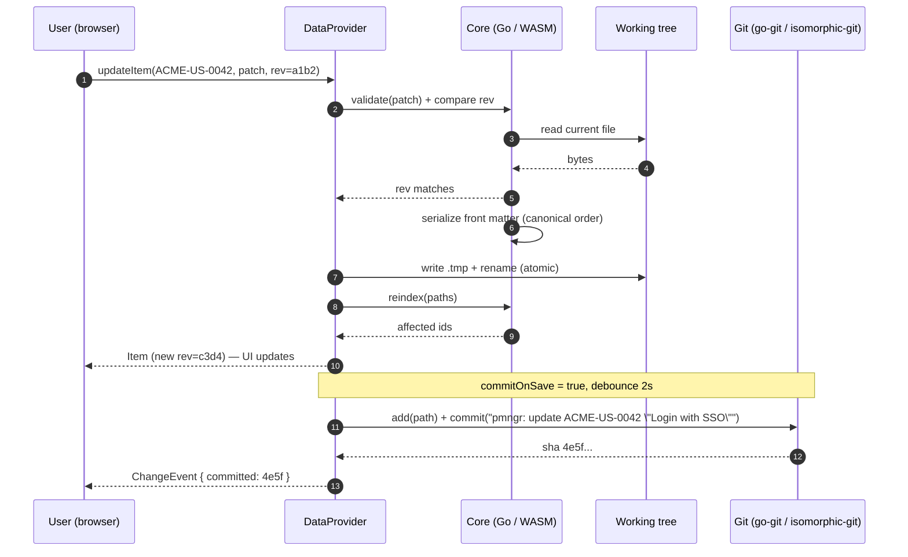
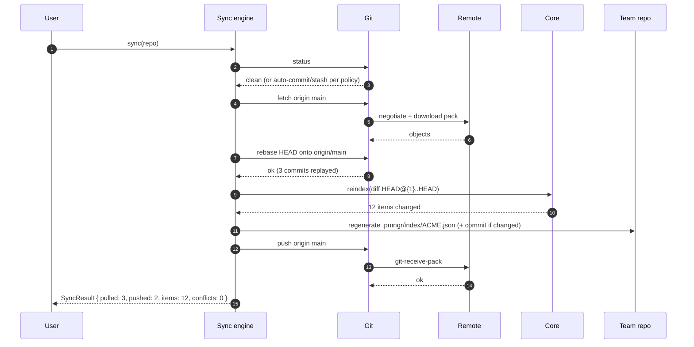
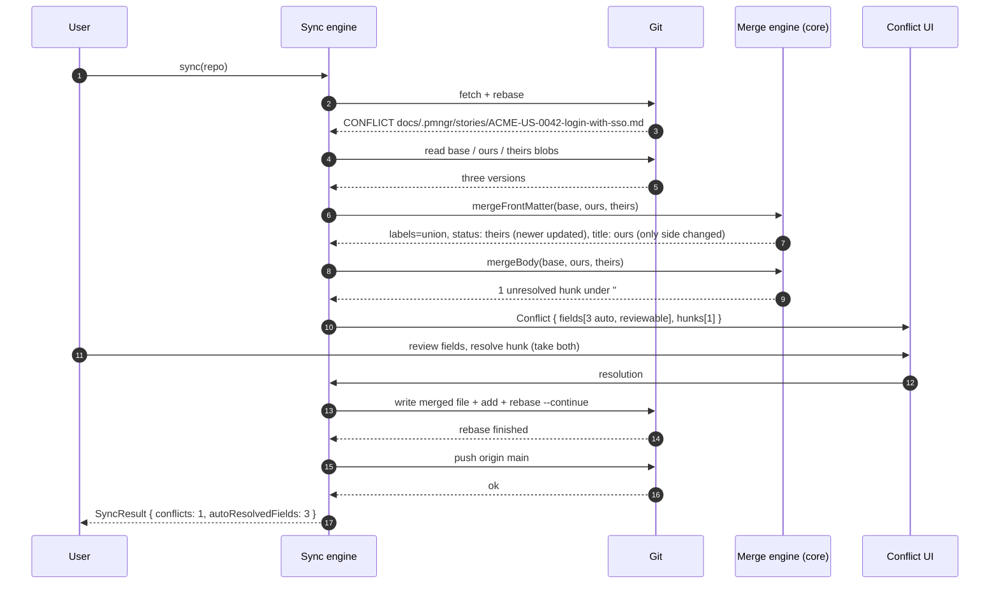
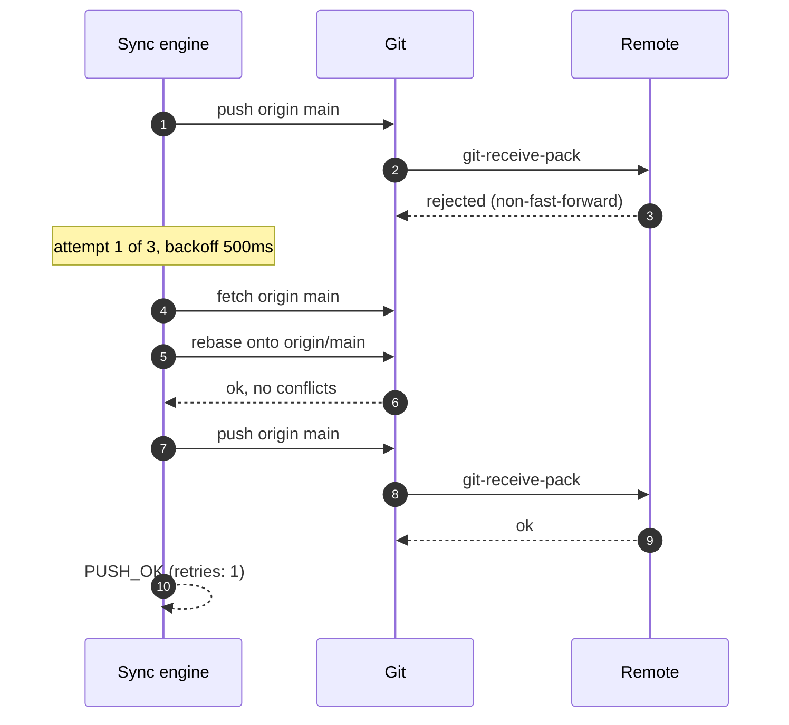

# 06 — Git synchronization design

Status: planning document. Primary target is Phase 4 of the roadmap ("Git sync"),
with hooks placed in Phases 1–3 and multi-user hardening in Phase 6.

## 1. Principle: git is the only sync mechanism

**git-in-track** has no server of its own. There is no database, no sync service,
no account system. Every artifact — epics, stories, tasks, milestones, comments,
boards, sprints, retros, knowledge base pages — is a file in a git repository, and
the only way state moves between people is `fetch` / `merge`-or-`rebase` / `push`
against the repositories they already share.

Consequences that shape everything below:

- **The working tree is the database.** The index is a cache; it can always be
  rebuilt from files. Nothing is authoritative unless it is on disk (and, once
  pushed, on the remote).
- **Any git host works.** GitHub, GitLab, Gitea, Bitbucket, a bare repo over SSH.
  We use no host APIs for data; the optional PR flow (§4.3) is the only place
  where a host-specific link is produced, and it is just a URL.
- **Offline is the normal case.** Edits always succeed locally. Sync is an
  explicit, resumable, interruptible operation.
- **Concurrency is human-scale.** Two people editing the same story minute-to-minute
  is rare; two people editing different stories in the same repo is constant. The
  design optimises for the second and makes the first survivable (§5, §9).
- **Merge semantics live in the data model.** Because items are small files with a
  stable name (`<ID>-<slug>.md`), most concurrent work touches disjoint files and
  git merges them without any help from us.

---

## 2. Repository roles recap

| Repo | Contains | Written by |
|---|---|---|
| Project repo | docs folder (KB) + `<docs>/.pmngr/{project.yaml,epics,stories,tasks,milestones,comments}` | Anyone editing backlog items or KB pages of that project |
| Team repo | `team.yaml`, `knowledge/`, `.pmngr/{boards,sprints,retros,index}` | Anyone moving cards, planning sprints, running retros |

A single user action can touch both repos — moving a card changes the item's
`status` in the project repo and the board's `order:` in the team repo. Those are
two commits in two repositories; they are **not** atomic (§9.4).

---

## 3. Write path (edit → disk → index → optional commit)

### 3.1 Steps

1. **Validate.** The core validates the patched item (known status for the
   project workflow, resolvable `parent`/`milestone`, well-formed dates, allowed
   priority). Invalid writes are rejected before touching disk.
2. **Rev check.** The caller supplies the `rev` it read. The core recomputes the
   current file's `rev` (see §9.1). Mismatch → `409 RevConflict`, no write.
3. **Serialise.** Front matter is re-emitted from the model with a **stable key
   order** and stable YAML style (block lists, no flow collections, 2-space
   indent, unquoted scalars unless required, ISO-8601 UTC timestamps). Body bytes
   are preserved verbatim unless the body itself was edited. `updated` is set to
   now; `rev` is never written.
4. **Atomic file write.** Write to `<name>.md.tmp-<pid/rand>` in the same
   directory, `fsync`, then `rename()` over the target (POSIX atomic). In the
   browser, `createWritable()` + `move()` where available (§ doc 05 §6.2).
5. **Index update.** Incremental reindex of the touched paths; emit a
   `ChangeEvent` so every open UI updates.
6. **Optional commit** (§3.3).

Renames deserve their own note: changing an item's `title` does **not** rename the
file by default (the slug is cosmetic and renames create noisy diffs). A
`rename-on-title-change` setting exists; when on, the write becomes
`git mv`-equivalent (write new, delete old, stage both) so history follows.

### 3.2 Ordering and durability

Writes to a single repo are serialised by a per-repo mutex in the companion, and
by a per-repo promise queue in the browser provider. A batch write
(`updateMany`, `moveCard`) takes the mutex once, writes every file, then indexes
and commits once — that is how a bulk status change becomes one commit instead of
forty.

### 3.3 Commit-on-save

Off by default in Phase 1–3; the setting becomes meaningful in Phase 4.

Settings live in the `git:` section of the companion config (doc 07 §3.2); the
browser stores the same keys per workspace in IndexedDB.

**Implemented in GIT-US-0020** for companion mode; browser mode is §6.5.

```yaml
git:
  commitOnSave: true                # false = leave changes in the working tree
  commitDebounce: 2s                # coalesce rapid saves of the same item
  messageTemplate: 'pmngr: update {{.ItemID}} "{{.Title}}"'
  authorName: ""                    # empty -> repo/global git config
  authorEmail: ""
  signCommits: false                # gpg/ssh signing, system backend only
  pushAfterCommit: false            # push immediately, or wait for an explicit sync
```

Two spellings that this document used to give differently, settled by the
implementation:

- the key is `commitDebounce` and its value is a Go duration (`2s`), matching
  `index.debounce` in the same file; `commitDebounceMs` is the same setting in
  milliseconds and is what the REST and provider surfaces use, because JSON has
  no duration type;
- the key is `messageTemplate`, as doc 07 §3.2 already spelled it.

The template is Go `text/template`, evaluated against a struct with
`.ItemID`, `.Title`, `.Type`, `.Status`, `.PrevStatus`, `.ProjectKey`, `.Board`,
`.Action` (create|update|delete|move|comment), `.Count` (for batches), `.User`,
`.Date`. Every one of them also has a short lowercase spelling bound as a
template function, so `{{action}} {{id}}: {{title}}` and
`{{.Action}} {{.ItemID}}: {{.Title}}` render identically: `id`, `title`, `type`,
`status`, `prevStatus`, `project`, `board`, `action`, `count`, `user`, `date`.
A template naming anything else is refused when it is configured, not when a
commit is attempted. Rendering strips newlines; the subject is truncated to 72
characters with the full title kept in the body.

**Batching.** The coalescing key is the repository plus the item the write is
about. A burst of saves of one item is one commit; two items edited in the same
window are two commits; and one call that writes many files — `updateMany`, a
card move, a sprint edit — is one commit per repository whatever the file count.
A pending batch is never postponed by more than 15 seconds, so steady typing
still produces commits. A batch that covers several items has no single id to
interpolate, so the subject falls back to the built-in `pmngr: <action> N items`
and the body carries `Items: N`. The shipped default is the `pmngr:` form above;
doc 07 §3.2 shows a conventional-commits variant
(`docs({{.ProjectKey}}): update {{.ItemID}} — {{.Title}}`) that teams whose docs
folder sits next to code often prefer. Rendered examples per action:

```
pmngr: create ACME-US-0042 "Login with SSO"
pmngr: update ACME-US-0042 "Login with SSO"
pmngr: move ACME-US-0042 to in_progress (board: team-alpha)
pmngr: comment on ACME-US-0042
pmngr: update 12 items (bulk status change)
pmngr: retro 2026-09-02 actions
```

Commit body (always) carries machine-readable trailers so tooling and agents can
attribute changes without parsing the diff:

```
pmngr: update ACME-US-0042 "Login with SSO"

Item: ACME-US-0042
Type: story
Status: todo -> in_progress
Tool: gintrack 0.4.1 (companion)
```

**Cross-repository writes.** Moving a card writes the item in its project clone
and the board in the team repository. Those are two repositories, so they are two
commits, one in each, and never one commit spanning both — which is also why they
are not atomic (§9.4).

**A failed commit never loses content.** The commit runs after the write has
already reached disk, so it cannot fail a save. A refused commit — a hook, a
missing identity, a broken template — leaves the working tree exactly as the
write left it and is reported as a `git.commit` event and by
`GET /api/v1/git/status`, with the hook's own output when there is one. Because
the commit is debounced it is not part of the write response.

Author selection: empty `authorName`/`authorEmail` uses the repo's
`user.name`/`user.email`
(companion: resolved by go-git's config chain; browser: read from
`.git/config`, falling back to a value the user supplies in settings and which is
stored per repo). Committer is always the same identity as author. If no identity
can be resolved, commits are blocked with an actionable error rather than falling
back to a placeholder identity.

When `commitOnSave` is off, changes accumulate in the working tree and the sync
panel offers "Commit N changes" with a message the user can edit; the same
template renders the default.

---

## 4. Sync operation

### 4.1 The pipeline

`sync(repoId, opts)` is a state machine, resumable and cancellable at every step:

```
PREFLIGHT → FETCH → INTEGRATE (rebase|merge) → [CONFLICTS] → REINDEX → SNAPSHOT → PUSH → DONE
```

1. **PREFLIGHT** — Ensure the working tree is in a known state. If dirty and
   `commitOnSave` is on, commit pending debounced saves first. If dirty and
   commit-on-save is off, either auto-stash (default) or ask, depending on
   `git.dirtyPolicy` (`commit` | `stash` | `ask` | `abort`). Refuse to sync while
   a rebase/merge is already in progress (offer "continue" / "abort" instead).
2. **FETCH** — `fetch <remote> <branch>` with the configured credentials. Prune
   is not enabled by default. Network errors here are non-destructive; the
   operation stops with the tree untouched.
3. **INTEGRATE** — Default **rebase** local commits onto `origin/<branch>`
   (`git.pullStrategy: rebase`, doc 07 §3.2). Rebase keeps history linear, which
   matters because most commits are tiny and mechanical; a merge commit per sync
   would drown the log. `git.pullStrategy: merge` switches to a merge (recommended for teams with protected branches that
   forbid force-pushes after rebase of already-pushed commits — see §4.4).
4. **CONFLICTS** — If integration stops with conflicts, the operation pauses in a
   `CONFLICTS` state; the UI shows the conflicted paths and the resolver (§5).
   Nothing is pushed until every conflict is resolved and the rebase/merge is
   continued or aborted.
5. **REINDEX** — Full incremental reindex of paths changed by the integration
   (from the diff of `HEAD@{before}..HEAD`), so the UI reflects incoming work.
6. **SNAPSHOT** — Team-index regeneration (§8), which may itself produce a commit
   in the team repo.
7. **PUSH** — `push <remote> <branch>` (skipped when `git.pushOnSync: false`,
   which leaves a local-only workflow that still pulls). On non-fast-forward rejection, retry
   (§4.2). On success, update the stored `lastSyncedAt`, `lastPushedSha`.

`SyncResult` reports per-repo: commits pulled, commits pushed, files changed,
items changed (ids), conflicts encountered/resolved, duration, and any warnings.

**As built (GIT-US-0021).** The pipeline is `gitops.Sync`, driven by
`POST /api/v1/sync/run` and by `gintrack sync`. What ships:

- PREFLIGHT commits what commit-on-save batched (`Committer.Flush`) and then
  refuses a run whose tree still has uncommitted changes to *tracked* files,
  with a message naming the two ways out ("Commit changes" in the panel, or
  `gintrack sync --commit-all`). Untracked files never block a run. It also
  refuses a detached HEAD, a repository with no remote, a branch with no
  upstream and a half-finished rebase or merge, each with its own code. This is
  `dirtyPolicy: commit` made explicit and `abort` as the default fallback; the
  `stash` and `ask` policies are not implemented, and the key is not read yet.
- FETCH, INTEGRATE and PUSH are as described, with the retry ladder of §4.2.
- REINDEX needs no step of its own in companion mode: the watcher sees the
  files the integration wrote. In browser mode the provider re-reads the vault
  after a run that pulled anything.
- SNAPSHOT runs after a run that pulled work, in both the CLI (`gintrack sync`,
  rule R-SNAP-6(a) of doc 04 §6) and the companion (`snapshot.refresh`).
- CONFLICTS is detection and reporting only: the paths are named, the rebase or
  merge is left in progress and resumable, and `POST /api/v1/sync/abort` or
  `gintrack sync --abort` restores the tree. The structured resolver is
  GIT-US-0022.
- Branch policy (§4.3) is not implemented: every repository syncs the branch it
  has checked out against its own upstream. `user-branch` mode, `autoPr` and the
  host URL templates arrive with the branch-policy work.

`SyncResult` is filled on failure too — `phase`, `code` and `message` — so the
CLI and the panel report what happened without inspecting an exception. Every
failure leaves a recoverable tree, which is the milestone-5 exit criterion.

### 4.2 Retry on non-fast-forward

Push races are the common failure. Policy:

- On rejection, re-enter FETCH → INTEGRATE → PUSH, up to `git.maxPushRetries`
  (default 3), with jittered backoff (0.5 s, 1.5 s, 4 s).
- Each retry re-runs the *same* integration strategy. If a retry produces
  conflicts, the loop stops and the conflict UI takes over — we never
  auto-resolve inside a retry.
- If retries are exhausted, the sync ends in `PUSH_REJECTED`; local work is
  committed and safe, and the user can retry manually. We never force-push
  automatically. `--force-with-lease` is available only from the CLI, behind an
  explicit flag, and is never exposed in the web UI.

### 4.3 Branch policy

```yaml
git:
  branchMode: default                     # default | user-branch
  userBranchTemplate: 'pmngr/{{.User}}'
  autoPr: false                           # user-branch mode only
```

- **default** (recommended for most teams): everyone works directly on the
  repository's default branch (`main`). This is what makes the tool feel like a
  shared board rather than a code review flow. Requires that the branch is not
  protected against direct pushes.
- **user-branch**: work is committed to `pmngr/<user>` (slugified git user name or
  configured handle). Sync then means: rebase the user branch onto
  `origin/<default>`, push the user branch, and — if `autoPr` — surface a "Create
  pull request" link built from the remote URL (GitHub/GitLab/Gitea/Bitbucket URL
  shapes are templated in `internal/gitops/hosts.go`; we open the browser, we do
  not call any host API). Incoming work still arrives by rebasing onto the
  default branch, so the UI stays current even before the PR merges.
  When the PR merges, the next sync detects the user branch is fully contained in
  the default branch and offers to reset it.
- Branch mode is per repo (protected `main` in the project repo, direct pushes in
  the team repo, is a realistic mix).
- Detached HEAD, or a checked-out branch that differs from the configured one,
  puts the repo in a read-only "unexpected branch" state with a clear explanation
  instead of silently switching branches. We never checkout a different branch
  behind the user's back.

### 4.4 Rebase vs. merge, and already-pushed commits

Rebase is safe while local commits are unpushed. In `user-branch` mode with
`autoPr`, commits are pushed to the user branch and a later rebase would require a
force-push — so in that mode the default strategy flips to `merge` unless the user
opts into `--force-with-lease` pushes for their own branch. The setting resolution
is: an explicit `git.pullStrategy` wins; otherwise the mode default applies
(`default` mode: rebase, `user-branch` mode: merge).

---

## 5. Conflict handling

### 5.1 Where conflicts happen

| Conflict class | Frequency | Handling |
|---|---|---|
| Two people edit different items | Very common | No conflict; git merges disjoint files |
| Two people edit the same item's different front matter fields | Occasional | Front-matter-aware 3-way merge (§5.2) |
| Two people edit the same item's body | Occasional | Side-by-side resolution (§5.3) |
| Two people reorder the same board column | Occasional | Order merge (§5.4) |
| Two people create an item that gets the same ID | Rare but real | ID collision repair (§5.5) |
| Binary asset edited on both sides | Rare | Manual: keep ours / keep theirs |

### 5.2 Front-matter-aware three-way merge

When a `.md` file under `.pmngr/` (or any file with YAML front matter) conflicts,
we do **not** hand the raw conflict markers to the user. Instead the core performs
a structured merge using base, ours, theirs:

Field rules, applied per key:

| Field kind | Fields | Rule |
|---|---|---|
| Immutable | `id`, `type`, `created`, `author` | Base wins; a difference is reported as an anomaly (should not happen; if it does, it means an ID collision — §5.5) |
| Set-like lists | `labels`, `assignees`, `participants` | **Union** of (ours ∪ theirs) minus (base \ ours) minus (base \ theirs) — i.e. additions from both sides are kept, deletions from either side are honoured. Result sorted for stable diffs |
| Ordered lists | `links`, `actions`, `items` (sprint), `order` (board column) | Ordered merge (§5.4); duplicates by identity key collapsed |
| Scalars | `title`, `status`, `priority`, `estimate`, `effort`, `due`, `parent`, `milestone` | If only one side changed → that side. If both changed to the same value → that value. If both changed differently → **newest `updated` wins**, and the losing value is recorded |
| Timestamp | `updated` | `max(ours, theirs)` after the merge, then bumped to now if any manual resolution occurred |
| Unknown keys | anything not in the schema | Preserved; both-changed → newest `updated` wins, flagged in the report |

Every scalar decided by "newest `updated` wins" is surfaced in the resolution UI
as a reviewable row (ours / theirs / chosen) — the merge is automatic but never
silent. The user can flip any row before accepting. `updated` ties (same second)
fall back to: local side loses (the remote already exists for others), and the row
is marked as requiring review.

The merged front matter is re-serialised with the canonical key order, which also
means the *result* of a conflict never contains YAML conflict markers.

### 5.3 Body conflicts

The body is free Markdown, so we fall back to git's own three-way text merge
first. Only hunks that git could not resolve reach the UI. The resolver shows:

- A side-by-side CodeMirror merge view (ours | theirs) with the base available in
  a third tab, per conflicted hunk.
- Per-hunk actions: take ours, take theirs, take both (ours then theirs), edit
  manually.
- Section awareness: because bodies follow conventions (`## Description`,
  `## Acceptance Criteria`, `## Notes`), the resolver labels each hunk with the
  heading it falls under, and offers "take both" as the default suggestion inside
  `## Notes` and `## Acceptance Criteria` (append-only sections in practice).
- Acceptance-criteria checkboxes get special treatment: a hunk that differs only
  in `- [ ]` vs `- [x]` on the same text is auto-resolved to checked (a completed
  criterion stays completed), reported as an auto-decision.

Accepting writes the resolved file, stages it, and continues the rebase/merge.
"Abort" returns the repo to its pre-sync state (`rebase --abort` / `merge --abort`)
and restores any stash.

### 5.4 Ordered-list merge (board order, sprint items, links)

Cards are identified by `ref`. The merge:

1. Compute `added_ours`, `added_theirs`, `removed_ours`, `removed_theirs` against
   base.
2. Start from theirs (the remote order, since others already see it).
3. Remove everything removed on either side.
4. Insert `added_ours` at the position they had relative to their neighbours in
   ours; if the neighbour is gone, append to the end of the same column.
5. If an item moved column on both sides to different columns → scalar rule on the
   item's `status` decides, and the card is placed in the matching column.

The result is order-stable and never loses a card. Cards that ended up somewhere
unexpected are listed in the sync report ("3 cards repositioned by merge").

### 5.5 ID collision repair

IDs are allocated per project by scanning the index for the highest sequence
number for a type (`ACME-US-0042` → next is `0043`). Two people offline can both
allocate `0043`. After a merge, the core runs a collision scan:

- Group items by `id`. A group with more than one file (different paths) is a
  collision.
- Keep the one with the **earliest `created`**; if equal, the one whose file is
  reachable from the older commit; if still equal, lexicographic path order (fully
  deterministic, so every replica repairs identically).
- Re-allocate the other(s) to the next free sequence numbers, rewriting: the file
  name, the `id` field, every `parent`/`links`/`milestone` reference in the same
  project, every board `order`/`ref` and sprint `items` entry in mounted team
  repos, and comment folder names under `.pmngr/comments/<ITEM-ID>/`.
- Produce one commit: `pmngr: resolve id collision ACME-US-0043 -> ACME-US-0044`
  with the full mapping in the body.
- References that live in unmounted repos cannot be rewritten; they are listed in
  the sync report as "stale references may exist" with the mapping so a teammate's
  client can repair them on its next sync (the repair is idempotent).

Mitigation, not just repair: the allocator reserves IDs by *writing the file
immediately* on create (so the ID is taken in the working tree), and, in
`user-branch` mode, an optional `idBlockSize` gives each user a reserved stride
(user A takes `…01, …04, …07`) configured in `project.yaml`.

### 5.6 Anything else

Files we cannot merge structurally (binary assets, deeply broken YAML) fall back
to a plain "keep ours / keep theirs / open externally" choice. `project.yaml`,
`team.yaml` and board headers get the same front-matter-aware treatment as items,
since they are YAML documents with a known schema.

---

## 6. Browser-only mode: `isomorphic-git`

### 6.0 What ships when

Browser-mode git lands with **GIT-US-0021**, which owns the isomorphic-git
integration and the CORS-proxy handling. GIT-US-0020 ships the parts of
commit-on-save that are runtime-independent: the settings are stored per
workspace, the message format is implemented a second time in
`web/src/git/message.ts` against the same cases as the Go renderer, and the
settings UI reports that this runtime cannot commit yet instead of offering a
switch that would do nothing. Nothing about the format has to be revisited when
the commits themselves start happening.

**As built (GIT-US-0021).** What ships in the browser is the *sync* half:
`web/src/git/fsa-fs.ts` is the `fs` adapter over the File System Access handles
(§6.1) and `web/src/git/browser-sync.ts` reads the status and runs fetch, merge
and push over it. The debounced commit-on-save of §3.3 still belongs to the
companion in this build — the settings card says so — because it needs the
write path to enqueue through the git worker rather than the vault. The
integration strategy is forced to `merge` (§6.2) and reported as such, and a
workspace with no configured CORS proxy reports `git_cors_proxy_required`
with the reason instead of attempting a request that a git host will refuse
(§6.3). SSH remotes are refused with their own message. The dedicated git Web
Worker of §6.4 is not split out yet: the operations run on the main thread with
the same abort semantics, which is enough for a backlog-sized repository and is
the next thing to move when it is not.

### 6.1 What works

`isomorphic-git` runs over the File System Access handles via a small `fs` adapter
implementing the `promises` subset it needs (`readFile`, `writeFile`, `unlink`,
`readdir`, `mkdir`, `rmdir`, `stat`, `lstat`, `rename`, `symlink`/`readlink` as
no-ops). Supported operations: `clone`, `fetch`, `pull` (as fetch + merge),
`push`, `add`, `commit`, `status`, `statusMatrix`, `log`, `checkout`, `merge`,
`resolveRef`, `listBranches`. Auth is HTTP basic with a token
(`onAuth: () => ({ username, password: token })`).

### 6.2 What does not work, and what we do about it

| Limitation | Impact | Mitigation |
|---|---|---|
| **No SSH** | `git@host:org/repo.git` remotes cannot be used | Detect SSH remotes at mount time and either ask for an HTTPS remote URL (stored as a per-repo "sync URL" override, since the on-disk `origin` stays SSH) or require the companion |
| **CORS** | Git HTTP endpoints of GitHub/GitLab/Bitbucket do not send CORS headers, so the browser cannot talk to them directly | A CORS proxy is required (§6.3) |
| **No rebase** | `isomorphic-git` has no rebase implementation | Browser mode uses **merge** as the integration strategy, always. The setting is forced and the UI explains why |
| Merge driver is limited | `isomorphic-git`'s merge handles fast-forward and non-conflicting three-way merges; conflicting content merges are limited | We run our own three-way merge (§5.2/§5.3) on the blobs we fetch (`base`, `ours`, `theirs` via `readBlob` at the merge bases), so conflict resolution quality does not depend on the library |
| Performance | Pack negotiation and object inflation in JS; large repos are slow | Shallow clone (`depth: 50`) and `singleBranch: true` by default; index/status via `statusMatrix` scoped to the docs folder, not the whole repo; long operations run in the git worker with progress events |
| Shallow history | `git log` beyond the shallow boundary is unavailable; some merges need a deeper base | On "merge base not found", deepen automatically (`depth *= 4`, up to a cap) and retry once, then tell the user to use the companion |
| No signing, no hooks, no submodules, no LFS | Signed commits and LFS assets are unsupported in browser mode | Documented; the companion covers all of them (LFS via system git) |
| Storage | Objects live in the user's real repo folder, so no extra quota is used, but IndexedDB caches are subject to eviction | `navigator.storage.persist()` at mount |

### 6.3 The CORS proxy

Because `git-upload-pack` / `git-receive-pack` endpoints do not send
`Access-Control-Allow-Origin`, browser git needs a proxy that adds them.

- Default: **no proxy configured**. Git operations in browser mode are disabled
  until the user sets one, with an explanation and a link to this document. We do
  not silently route repository traffic — including credentials — through a
  third-party host.
- `isomorphic-git`'s public `https://cors.isomorphic-git.org` is offered only as
  an explicitly-chosen convenience for public repositories, with a warning that
  the proxy sees the traffic and any token sent with it.
- **Recommended: self-host.** `@isomorphic-git/cors-proxy` behind the team's own
  domain, or the reverse-proxy snippet we ship in the docs (nginx/Caddy config
  that forwards only `/*/info/refs`, `/*/git-upload-pack`, `/*/git-receive-pack`
  to an allowlisted set of hosts and adds the CORS headers). The companion also
  serves one at `http://127.0.0.1:7317/cors-proxy/` when running, which makes the
  hybrid "browser UI + local companion for networking" setup work with zero extra
  infrastructure.
- Proxy configuration is per workspace, with an optional per-repo override, and is
  validated at save time by a preflight request against the repo's `info/refs`.
- Self-hosted git servers that already send permissive CORS headers can be used
  with no proxy at all; the mount wizard probes for this and skips the proxy step.

### 6.4 Browser git worker

Git runs in its own Web Worker (separate from the core WASM worker) so a clone or
push never blocks parsing or the UI. Progress events (`phase`, `loaded`, `total`)
stream to the sync panel. Cancellation aborts the underlying `fetch` via an
`AbortController`, and any partially-written objects are cleaned by the next
operation (`git` object writes are content-addressed, so partial state is inert).

---

## 7. Companion mode: `go-git` and system git

### 7.1 Two backends

`internal/gitops` defines a `Git` interface implemented twice:

- **`go-git`**: pure Go, no external dependency. Used for status, log, diff,
  commit, and for fetch/push over HTTPS and SSH.
- **`system`**: shells out to the `git` binary.

`git.backend` selects between them: `auto` (the default — use system git when a
compatible binary is on `PATH`, else go-git), `go-git`, or `system`.

`internal/gitops` binds one `Backend` to one working tree, so the caller passes
no repository path per call. It exposes `Name`, `Path`, `Capabilities`,
`Identity`, `Status` and `Commit` (GIT-US-0020) plus the sync half added by
GIT-US-0021: `SyncStatus`, `Fetch`, `Integrate`, `Push`, `Abort`, `Continue`
and `Commits`. The structured conflict surface — reading the base/ours/theirs
blobs of a conflicted path and continuing from a resolution — is GIT-US-0022 and
is still deliberately absent rather than declared and unimplemented.

A third go-git gap matters to sync, on top of the two below: **go-git has no
rebase, and its merge is fast-forward only.** The go-git backend therefore
fast-forwards when it can and fails with `git_unsupported` and an actionable
message when it cannot, rather than half-applying an integration; `Abort` and
`Continue` are likewise system-only. With the default `auto` backend a machine
that has git never lands there.

Two go-git gaps that matter to commit-on-save, both invisible with the default
`auto` backend on a machine that has git:

- **no hooks and no signing.** `signCommits: true` with the go-git backend fails
  with `git_unsupported` instead of writing an unsigned commit that pretends to
  be signed;
- **no pathspec commit.** go-git commits the whole index, so a change the user
  staged by hand before the debounce window elapsed is swept into our commit.
  The system backend uses `git commit --only -- <paths>` and does not have this
  problem.

`auto` matters because system git brings things go-git does not: credential
helpers, `~/.gitconfig` includes, `insteadOf` rewrites, LFS, sparse checkout,
commit signing with the user's existing gpg/ssh setup, hooks, and battle-tested
rebase. Operations that are *only* correct with system git (rebase with
`--rebase-merges`, LFS smudge, signing) are gated on it; when unavailable, we
degrade explicitly (merge instead of rebase, unsigned commits with a warning).

### 7.2 SSH

go-git uses `golang.org/x/crypto/ssh`:

- `SSH_AUTH_SOCK` (ssh-agent) first — this is the path that works with hardware
  keys and passphrase-protected keys without prompting.
- Then `~/.ssh/config` for `Host` aliases, `IdentityFile`, `User`, `Port`,
  `ProxyJump` is *not* supported by go-git and forces the `system` backend.
- Then default key paths (`id_ed25519`, `id_rsa`); passphrase-protected keys
  prompt on the CLI (never in the web UI, which cannot be trusted with a key
  passphrase over a local HTTP hop unless the user opts in).
- Host key verification against `~/.ssh/known_hosts`, strict by default. An
  unknown host fails with the fingerprint shown and a CLI command to accept it;
  we never auto-accept.

### 7.3 HTTPS and credential helpers

With the `system` backend, credentials come from the configured `credential.helper`
(osxkeychain, libsecret, manager, cache) and we never see them. With `go-git`, we
read the same helpers ourselves by invoking `git credential fill` when a git
binary exists; otherwise we fall back to our own keychain storage (§8.1). Tokens
are always sent as HTTP basic (`x-access-token:<token>` for GitHub-style hosts,
`oauth2:<token>` for GitLab); the exact username shape is per-host and lives in
`internal/gitops/hosts.go`.

---

## 8. Credentials

### 8.1 CLI / companion

Order of preference:

1. `git credential fill` (the user's existing helper) — nothing new is stored.
2. OS keychain via `go-keyring` (macOS Keychain, Windows Credential Manager,
   libsecret/kwallet on Linux) under service `gintrack`, account
   `<scheme>://<host>/<owner>`.
3. Environment variables (`GINTRACK_TOKEN`, `GITHUB_TOKEN`, …) for CI and
   headless use.
4. Prompt on the terminal, with an explicit "save to keychain?" question.

On Linux without a secret service, we refuse to write a plaintext credentials file
by default; `--allow-plaintext-credentials` writes `~/.config/gintrack/credentials`
with mode 0600 and a loud warning. Tokens are never logged, never included in
error messages, and are redacted from remote URLs before display.

### 8.2 Browser

Two modes, chosen by the user at first git operation:

- **Session only** (default): the token lives in memory for the tab's lifetime,
  in a closure inside the git worker, never in `localStorage`/`sessionStorage`.
  Reloading asks again.
- **Encrypted at rest**: the token is encrypted with AES-GCM using a key derived
  from a user passphrase via PBKDF2-SHA-256 (≥ 600 000 iterations) or Argon2id
  (WASM) with a random 16-byte salt, and stored in IndexedDB as
  `{ salt, iv, ciphertext, kdf, iterations, createdAt }`. The passphrase is asked
  once per session and the derived key is kept as a non-extractable `CryptoKey`.
  We state plainly in the UI that this protects against casual access to the
  device, not against a compromised browser or an XSS in this app — which is why
  the sanitisation schema in doc 05 §7 is strict and there is no third-party
  script in the bundle.
- WebAuthn PRF-derived keys are an intended Phase 6 improvement (unlock with the
  device's biometric instead of a passphrase).
- Tokens are scoped as narrowly as the host allows (repo-scoped fine-grained PAT
  on GitHub, project access token on GitLab) — the docs tell the user exactly
  which scopes are needed (`contents: read/write` only).
- "Forget credentials" clears both the in-memory copy and the IndexedDB record,
  and is also triggered by unmounting the repo.

---

## 9. Real-time propagation and consistency

### 9.1 `rev`

`rev` is a content hash over the whole file, computed by readers and never stored
(doc 03 §5, rule `R-REV-1`):

```
canonical_bytes = file bytes, BOM removed, CRLF -> LF, exactly one trailing LF
rev             = "sha256:" + lowercase_hex(sha256(canonical_bytes))[0:16]
```

Because the write path always re-serialises front matter canonically (stable key
order, block lists, ISO-8601 UTC), two clients that hold the same logical item
compute the same `rev`, so a no-op write is detectable and cheap. Every read
returns `rev`; every update carries it (`If-Match` over REST, `expected_rev` over
MCP). Mismatch → `409 stale_revision` with the current `rev` and front matter in
the payload, and the UI shows a diff instead of overwriting. `rev` is a pure
function of content: it is never ordered, never persisted, and never used as a
version number.

### 9.2 Change propagation in companion mode

```
editor/agent/git writes file
  → fsnotify event (internal/watcher)
  → debounce (`index.debounceMs`, default 250 ms) per path, coalesce bursts,
    drop events for ignored paths
  → incremental reindex of changed paths (core)
  → WebSocket broadcast on /api/v1/events:
       { type: 'file.changed', ... } then { type: 'item.changed', origin: 'watcher', ... }
  → web app invalidates the narrowest TanStack Query keys
     (events carrying origin:'api' and the caller's request id are skipped by the
      tab that caused them, so its optimistic update is not echoed)
```

Watcher details that matter in practice:

- Ignored: `.git/**` (except `.git/HEAD`, `.git/refs/**` and `.git/MERGE_HEAD`,
  which we *do* watch to detect branch switches and external commits),
  `node_modules/**`, `*.tmp`, `*.swp`, `*.swx`, `.#*`, `#*#`, `4913`,
  `.DS_Store`, plus user globs.
- Editors write via rename (Vim, VS Code atomic save), so we treat
  `CREATE`+`RENAME` on a `.tmp`/`~` sibling as a single write of the target and
  we re-`stat` before parsing to avoid reading a half-written file.
- Debounce is per path with a 500 ms cap on the coalescing window, so a `git
  checkout` that touches 500 files produces one batch reindex, not 500.
- Watcher descriptor exhaustion (inotify limits) degrades to a 5 s polling scan of
  the docs folder with a warning in the UI.
- Our own writes are tagged with an "expected write" set so the round trip does
  not cause a redundant reindex — but the event is still emitted to other clients.

In browser-only mode there is no watcher: changes made outside the app are picked
up on window focus (a cheap metadata crawl comparing size/mtime) and after every
git operation.

### 9.3 Consistency model

**Eventual consistency with optimistic concurrency.**

- No locks. Two people can edit the same item; the loser of a `rev` check is told
  before writing, and a merge that reaches git is resolved by §5.
- **Last-writer-wins applies only to scalars**, and only when both sides changed
  the same scalar since the common ancestor, decided by `updated`. Lists are
  merged by union/ordered-merge; bodies are merged textually; nothing is silently
  dropped without appearing in the sync report.
- Clock skew is real: `updated` comes from the writer's clock. We record commit
  time as a tie-break signal and warn when a merge sees an `updated` more than
  10 minutes in the future relative to local time ("check the clock on <host>").
- Reads are always local. A user sees their own writes immediately (read-your-writes),
  and everyone else's after a sync. The UI never pretends otherwise: every screen
  that shows shared state shows "synced <relative time> ago" and the ahead/behind
  counters.

### 9.4 Cross-repository operations

Moving a card writes two repos. If the project-repo write succeeds and the
team-repo write fails (or vice versa), we do not roll back — instead the operation
is recorded in a local journal (`.gintrack/pending-ops.json`, git-ignored) and the
sync panel shows "1 incomplete operation" with a retry. On retry the operation is
idempotent (setting a status that is already set, or an order entry that already
exists, is a no-op). The same journal makes the operation survive a crash.

---

## 10. Team index snapshots

`.pmngr/index/<projectKey>.json` in the **team repo** lets boards render cards for
projects a given user has not cloned (doc 05 §9).

Shape:

```json
{
  "schema": 1,
  "projectKey": "ACME",
  "remote": "https://github.com/acme/webapp.git",
  "branch": "main",
  "docsPath": "docs",
  "generatedAt": "2026-09-03T09:12:44Z",
  "generatedBy": "jose@digio.es",
  "sourceCommit": "9f2c1ab…",
  "items": [
    {
      "id": "ACME-US-0042",
      "type": "story",
      "title": "Login with SSO",
      "status": "in_progress",
      "priority": "high",
      "assignees": ["jose"],
      "labels": ["auth"],
      "milestone": "M2",
      "parent": "ACME-EP-0003",
      "estimate": 5,
      "updated": "2026-09-02T16:40:11Z",
      "path": "docs/.pmngr/stories/ACME-US-0042-login-with-sso.md",
      "url": "https://github.com/acme/webapp/blob/main/docs/.pmngr/stories/ACME-US-0042-login-with-sso.md"
    }
  ]
}
```

Rules:

- **Front matter only.** No bodies, no comments — the snapshot is a display cache,
  not a copy of the backlog. Size is bounded (a 2 000-item project is ~400 KB;
  above `snapshot.maxItems` the file is truncated to the items referenced by team
  boards plus their parents).
- **Deterministic serialisation** (sorted keys, sorted items by id, 2-space
  indent, trailing newline) so unchanged content produces a zero-byte diff and no
  commit.
- **Regenerated on sync** of a mounted project repo, by whoever has that repo
  mounted, and committed to the team repo with
  `pmngr: index snapshot ACME @ 9f2c1ab`. If the content is unchanged, no commit.
- **Merge rule:** snapshots conflict often (two people regenerate the same file).
  Resolution is trivially deterministic: keep the snapshot whose `sourceCommit` is
  a descendant of the other in the project repo, if that can be determined
  locally; otherwise keep the newer `generatedAt`. This rule is implemented as a
  dedicated merge driver in the core so the UI never asks about it.
- **Staleness:** the UI shows the snapshot age on remote cards and warns above
  `snapshot.staleAfterDays` (default 7). Users with the project mounted see live
  data and never the snapshot.
- Snapshots are advisory. A remote card is never editable, and item counts derived
  from snapshots are labelled as such in metrics.

---

## 11. Sequence diagrams

### 11.1 Save (with commit-on-save)



### 11.2 Sync (clean case)



### 11.3 Sync with conflict



### 11.4 Push race



---

## 12. Failure modes and recovery

| # | Failure | Detection | User-visible behaviour | Recovery |
|---|---|---|---|---|
| 1 | Network unreachable during fetch | Transport error before any ref update | "Offline — local changes are safe", sync button shows retry | Retry; work continues offline. Nothing was modified |
| 2 | Auth failure (401/403) | HTTP status from the transport | Credential dialog with the host and required scopes | Re-enter token / fix SSH key; "Forget credentials" clears the bad one |
| 3 | Unknown SSH host key | go-git host key callback | Fingerprint shown, sync aborted | User accepts explicitly (CLI command shown); never auto-accepted |
| 4 | Push rejected, non-fast-forward | Remote rejection | Automatic fetch+integrate+retry ×3 | Manual retry; local commits are intact |
| 5 | Push rejected, protected branch | Remote rejection with a policy message | Suggest switching this repo to `user-branch` mode | Change branch policy; existing commits are cherry-picked to the user branch |
| 6 | Rebase conflict | Git stops with conflicted paths | Conflict UI (§5), sync paused in `CONFLICTS` | Resolve and continue, or abort (tree restored, stash reapplied) |
| 7 | Conflict in a file we cannot merge (binary/broken YAML) | Structured merge fails | "Keep ours / keep theirs / open externally" | Manual choice; the raw conflicted file is available |
| 8 | Interrupted rebase (crash, power loss) | `.git/rebase-merge` present at startup | Repo enters "rebase in progress" state, editing disabled | "Continue" or "Abort" from the sync panel; both are plain git operations |
| 9 | Dirty tree at sync time | `status` before fetch | Per `git.dirtyPolicy`: commit, stash, ask, or abort | Auto-stash is restored after integration; a failed restore leaves the stash listed with its ref |
| 10 | Working tree modified externally mid-write | `rev` recomputed just before write | `409 stale_revision` and a diff dialog instead of an overwrite | Reload the item or merge manually |
| 11 | ID collision after merge | Post-merge collision scan | Banner "IDs repaired" + a mapping list | Automatic, deterministic repair commit; unmounted repos reported as possibly stale |
| 12 | Corrupted / partial index | Index digest mismatch or parse panic | "Rebuilding index…" | Full reindex from files; the index is always disposable |
| 13 | Corrupted git object store | go-git/isomorphic-git object error | Blocking error with the exact `git fsck` command | Manual repair or re-clone; we never rewrite the object store ourselves |
| 14 | Merge base not found (shallow clone) | Browser mode, merge base lookup fails | "Deepening history…" then retry once | Auto-deepen; if it still fails, "use the companion" guidance |
| 15 | CORS proxy missing or refusing | Preflight failure on `info/refs` | Git disabled in browser mode with a link to §6.3 | Configure a proxy, or run the companion (which serves one) |
| 16 | File System Access permission revoked | `queryPermission` returns `prompt`/`denied` | Repo in `needs-permission` state, single "Reconnect folders" button | Re-grant in one user gesture; handles are preserved |
| 17 | Companion stopped mid-session | WebSocket close + 3 failed probes | Read-only banner, cached data still visible | Restart `gintrack serve` (auto-reconnect) or fall back to browser mode |
| 18 | Companion and browser both writing the same repo | Both use `rev` checks and per-repo mutexes | The second writer gets `409` | Retry after refresh; documented as supported but discouraged |
| 19 | Clock skew across machines | `updated` far in the future during merge | Warning in the sync report, tie-break uses commit time | Fix the clock; the merge still completes deterministically |
| 20 | Team-index snapshot conflict | Merge conflict on `.pmngr/index/*.json` | Resolved automatically by the snapshot merge rule (§10) | None needed; reported in the sync log |
| 21 | Half-completed cross-repo move | Journal entry left in `pending-ops.json` | "1 incomplete operation" with retry | Idempotent retry, or discard the journal entry |
| 22 | Disk full during write | Write/rename error | Save fails loudly, the original file is untouched (temp file discarded) | Free space and retry; the editor buffer and its draft are preserved |
| 23 | Very large repo makes browser git unusable | Operation exceeds the time budget | "This repository is too large for browser git" with measured numbers | Install the companion; the KB/backlog remain usable read-write without git |
| 24 | Force-push on the remote rewrote history | Local branch and remote diverge with no common recent base | Explicit "history rewritten upstream" dialog, never an automatic reset | Choose "rebase my commits onto the new history" or "keep mine on a rescue branch" |

---

## 13. Configuration reference (sync-related)

The canonical config file and its location are defined in doc 07 §3. The keys
below are the sync-relevant subset; keys marked *(new)* are introduced by this
document and extend that schema.

```yaml
# ~/.config/gintrack/config.yaml (see doc 07 §3.1 for platform paths)
version: 1

git:
  backend: auto                 # auto | go-git | system
  pullStrategy: rebase          # rebase | merge (forced to merge in browser-only mode)
  pushOnSync: true
  commitOnSave: false
  messageTemplate: 'pmngr: update {{.ItemID}} "{{.Title}}"'
  authorName: ""                # empty -> repo/global git config
  authorEmail: ""
  signCommits: false            # system backend only
  commitDebounce: 2s            # coalesce rapid saves of the same item

  # --- new in this document ---
  pushAfterCommit: false        # (new) push right after a commit-on-save
  # pullStrategy, pushOnSync and maxPushRetries above are read as built
  # (GIT-US-0021); the keys below are still declarative unless marked.
  branchMode: default           # (new) default | user-branch
  userBranchTemplate: 'pmngr/{{.User}}'   # (new)
  autoPr: false                 # (new) user-branch mode only
  dirtyPolicy: commit           # (new) commit | stash | ask | abort — not read yet:
                                # the effective behaviour is "commit what
                                # commit-on-save batched, then abort with an
                                # actionable message" (§4.1)
  maxPushRetries: 3             # (new)
  autoSyncIntervalMinutes: 0    # (new) 0 = manual sync only
  renameOnTitleChange: false    # (new) see §3.1
  corsProxy: ""                 # (new) required for browser-mode git over HTTPS.
                                # The browser stores it per workspace rather
                                # than in this file, which the companion owns
  cloneDepth: 50                # (new) browser-mode shallow clone depth

credentials:                    # (new section)
  store: keychain               # keychain | helper | env | prompt | plaintext(unsafe)

snapshot:                       # (new section, see §10)
  enabled: true
  maxItems: 2000
  staleAfterDays: 7

index:
  debounceMs: 250
  ignore:
    - ".git/**"
    - "node_modules/**"
    - "**/*.tmp"
    - "**/.DS_Store"
```

Per-repo overrides live in the workspace repo entry (`workspaces[].repos[]`) using
the same key names under a `git:` sub-map — a realistic mix is `branchMode:
user-branch` on a project repo with a protected `main` and `branchMode: default`
on the team repo.

---

## 14. Phase mapping

| Phase | Sync deliverables |
|---|---|
| 1 | Atomic writes, canonical serialisation, `rev` computation and checks. No git yet |
| 2 | fsnotify watcher, debounce, WS change events, external-change detection including `.git/HEAD` |
| 3 | Team-index snapshot generation and its deterministic merge rule; cross-repo operation journal |
| 4 | Commit-on-save and the two native backends (GIT-US-0020, done); the sync pipeline — fetch, rebase or merge, push, retries, dry run, status indicator — plus isomorphic-git browser sync and the CORS-proxy handling (GIT-US-0021, done; branch policy §4.3 deferred); front-matter-aware merge, conflict UI, ID collision repair (GIT-US-0022); credential storage in both runtimes (GIT-US-0023) |
| 5 | MCP writes go through exactly the same write path and `rev` checks; agent-authored commits carry a `Tool:` trailer identifying the agent |
| 6 | Auto-sync interval, WebAuthn-protected browser credentials, sync metrics in the dashboard, force-push recovery flow polish |

---

## 15. Explicit non-goals

- No central server, no hosted service, no realtime collaborative editing (no CRDT,
  no OT). Two people typing in the same body at the same second is a conflict, and
  that is acceptable for this workload.
- No host APIs for data (issues, projects). Import/export bridges may come later,
  but they are conversions, not sync.
- No rewriting of user history. We never `rebase --root`, never `filter-branch`,
  never force-push without an explicit, per-operation user decision on the CLI.
- No credential exfiltration path: tokens never leave the machine except to the
  git host (or the user-configured CORS proxy), and never appear in logs, commit
  messages, or telemetry (there is no telemetry).
