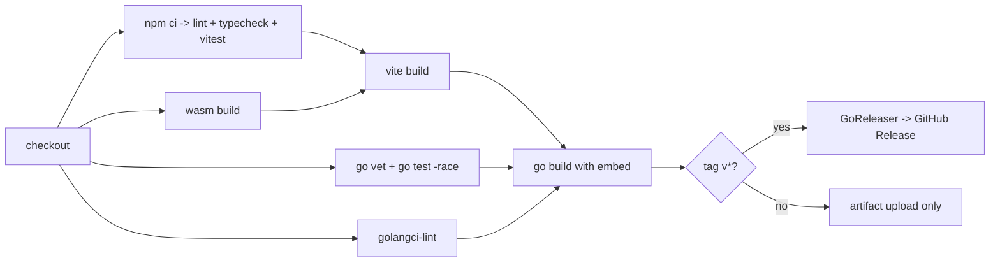

# 09 — CI/CD and Releases

This document defines how **git-in-track** is built, verified and released. It contains
complete, ready-to-copy YAML for the GitHub Actions workflows and for GoReleaser, plus the
versioning policy, branch strategy, release checklist and the distribution channels planned
for later phases.

> Status: planning. The workflow files below are **not** yet committed to
> `.github/workflows/`. They live here until Phase 0 (Foundations) creates the repository
> scaffold, at which point they are copied verbatim to their real paths.

- Module path: `github.com/digiogithub/git-in-track`
- CLI binary: `gintrack`
- Toolchain: Go 1.23+, Node 22, npm
- Build artifacts: `web/dist` (Vite bundle), `web/public/core.wasm` (Go → WASM core),
  `gintrack` (single static binary embedding `web/dist` via `go:embed`)

---

## 1. Build pipeline overview

The build has a strict order, because the Go binary embeds the frontend and the frontend
ships the WASM core:

```
1. wasm    GOOS=js GOARCH=wasm go build -o web/public/core.wasm ./wasm
2. web     npm ci && npm run build            -> web/dist
3. build   go build -tags embed ./cmd/gintrack -> gintrack (embeds web/dist)
```

Any pipeline that produces a runnable binary must run these three steps in this order.
CI additionally runs the verification steps (vet, lint, typecheck, unit tests) which are
order-independent and are parallelised across jobs.



---

## 2. `.github/workflows/ci.yml`

> **Repository status.** The workflows below are committed under `.github/workflows/` from day
> one. Because the code scaffold does not exist yet, each workflow starts with a `preflight` job
> that checks for `go.mod` and `web/package.json` and skips every other job (with a notice) when
> they are missing. Once the Phase 0 scaffold lands, the guard becomes a no-op and the pipelines
> run exactly as documented here. The guard can be removed after 1.0.

Runs on every push to `main` and on every pull request. Fails fast on formatting and
static analysis, then runs the full test suite and a real build.

```yaml
name: CI

on:
  push:
    branches: [main]
  pull_request:
    branches: [main]
  workflow_dispatch:

permissions:
  contents: read

concurrency:
  group: ci-${{ github.workflow }}-${{ github.ref }}
  cancel-in-progress: true

env:
  GO_VERSION: "1.23"
  NODE_VERSION: "22"

jobs:
  go:
    name: Go (vet, test, lint)
    runs-on: ubuntu-latest
    steps:
      - name: Checkout
        uses: actions/checkout@v4

      - name: Set up Go
        uses: actions/setup-go@v5
        with:
          go-version: ${{ env.GO_VERSION }}
          cache: true
          cache-dependency-path: go.sum

      - name: Download modules
        run: go mod download

      - name: Verify go.mod is tidy
        run: |
          go mod tidy
          git diff --exit-code -- go.mod go.sum

      - name: Check gofmt
        run: |
          unformatted=$(gofmt -l . | grep -v '^web/' || true)
          if [ -n "$unformatted" ]; then
            echo "These files are not gofmt'ed:"
            echo "$unformatted"
            exit 1
          fi

      - name: go vet
        run: go vet ./...

      - name: go test (race + coverage)
        run: go test -race -covermode=atomic -coverprofile=coverage.out ./...

      - name: Upload coverage artifact
        uses: actions/upload-artifact@v4
        with:
          name: go-coverage
          path: coverage.out
          retention-days: 7

      - name: golangci-lint
        uses: golangci/golangci-lint-action@v6
        with:
          version: v1.61.0
          args: --timeout=5m

  web:
    name: Web (lint, typecheck, test, build)
    runs-on: ubuntu-latest
    defaults:
      run:
        working-directory: web
    steps:
      - name: Checkout
        uses: actions/checkout@v4

      - name: Set up Node
        uses: actions/setup-node@v4
        with:
          node-version: ${{ env.NODE_VERSION }}
          cache: npm
          cache-dependency-path: web/package-lock.json

      - name: Install dependencies
        run: npm ci

      - name: ESLint
        run: npm run lint

      - name: TypeScript typecheck
        run: npm run typecheck

      - name: Unit tests (vitest)
        run: npm run test -- --run --coverage

      - name: Vite build
        run: npm run build

      - name: Upload web bundle
        uses: actions/upload-artifact@v4
        with:
          name: web-dist
          path: web/dist
          retention-days: 7

  wasm:
    name: WASM core
    runs-on: ubuntu-latest
    steps:
      - name: Checkout
        uses: actions/checkout@v4

      - name: Set up Go
        uses: actions/setup-go@v5
        with:
          go-version: ${{ env.GO_VERSION }}
          cache: true
          cache-dependency-path: go.sum

      - name: Build core.wasm
        env:
          GOOS: js
          GOARCH: wasm
        run: go build -trimpath -o core.wasm ./wasm

      - name: Report size
        run: ls -lh core.wasm

      - name: Upload core.wasm
        uses: actions/upload-artifact@v4
        with:
          name: core-wasm
          path: core.wasm
          retention-days: 7

  build:
    name: Full build (embed frontend)
    runs-on: ubuntu-latest
    needs: [go, web, wasm]
    steps:
      - name: Checkout
        uses: actions/checkout@v4

      - name: Set up Go
        uses: actions/setup-go@v5
        with:
          go-version: ${{ env.GO_VERSION }}
          cache: true
          cache-dependency-path: go.sum

      - name: Set up Node
        uses: actions/setup-node@v4
        with:
          node-version: ${{ env.NODE_VERSION }}
          cache: npm
          cache-dependency-path: web/package-lock.json

      - name: Build WASM core into web/public
        env:
          GOOS: js
          GOARCH: wasm
        run: go build -trimpath -o web/public/core.wasm ./wasm

      - name: Build web bundle
        working-directory: web
        run: |
          npm ci
          npm run build

      - name: Build gintrack binary
        env:
          CGO_ENABLED: "0"
        run: |
          go build -trimpath \
            -ldflags "-s -w -X main.version=ci -X main.commit=${{ github.sha }} -X main.date=$(date -u +%Y-%m-%dT%H:%M:%SZ)" \
            -o dist/gintrack ./cmd/gintrack

      - name: Smoke test
        run: |
          ./dist/gintrack version
          ./dist/gintrack --help

      - name: Upload dev binary
        uses: actions/upload-artifact@v4
        with:
          name: gintrack-linux-amd64-dev
          path: dist/gintrack
          retention-days: 7
```

### Notes on the CI workflow

- **Caching**: `actions/setup-go@v5` with `cache: true` caches both the module cache and
  the build cache, keyed on `go.sum`. `actions/setup-node@v4` with `cache: npm` caches the
  npm cache directory keyed on `web/package-lock.json`. No manual `actions/cache` step is
  needed.
- **`concurrency`** cancels superseded runs on the same branch/PR, which keeps queue times
  low on a small open-source project.
- **`permissions: contents: read`** — CI never needs write access.
- **`go mod tidy` check** prevents drift between imports and `go.mod`.
- The `build` job depends on all three verification jobs so that a broken lint/test never
  produces a downloadable artifact.
- Later phases add a `e2e` job running Playwright against `gintrack serve` (Phase 2+) and a
  `matrix` of `ubuntu-latest`, `macos-latest`, `windows-latest` for the Go job once file
  watching is implemented (Phase 2), because `fsnotify` behaviour is platform specific.

---

## 3. `.github/workflows/release.yml`

Triggered by pushing a tag matching `v*`. Builds the frontend and the WASM core first,
then hands over to GoReleaser, which cross-compiles, archives, checksums, generates the
changelog and publishes the GitHub Release.

```yaml
name: Release

on:
  push:
    tags:
      - "v*"

permissions:
  contents: write

env:
  GO_VERSION: "1.23"
  NODE_VERSION: "22"

jobs:
  release:
    name: Build and publish release
    runs-on: ubuntu-latest
    steps:
      - name: Checkout (full history for changelog)
        uses: actions/checkout@v4
        with:
          fetch-depth: 0

      - name: Set up Go
        uses: actions/setup-go@v5
        with:
          go-version: ${{ env.GO_VERSION }}
          cache: true
          cache-dependency-path: go.sum

      - name: Set up Node
        uses: actions/setup-node@v4
        with:
          node-version: ${{ env.NODE_VERSION }}
          cache: npm
          cache-dependency-path: web/package-lock.json

      - name: Build WASM core
        env:
          GOOS: js
          GOARCH: wasm
        run: go build -trimpath -o web/public/core.wasm ./wasm

      - name: Build web bundle
        working-directory: web
        run: |
          npm ci
          npm run build

      - name: Verify embedded assets exist
        run: |
          test -f web/dist/index.html
          test -f web/dist/core.wasm || test -f web/public/core.wasm

      - name: Run GoReleaser
        uses: goreleaser/goreleaser-action@v6
        with:
          distribution: goreleaser
          version: "~> v2"
          args: release --clean
        env:
          GITHUB_TOKEN: ${{ secrets.GITHUB_TOKEN }}
```

### Snapshot job (optional, for `main`)

A nightly or manual snapshot build is useful to catch cross-compilation breakage before a
tag is cut. It is the same workflow with `args: release --snapshot --clean --skip=publish`
and no `contents: write` permission.

---

## 4. Artifacts are unsigned

**git-in-track releases are not code-signed and not notarized.** There is no Apple
Developer ID certificate, no Windows Authenticode certificate and no notarization step in
the release pipeline. This is a deliberate choice for the initial releases: certificates
cost money, require a legal entity and secrets management, and would gate the project on
non-technical work.

The consequence is that operating systems will warn users on first launch. Integrity is
instead verified through `checksums.txt`, which is published with every release, and
through the fact that every artifact is built by a public GitHub Actions run from a public
tag.

### macOS (Gatekeeper)

Downloaded archives carry the `com.apple.quarantine` attribute, so the first run reports
that the binary "cannot be opened because the developer cannot be verified".

```bash
# Option A — remove the quarantine attribute after extracting
xattr -d com.apple.quarantine ./gintrack

# Option B — approve once via System Settings
#   Run ./gintrack, let it be blocked, then open
#   System Settings > Privacy & Security > "Open Anyway"

# Option C — install via Homebrew tap (Phase 6), which strips quarantine for you
```

Verify the download first:

```bash
shasum -a 256 -c checksums.txt --ignore-missing
```

### Windows (SmartScreen)

Windows Defender SmartScreen shows a "Windows protected your PC" dialog for unrecognised
publishers. Users click **More info** → **Run anyway**. Alternatively, unblock the archive
before extracting:

```powershell
Unblock-File -Path .\gintrack_1.0.0_windows_amd64.zip
Get-FileHash .\gintrack.exe -Algorithm SHA256
```

### Linux

No signature checks apply. Users should still verify the checksum and mark the binary
executable:

```bash
sha256sum -c checksums.txt --ignore-missing
chmod +x gintrack
```

The release notes template repeats these instructions for every release so users never
have to search for them.

---

## 5. `.goreleaser.yaml`

GoReleaser v2 configuration. CGO is disabled everywhere so the binaries are fully static
and cross-compilation needs no C toolchain. `before.hooks` rebuild the WASM core and the
web bundle so that a local `goreleaser release --snapshot` reproduces CI exactly.

```yaml
# .goreleaser.yaml
version: 2

project_name: gintrack

before:
  hooks:
    - go mod tidy
    - go mod download
    # The Go core compiled to WebAssembly, consumed by the web app.
    - sh -c "GOOS=js GOARCH=wasm go build -trimpath -o web/public/core.wasm ./wasm"
    # The React/Vite bundle that the binary embeds through go:embed.
    - sh -c "cd web && npm ci && npm run build"

builds:
  - id: gintrack
    main: ./cmd/gintrack
    binary: gintrack
    env:
      - CGO_ENABLED=0
    flags:
      - -trimpath
      - -tags=embed
    ldflags:
      - -s -w
      - -X main.version={{ .Version }}
      - -X main.commit={{ .FullCommit }}
      - -X main.date={{ .CommitDate }}
      - -X main.builtBy=goreleaser
    goos:
      - linux
      - darwin
      - windows
    goarch:
      - amd64
      - arm64
    mod_timestamp: "{{ .CommitTimestamp }}"

archives:
  - id: default
    ids:
      - gintrack
    name_template: "gintrack_{{ .Version }}_{{ .Os }}_{{ .Arch }}"
    formats:
      - tar.gz
    format_overrides:
      - goos: windows
        formats:
          - zip
    files:
      - README.md
      - LICENSE
      - CHANGELOG.md
      - src: docs/**/*.md
        dst: docs
        strip_parent: false

checksum:
  name_template: "checksums.txt"
  algorithm: sha256

snapshot:
  version_template: "{{ incpatch .Version }}-snapshot-{{ .ShortCommit }}"

changelog:
  use: github
  sort: asc
  abbrev: -1
  groups:
    - title: Features
      regexp: '^.*?feat(\([[:word:]\-\.]+\))??!?:.+$'
      order: 0
    - title: Bug fixes
      regexp: '^.*?fix(\([[:word:]\-\.]+\))??!?:.+$'
      order: 1
    - title: Performance
      regexp: '^.*?perf(\([[:word:]\-\.]+\))??!?:.+$'
      order: 2
    - title: Refactors
      regexp: '^.*?refactor(\([[:word:]\-\.]+\))??!?:.+$'
      order: 3
    - title: Documentation
      regexp: '^.*?docs(\([[:word:]\-\.]+\))??!?:.+$'
      order: 4
    - title: Others
      order: 999
  filters:
    exclude:
      - '^test:'
      - '^test\('
      - '^chore:'
      - '^chore\('
      - '^ci:'
      - '^ci\('
      - '^style:'
      - "merge conflict"
      - Merge pull request
      - Merge remote-tracking branch
      - Merge branch

release:
  github:
    owner: digiogithub
    name: git-in-track
  draft: false
  prerelease: auto
  mode: replace
  name_template: "git-in-track {{ .Tag }}"
  header: |
    ## git-in-track {{ .Tag }}

    A git-native, markdown-first project management tool.
  footer: |
    ---

    ### Verifying your download

    All artifacts are listed in `checksums.txt` (SHA-256).

    ```bash
    sha256sum -c checksums.txt --ignore-missing   # Linux
    shasum -a 256 -c checksums.txt --ignore-missing   # macOS
    ```

    ### Unsigned binaries

    These binaries are **not code-signed and not notarized**.

    - **macOS**: `xattr -d com.apple.quarantine ./gintrack`, or System Settings >
      Privacy & Security > "Open Anyway".
    - **Windows**: SmartScreen > "More info" > "Run anyway", or
      `Unblock-File -Path .\gintrack_*.zip` before extracting.
    - **Linux**: `chmod +x gintrack`.

    **Full changelog**: https://github.com/digiogithub/git-in-track/compare/{{ .PreviousTag }}...{{ .Tag }}
```

### Artifact matrix produced

| OS      | Arch  | Archive                                    |
| ------- | ----- | ------------------------------------------ |
| linux   | amd64 | `gintrack_1.0.0_linux_amd64.tar.gz`        |
| linux   | arm64 | `gintrack_1.0.0_linux_arm64.tar.gz`        |
| darwin  | amd64 | `gintrack_1.0.0_darwin_amd64.tar.gz`       |
| darwin  | arm64 | `gintrack_1.0.0_darwin_arm64.tar.gz`       |
| windows | amd64 | `gintrack_1.0.0_windows_amd64.zip`         |
| windows | arm64 | `gintrack_1.0.0_windows_arm64.zip`         |
| —       | —     | `checksums.txt`                            |

---

## 6. `Makefile` sketch

The Makefile is the single local entry point; CI reproduces the same commands so that
"works on my machine" and "works in CI" cannot diverge.

```makefile
# Makefile — git-in-track
SHELL          := /bin/bash
BINARY         := gintrack
CMD            := ./cmd/gintrack
WASM_OUT       := web/public/core.wasm
DIST           := dist

VERSION        ?= $(shell git describe --tags --always --dirty 2>/dev/null || echo dev)
COMMIT         ?= $(shell git rev-parse --short HEAD 2>/dev/null || echo none)
DATE           ?= $(shell date -u +%Y-%m-%dT%H:%M:%SZ)
LDFLAGS        := -s -w \
                  -X main.version=$(VERSION) \
                  -X main.commit=$(COMMIT) \
                  -X main.date=$(DATE)

export CGO_ENABLED := 0

.DEFAULT_GOAL := build
.PHONY: help deps web wasm build test test-go test-web lint lint-go lint-web run release-snapshot clean

help: ## Show available targets
	@grep -E '^[a-zA-Z_-]+:.*?## .*$$' $(MAKEFILE_LIST) | \
	  awk 'BEGIN {FS = ":.*?## "}; {printf "  \033[36m%-18s\033[0m %s\n", $$1, $$2}'

deps: ## Install Go modules and npm dependencies
	go mod download
	cd web && npm ci

wasm: ## Compile the shared Go core to WebAssembly
	GOOS=js GOARCH=wasm go build -trimpath -o $(WASM_OUT) ./wasm
	@cp "$$(go env GOROOT)/lib/wasm/wasm_exec.js" web/public/wasm_exec.js 2>/dev/null || \
	 cp "$$(go env GOROOT)/misc/wasm/wasm_exec.js" web/public/wasm_exec.js

web: wasm ## Build the React app into web/dist
	cd web && npm run build

build: web ## Build the gintrack binary embedding web/dist
	mkdir -p $(DIST)
	go build -trimpath -tags embed -ldflags "$(LDFLAGS)" -o $(DIST)/$(BINARY) $(CMD)

test: test-go test-web ## Run all tests

test-go: ## Go tests with the race detector
	go test -race -covermode=atomic -coverprofile=coverage.out ./...

test-web: ## Vitest unit tests
	cd web && npm run test -- --run

lint: lint-go lint-web ## Run all linters

lint-go: ## gofmt check + go vet + golangci-lint
	gofmt -l . | grep -v '^web/' | tee /dev/stderr | (! read)
	go vet ./...
	golangci-lint run --timeout=5m

lint-web: ## ESLint + TypeScript typecheck
	cd web && npm run lint && npm run typecheck

run: build ## Build and start the companion server on 127.0.0.1:7317
	$(DIST)/$(BINARY) serve --addr 127.0.0.1:7317

dev: ## Vite dev server with the companion proxy (needs `make run` in another shell)
	cd web && npm run dev

release-snapshot: ## Local GoReleaser dry run, no publishing
	goreleaser release --snapshot --clean --skip=publish

clean: ## Remove build outputs
	rm -rf $(DIST) web/dist $(WASM_OUT) coverage.out
```

---

## 7. Versioning policy

git-in-track follows [Semantic Versioning 2.0.0](https://semver.org/).

- **Tags** are `vX.Y.Z` (leading `v`, no other prefix). GoReleaser derives the version by
  stripping the `v`.
- **MAJOR** — breaking change to any public contract: the on-disk data model in `.pmngr/`,
  the REST/WebSocket API, the MCP tool schemas, or the CLI flags and command names.
- **MINOR** — backwards-compatible features: new front-matter fields with defaults, new
  API endpoints, new MCP tools, new UI surfaces.
- **PATCH** — backwards-compatible fixes and internal changes.
- **Pre-releases** are `vX.Y.Z-rc.N` (for example `v1.0.0-rc.1`). GoReleaser's
  `prerelease: auto` marks any tag containing a hyphen as a GitHub pre-release, so no
  configuration change is needed per release.
- **Before 1.0.0** (Phases 0–5) the project is `v0.Y.Z`. The `0.` major means the data
  model may still change; every breaking change to `.pmngr/` bumps the MINOR and is
  documented with a migration note in `CHANGELOG.md`.
- **Data model version**: `project.yaml` and `team.yaml` carry a `schemaVersion` field so
  the tool can detect and migrate older vaults independently of the binary version.
- The binary reports its version through `gintrack version`, populated by the ldflags
  `main.version`, `main.commit`, `main.date`.

---

## 8. Branch strategy

**Trunk-based development.** There is exactly one long-lived branch.

- `main` is always releasable. Every commit on `main` passes CI.
- Work happens on short-lived branches named `<type>/<scope>-<short-slug>`, for example
  `feat/core-frontmatter-parser`, `fix/web-board-drag`, `docs/ci-release-plan`. Branches
  live hours to a few days, never weeks.
- Changes reach `main` only through pull requests, **squash-merged**, so `main` has one
  commit per PR and the PR title becomes the commit subject. That title must be a valid
  Conventional Commit — it is what the changelog is generated from.
- No release branches while the project is small. If a patch is ever needed for an old
  minor, a `release/vX.Y` branch is cut from the tag on demand and deleted after the patch
  release.
- Tags are created **on `main` only**, by a maintainer, after CI is green.

### Protection rules for `main`

- Require a pull request before merging, with at least 1 approving review.
- Require status checks to pass: `Go (vet, test, lint)`, `Web (lint, typecheck, test,
  build)`, `WASM core`, `Full build (embed frontend)`.
- Require branches to be up to date before merging.
- Require conversation resolution before merging.
- Require linear history (squash merges only).
- Block force pushes and deletions.
- Include administrators (maintainers follow the same rules).

### Conventional commits

Commit subjects and PR titles follow
[Conventional Commits 1.0.0](https://www.conventionalcommits.org/):

```
<type>(<scope>): <subject>
```

Types: `feat`, `fix`, `perf`, `refactor`, `docs`, `test`, `build`, `ci`, `chore`, `style`,
`revert`. Scopes: `core`, `cli`, `server`, `web`, `wasm`, `mcp`, `docs`, `ci`. A breaking
change is marked with `!` after the scope (`feat(core)!: rename story parent field`) and a
`BREAKING CHANGE:` footer. The full convention is specified in
[10-development-guidelines.md](./10-development-guidelines.md).

A `commitlint`-style check runs in CI on PR titles (Phase 0 deliverable) so that a
malformed title cannot reach `main` and corrupt the generated changelog.

---

## 9. Release checklist

Run through this list for every tagged release. Steps marked *(automated)* are performed
by the pipeline; the rest are the maintainer's responsibility.

**Before tagging**

- [ ] `main` is green in CI and there are no open blocking issues for the milestone.
- [ ] `make lint test` passes locally on macOS **and** Linux (Windows if the release
      touches the watcher or path handling).
- [ ] `make release-snapshot` succeeds and produces all 6 archives plus `checksums.txt`.
- [ ] The snapshot binary runs: `./dist/gintrack version`, `gintrack serve` starts and the
      embedded web app loads at `http://127.0.0.1:7317`.
- [ ] Data model changes, if any, are accompanied by a migration and a `schemaVersion`
      bump.
- [ ] `CHANGELOG.md` "Unreleased" section is reviewed; anything the generated changelog
      cannot express (migrations, deprecations, known issues) is written by hand.
- [ ] Documentation under `docs/` reflects the release; screenshots regenerated if the UI
      changed.
- [ ] `README.md` installation section mentions the new version where it is pinned.
- [ ] The version's milestone in `docs/.pmngr/milestones/` is closed and its stories are
      `done`.

**Tagging**

- [ ] Decide the version according to §7.
- [ ] `git switch main && git pull --ff-only`
- [ ] `git tag -a vX.Y.Z -m "vX.Y.Z"` (annotated tags only)
- [ ] `git push origin vX.Y.Z`

**After tagging**

- [ ] *(automated)* Release workflow builds WASM + web + 6 binaries.
- [ ] *(automated)* GoReleaser publishes the GitHub Release with archives, `checksums.txt`
      and the generated changelog.
- [ ] Download one archive per OS family and verify its checksum.
- [ ] Smoke test the macOS artifact through the documented Gatekeeper bypass and the
      Windows artifact through the SmartScreen bypass.
- [ ] Announce: GitHub Release notes, repository Discussions, project README badge.
- [ ] Open a follow-up issue for anything deferred during the release.

**If a release is broken**

- Do not delete or move a published tag. Cut `vX.Y.Z+1` with the fix and mark the broken
  release as deprecated in its release notes.

---

## 10. Distribution channels (later phases)

Only the GitHub Release exists for Phases 0–5. The following channels are added as part of
Phase 6 (polish and 1.0), each as its own user story.

### `go install` — available from day one

Works without any extra infrastructure, but produces a binary **without** the embedded web
app unless the frontend was built first, so it is documented as the "developer install":

```bash
go install github.com/digiogithub/git-in-track/cmd/gintrack@latest
```

The `embed` build tag guards the `go:embed` directive; without it the CLI still runs
`gintrack mcp` and the file-based commands, and `gintrack serve` reports that no embedded
UI is available and points at the released binaries.

### Homebrew tap

A separate repository `digiogithub/homebrew-tap` holds the formula. GoReleaser publishes
it automatically on each release by adding to `.goreleaser.yaml`:

```yaml
brews:
  - name: gintrack
    repository:
      owner: digiogithub
      name: homebrew-tap
      token: "{{ .Env.HOMEBREW_TAP_TOKEN }}"
    directory: Formula
    homepage: https://github.com/digiogithub/git-in-track
    description: Git-native, markdown-first project management for teams
    license: MIT
    test: |
      system "#{bin}/gintrack", "version"
```

Install: `brew install digiogithub/tap/gintrack`. Homebrew removes the quarantine
attribute, so this is the recommended macOS path.

### Scoop bucket

A `digiogithub/scoop-bucket` repository, also published by GoReleaser:

```yaml
scoops:
  - name: gintrack
    repository:
      owner: digiogithub
      name: scoop-bucket
      token: "{{ .Env.SCOOP_BUCKET_TOKEN }}"
    homepage: https://github.com/digiogithub/git-in-track
    description: Git-native, markdown-first project management for teams
    license: MIT
```

Install: `scoop bucket add digiogithub https://github.com/digiogithub/scoop-bucket` then
`scoop install gintrack`.

### Docker image

Published to GitHub Container Registry as `ghcr.io/digiogithub/git-in-track`. Useful for
running the companion server against a repository mounted into the container, and for CI
of downstream projects. Added to `.goreleaser.yaml`:

```yaml
dockers:
  - image_templates:
      - "ghcr.io/digiogithub/git-in-track:{{ .Version }}-amd64"
    dockerfile: Dockerfile
    use: buildx
    goarch: amd64
    build_flag_templates:
      - "--platform=linux/amd64"
      - "--label=org.opencontainers.image.source=https://github.com/digiogithub/git-in-track"
  - image_templates:
      - "ghcr.io/digiogithub/git-in-track:{{ .Version }}-arm64"
    dockerfile: Dockerfile
    use: buildx
    goarch: arm64
    build_flag_templates:
      - "--platform=linux/arm64"

docker_manifests:
  - name_template: "ghcr.io/digiogithub/git-in-track:{{ .Version }}"
    image_templates:
      - "ghcr.io/digiogithub/git-in-track:{{ .Version }}-amd64"
      - "ghcr.io/digiogithub/git-in-track:{{ .Version }}-arm64"
  - name_template: "ghcr.io/digiogithub/git-in-track:latest"
    image_templates:
      - "ghcr.io/digiogithub/git-in-track:{{ .Version }}-amd64"
      - "ghcr.io/digiogithub/git-in-track:{{ .Version }}-arm64"
```

The release workflow then also needs `packages: write` permission and a
`docker/login-action` step against `ghcr.io`.

Usage:

```bash
docker run --rm -p 7317:7317 \
  -v "$PWD:/work" \
  ghcr.io/digiogithub/git-in-track:latest \
  serve --addr 0.0.0.0:7317 --root /work
```

Note that binding to `0.0.0.0` inside a container is acceptable because the port mapping
controls exposure; the native binary defaults to `127.0.0.1` and refuses non-loopback
addresses unless `--allow-remote` is passed. See
[10-development-guidelines.md](./10-development-guidelines.md) §8.

### Deliberately out of scope

Linux distribution packages (`.deb`, `.rpm`, AUR, nixpkgs), winget, and Snap/Flatpak are
not planned before 1.0. They add maintenance load without reaching an audience the GitHub
Release does not already serve. GoReleaser can produce `.deb`/`.rpm` with `nfpms:` if
demand appears.
