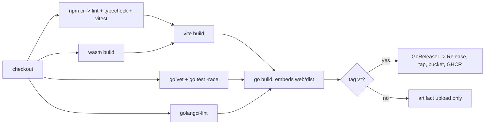

# 09 — CI/CD and Releases

This document defines how **git-in-track** is built, verified and released. It explains the
committed GitHub Actions workflows and the GoReleaser configuration, and adds the
versioning policy, branch strategy, release checklist and the distribution channels.

> Status: implemented. `.github/workflows/ci.yml`, `.github/workflows/release.yml`,
> `.goreleaser.yaml`, `.golangci.yaml` and the `Makefile` are committed and are the source
> of truth. This document explains them; when the two disagree, the file wins and this
> document is the bug.

- Module path: `github.com/digiogithub/git-in-track`
- CLI binary: `gintrack`
- Toolchain: Go 1.25 in CI, matching the `go 1.25.0` directive in `go.mod` (the MCP SDK requires it), Node 22, npm
- Build artifacts: `web/dist` (Vite bundle), `web/public/core.wasm` + `web/public/wasm_exec.js`
  (Go → WASM core, both git-ignored), `gintrack` (single static binary embedding `web/dist`
  via `go:embed`)

---

## 1. Build pipeline overview

The build has a strict order, because the Go binary embeds the frontend and the frontend
ships the WASM core:

```
1. wasm    GOOS=js GOARCH=wasm go build -o web/public/core.wasm ./wasm
2. web     npm ci && npm run build            -> web/dist
3. build   go build ./cmd/gintrack             -> gintrack (embeds web/dist)
```

Any pipeline that produces a runnable binary must run these three steps in this order.
CI additionally runs the verification steps (vet, lint, typecheck, unit tests) which are
order-independent and are parallelised across jobs.



---

## 2. `.github/workflows/ci.yml`

**Source of truth: [`.github/workflows/ci.yml`](../.github/workflows/ci.yml).** The file is
the specification; this section explains it and is kept in step with it. `make lint-ci`
parses both workflows as YAML and runs `actionlint` when it is installed.

Runs on every push to `main`, on every pull request, and on demand. Fails fast on
formatting and static analysis, then runs the full test suite and a real build.

| Job         | Name in the checks list             | What it does                                                                                     |
| ----------- | ----------------------------------- | ------------------------------------------------------------------------------------------------ |
| `preflight` | Preflight (repository layout)       | Asserts the scaffold every other job needs is present, and fails if a change removed it            |
| `workflows` | Workflows (YAML + actionlint)       | Parses `.github/workflows/*.yml` with PyYAML, then runs `actionlint`                               |
| `go`        | Go (vet, test, lint)                | `go mod download`, tidy check, `gofmt` check, `go vet`, `go test -race` + coverage, golangci-lint  |
| `web`       | Web (lint, typecheck, test, build)  | `npm ci`, ESLint, `tsc -b`, vitest, `vite build`, uploads `web/dist`                               |
| `wasm`      | WASM core                           | `make wasm`, size report, `node scripts/wasm-smoke.mjs`, uploads `core.wasm` + `wasm_exec.js`      |
| `build`     | Full build (embed frontend)         | WASM → web → `go build`, runs `gintrack version` and `--help`, uploads the binary                  |

Everything except `build` fans out from `preflight`; `build` waits for all of them, so a
failed lint or test never produces a downloadable artifact.

### Preflight

The Phase 0 scaffold has landed, so the guard no longer skips the pipeline when `go.mod`
and `web/package.json` are missing. It now asserts the layout — `go.mod`, `go.sum`,
`Makefile`, `.goreleaser.yaml`, `.golangci.yaml`, `Dockerfile`, `cmd/gintrack`, `wasm`, the web
workspace, `web/dist/.gitkeep` and `scripts/wasm-smoke.mjs` — and **fails** when something
is gone, which is a real regression rather than a reason to stay green. Downstream jobs
therefore no longer carry an `if:` condition, and the required status checks of §8 always
report.

### The two traps this repository sets

```yaml
# 1. .golangci.yaml is a v2 config, so the action must be v7+ with a v2.x linter.
- uses: golangci/golangci-lint-action@v8
  with:
    version: ${{ env.GOLANGCI_LINT_VERSION }}   # v2.x
    args: --timeout=5m

# 2. npm installs third-party Go sources under web/node_modules; never build them.
- run: go list ./... | grep -v '/web/node_modules/' | xargs go vet
```

### Notes on the CI workflow

- **Caching**: `actions/setup-go@v5` with `cache: true` caches both the module cache and
  the build cache, keyed on `go.sum`. `actions/setup-node@v4` with `cache: npm` caches the
  npm cache directory keyed on `web/package-lock.json`. `golangci/golangci-lint-action`
  keeps its own analysis cache. No manual `actions/cache` step is needed.
- **`concurrency`** cancels superseded runs on the same branch/PR, which keeps queue times
  low on a small open-source project.
- **`permissions: contents: read`** — CI never needs write access.
- **`go mod tidy` check** prevents drift between imports and `go.mod`.
- **golangci-lint v2.** `.golangci.yaml` is a `version: "2"` configuration, so the action
  must be `golangci/golangci-lint-action@v7` or later with a `v2.x` linter version;
  `@v6` only knows how to install golangci-lint v1 and fails to parse the config. The
  version is pinned in the `GOLANGCI_LINT_VERSION` environment variable to the release
  verified locally by `make lint`, and the action's default `verify: true` additionally
  validates the config against its JSON schema.
- **Never lint `web/node_modules`.** npm ships Go sources there; every Go step filters
  `go list ./...` through `grep -v '/web/node_modules/'`, matching `GO_PKGS` in the
  Makefile.
- **`gofmt` scope.** The check skips `web/node_modules/` only, so `web/embed.go` is
  formatted like every other Go file in the module.
- **No `--coverage` for vitest.** The web workspace does not install a coverage provider,
  and `vitest --coverage` would try to install one non-interactively in CI.
- The `build` job depends on every verification job so that a broken lint/test never
  produces a downloadable artifact.
- Later phases add an `e2e` job running Playwright against `gintrack serve` (Phase 2+) and
  a `matrix` of `ubuntu-latest`, `macos-latest`, `windows-latest` for the Go job once file
  watching is implemented (Phase 2), because `fsnotify` behaviour is platform specific.

---

## 3. `.github/workflows/release.yml`

**Source of truth: [`.github/workflows/release.yml`](../.github/workflows/release.yml).**

Triggered by pushing a tag matching `v*`. Builds the WASM core and the frontend first,
smoke-tests the WASM module, validates the GoReleaser configuration, then hands over to
GoReleaser, which cross-compiles, archives, checksums, generates the changelog and
publishes the GitHub Release.

| Job         | Steps                                                                                 |
| ----------- | ------------------------------------------------------------------------------------- |
| `preflight` | asserts the repository layout GoReleaser needs (including `Dockerfile`)                 |
| `release`   | verify the publishing credentials → checkout with `fetch-depth: 0` → setup Go/Node → `make wasm` → `node scripts/wasm-smoke.mjs` → `npm ci && npm run build` → verify embedded assets → `goreleaser check` → QEMU + Buildx + `ghcr.io` login → `goreleaser release --clean` |

Permissions follow least privilege: the workflow is `contents: read` at the top level and
only the `release` job raises itself to `contents: write` (to create the GitHub Release)
and `packages: write` (to push the images to GHCR). `fetch-depth: 0` is required for the
generated changelog.

The first step of the `release` job checks that `HOMEBREW_TAP_TOKEN` and
`SCOOP_BUCKET_TOKEN` are present and fails the run with the fix in the message when either
is not, before a single binary is built — see §10 for what each one is and why
`GITHUB_TOKEN` cannot stand in for them.

### Snapshot build (local, or optional for `main`)

A snapshot build catches cross-compilation breakage before a tag is cut. Locally that is
`make release-snapshot`; as a nightly or manual workflow it is the same job with
`args: release --snapshot --clean --skip=publish` and no `contents: write` permission.
---

## 4. Artifacts are unsigned

**git-in-track releases are not code-signed and not notarized.** There is no Apple
Developer ID certificate, no Windows Authenticode certificate and no notarization step in
the release pipeline. This is a deliberate choice for the initial releases: certificates
cost money, require a legal entity and secrets management, and would gate the project on
non-technical work.

The consequence is that operating systems will warn users on first launch. Integrity is
instead verified through `checksums.txt`, which is published with every release, and
through the fact that every artifact is built by a public GitHub Actions run from a public
tag.

### macOS (Gatekeeper)

Downloaded archives carry the `com.apple.quarantine` attribute, so the first run reports
that the binary "cannot be opened because the developer cannot be verified".

```bash
# Option A — remove the quarantine attribute after extracting
xattr -d com.apple.quarantine ./gintrack

# Option B — approve once via System Settings
#   Run ./gintrack, let it be blocked, then open
#   System Settings > Privacy & Security > "Open Anyway"

# Option C — install via Homebrew tap (Phase 6), which strips quarantine for you
```

Verify the download first:

```bash
shasum -a 256 -c checksums.txt --ignore-missing
```

### Windows (SmartScreen)

Windows Defender SmartScreen shows a "Windows protected your PC" dialog for unrecognised
publishers. Users click **More info** → **Run anyway**. Alternatively, unblock the archive
before extracting:

```powershell
Unblock-File -Path .\gintrack_1.0.0_windows_amd64.zip
Get-FileHash .\gintrack.exe -Algorithm SHA256
```

### Linux

No signature checks apply. Users should still verify the checksum and mark the binary
executable:

```bash
sha256sum -c checksums.txt --ignore-missing
chmod +x gintrack
```

The release notes template repeats these instructions for every release so users never
have to search for them.

---

## 5. `.goreleaser.yaml`

**Source of truth: [`.goreleaser.yaml`](../.goreleaser.yaml)**, validated by
`make release-check` (`goreleaser check`) and by the release workflow before it publishes.

GoReleaser v2 configuration. CGO is disabled everywhere so the binaries are fully static
and cross-compilation needs no C toolchain. `before.hooks` rebuild the WASM core and the
web bundle, in that order, so that a local `make release-snapshot` reproduces CI exactly:

```yaml
before:
  hooks:
    - go mod tidy
    - go mod download
    - sh -c "GOOS=js GOARCH=wasm go build -trimpath -o web/public/core.wasm ./wasm"
    - sh -c "cd web && npm ci && npm run build"
```

The `ldflags` set the four variables declared in `cmd/gintrack/main.go` — `main.version`,
`main.commit`, `main.date` and `main.builtBy` — which is what `gintrack version` prints:

```yaml
    ldflags:
      - -s -w
      - -X main.version={{ .Version }}
      - -X main.commit={{ .FullCommit }}
      - -X main.date={{ .CommitDate }}
      - -X main.builtBy=goreleaser
```

The rest of the file configures the 3×2 `goos`/`goarch` matrix, `tar.gz` archives with a
`zip` override for Windows, `checksums.txt` (SHA-256), the grouped Conventional-Commits
changelog, the release notes template that repeats the Gatekeeper and SmartScreen
instructions of §4 on every release, and the distribution channels — `homebrew_casks:`,
`scoops:`, `dockers:` and `docker_manifests:` — documented in §10.

There is no `-tags=embed` build tag: `web/embed.go` embeds `web/dist` unconditionally and
reports `Built() == false` when the directory holds nothing but its `.gitkeep`, which is
what lets `go install` produce a working CLI without a frontend build.

### Artifact matrix produced

| OS      | Arch  | Archive                                    |
| ------- | ----- | ------------------------------------------ |
| linux   | amd64 | `gintrack_1.0.0_linux_amd64.tar.gz`        |
| linux   | arm64 | `gintrack_1.0.0_linux_arm64.tar.gz`        |
| darwin  | amd64 | `gintrack_1.0.0_darwin_amd64.tar.gz`       |
| darwin  | arm64 | `gintrack_1.0.0_darwin_arm64.tar.gz`       |
| windows | amd64 | `gintrack_1.0.0_windows_amd64.zip`         |
| windows | arm64 | `gintrack_1.0.0_windows_arm64.zip`         |
| —       | —     | `checksums.txt`                            |

---

## 6. `Makefile`

The Makefile is the single local entry point; CI calls the same targets (`make wasm`,
`node scripts/wasm-smoke.mjs`) or the identical commands, so "works on my machine" and
"works in CI" cannot diverge.

**Source of truth: [`Makefile`](../Makefile).** Targets:

| Target             | What it does                                                             |
| ------------------ | ------------------------------------------------------------------------ |
| `deps`             | `go mod download` and `npm ci` in `web/`                                  |
| `wasm`             | `GOOS=js GOARCH=wasm go build -o web/public/core.wasm ./wasm`, then copies the matching `wasm_exec.js` |
| `wasm-smoke`       | depends on `wasm`; runs `scripts/wasm-smoke.mjs` (§6.1)                   |
| `web`              | depends on `wasm`; `npm ci && npm run build` → `web/dist`                 |
| `build`            | `go build` → `bin/gintrack`, embedding `web/dist`                         |
| `test`             | `test-go` (race + coverage) and `test-web` (vitest)                       |
| `lint`             | `lint-go`, `lint-web` and `lint-ci`                                       |
| `lint-ci`          | parses both workflow files as YAML and runs `actionlint` when installed   |
| `fmt`              | `gofmt -w` over the tracked Go sources                                    |
| `run` / `dev`      | companion server / Vite dev server                                        |
| `release-check`    | `goreleaser check` on `.goreleaser.yaml`, no build                        |
| `release-snapshot` | `goreleaser release --snapshot --clean --skip=publish`                    |
| `clean`            | removes build outputs, keeping `web/dist/.gitkeep`                        |

Two details matter and are easy to get wrong:

- **`GO_PKGS`.** npm installs third-party *Go* sources under `web/node_modules` (for
  example `flatted/golang`), which `go list ./...` happily returns. Every Go target
  filters them out:

  ```makefile
  GO_PKGS = $(shell go list ./... | grep -v '/web/node_modules/')
  ```

  CI does the same with `go list ./... | grep -v '/web/node_modules/' | xargs go vet`.
  `golangci-lint` excludes the same path through `linters.exclusions.paths`.

- **`clean` keeps `web/dist/.gitkeep`.** `web/embed.go` declares `//go:embed all:dist`, so
  deleting the directory breaks `go build` until the frontend is rebuilt.

### 6.1 WASM smoke test

`scripts/wasm-smoke.mjs` (Node 22, ESM) proves the browser bundle can actually call into
the Go core, without a browser and without Playwright. It does exactly what
`web/src/core-bridge/worker.ts` does at runtime:

1. evaluates `web/public/wasm_exec.js` in the current context, which defines `globalThis.Go`;
2. instantiates `web/public/core.wasm` against `go.importObject`;
3. calls `go.run(instance)` — `wasm/main_js.go` ends in `select {}`, so the promise never
   resolves and the module stays resident; an early exit or a trap fails the test;
4. asserts `gintrackCore.version()` returns `{"ok":true,"data":{version,commit,date,schema}}`;
5. asserts `gintrackCore.parseItem(path, text)` returns an envelope whose `data` carries
   `id`, `type`, `title` and a computed `rev` — `rev` is never stored in a file, so its
   presence is the proof that real core code ran;
6. asserts a malformed item comes back as `{"ok":false,"error":{"code":...}}`.

Node 20+ already provides every global `wasm_exec.js` expects (`crypto`, `TextEncoder`,
`TextDecoder`, `performance`); the script installs them from `node:` builtins only when
they are missing, so it also runs on older hosts.

Run it with `make wasm-smoke` (which builds the artifacts first) or `npm run wasm:smoke`
from `web/`. The `wasm` job in CI and the `release` job both run it.

---

## 7. Versioning policy

git-in-track follows [Semantic Versioning 2.0.0](https://semver.org/).

- **Tags** are `vX.Y.Z` (leading `v`, no other prefix). GoReleaser derives the version by
  stripping the `v`.
- **MAJOR** — breaking change to any public contract: the on-disk data model in `.pmngr/`,
  the REST/WebSocket API, the MCP tool schemas, or the CLI flags and command names.
- **MINOR** — backwards-compatible features: new front-matter fields with defaults, new
  API endpoints, new MCP tools, new UI surfaces.
- **PATCH** — backwards-compatible fixes and internal changes.
- **Pre-releases** are `vX.Y.Z-rc.N` (for example `v1.0.0-rc.1`). GoReleaser's
  `prerelease: auto` marks any tag containing a hyphen as a GitHub pre-release, so no
  configuration change is needed per release.
- **Before 1.0.0** the project would have been `v0.Y.Z`. In practice **no 0.x tag was ever
  pushed**: Phases 0–6 were developed on `main` without a release, and `v1.0.0` is the
  first tag the repository will carry. There is therefore no 0.x layout in the field, and
  the compatibility promise starts at 1.0.
- **Data model version**: `project.yaml` and `team.yaml` carry a **`schema`** field (not
  `schemaVersion`; the constant is `core.SupportedSchema`) so the tool can detect and
  migrate older vaults independently of the binary version. 1.0 freezes it at `schema: 1`.
  The evolution rules are `docs/03-data-model.md` §19; `gintrack migrate` (R-EVO-4) is
  specified but not yet implemented, which is acceptable only while `schema: 1` is the
  only version ever published.
- The binary reports its version through `gintrack version`, populated by the ldflags
  `main.version`, `main.commit`, `main.date` and `main.builtBy`, and it also prints
  whether the web UI is embedded and which `schema` the core supports:

  ```
  gintrack 1.0.0
  commit:   <full sha>
  built:    <commit date>
  by:       goreleaser
  go:       go1.24 linux/amd64
  ui:       embedded
  core:     schema v1
  ```

- **`CHANGELOG.md`** at the repository root is the hand-written companion to the generated
  release notes: migrations, deprecations, the compatibility promise and known limitations
  live there, because a list of commit subjects cannot express them.

---

## 8. Branch strategy

**Trunk-based development.** There is exactly one long-lived branch.

- `main` is always releasable. Every commit on `main` passes CI.
- Work happens on short-lived branches named `<type>/<scope>-<short-slug>`, for example
  `feat/core-frontmatter-parser`, `fix/web-board-drag`, `docs/ci-release-plan`. Branches
  live hours to a few days, never weeks.
- Changes reach `main` only through pull requests, **squash-merged**, so `main` has one
  commit per PR and the PR title becomes the commit subject. That title must be a valid
  Conventional Commit — it is what the changelog is generated from.
- No release branches while the project is small. If a patch is ever needed for an old
  minor, a `release/vX.Y` branch is cut from the tag on demand and deleted after the patch
  release.
- Tags are created **on `main` only**, by a maintainer, after CI is green.

### Protection rules for `main`

- Require a pull request before merging, with at least 1 approving review.
- Require status checks to pass: `Preflight (repository layout)`,
  `Workflows (YAML + actionlint)`, `Go (vet, test, lint)`, `Web (lint, typecheck, test,
  build)`, `WASM core`, `Full build (embed frontend)`.
- Require branches to be up to date before merging.
- Require conversation resolution before merging.
- Require linear history (squash merges only).
- Block force pushes and deletions.
- Include administrators (maintainers follow the same rules).

### Conventional commits

Commit subjects and PR titles follow
[Conventional Commits 1.0.0](https://www.conventionalcommits.org/):

```
<type>(<scope>): <subject>
```

Types: `feat`, `fix`, `perf`, `refactor`, `docs`, `test`, `build`, `ci`, `chore`, `style`,
`revert`. Scopes: `core`, `cli`, `server`, `web`, `wasm`, `mcp`, `docs`, `ci`. A breaking
change is marked with `!` after the scope (`feat(core)!: rename story parent field`) and a
`BREAKING CHANGE:` footer. The full convention is specified in
[10-development-guidelines.md](./10-development-guidelines.md).

A `commitlint`-style check runs in CI on PR titles (Phase 0 deliverable) so that a
malformed title cannot reach `main` and corrupt the generated changelog.

---

## 9. Release checklist

Run through this list for every tagged release. Steps marked *(automated)* are performed
by the pipeline; the rest are the maintainer's responsibility.

**Before tagging**

- [ ] `main` is green in CI and there are no open blocking issues for the milestone.
- [ ] `make lint test` passes locally on macOS **and** Linux (Windows if the release
      touches the watcher or path handling).
- [ ] `make wasm-smoke` passes: `core.wasm` instantiates and answers outside a browser.
- [ ] `make release-check` validates `.goreleaser.yaml`.
- [ ] `make release-snapshot` succeeds and produces all 6 archives plus `checksums.txt`,
      `dist/homebrew/Casks/gintrack.rb`, `dist/scoop/bucket/gintrack.json` and both images.
      (It needs a Docker daemon, and binfmt emulation for the arm64 image:
      `docker run --privileged --rm tonistiigi/binfmt --install arm64`.)
- [ ] `digiogithub/homebrew-tap` and `digiogithub/scoop-bucket` exist, and the
      `HOMEBREW_TAP_TOKEN` and `SCOOP_BUCKET_TOKEN` secrets are set and unexpired (§10).
- [ ] The snapshot binary runs: `./dist/gintrack_linux_amd64_v1/gintrack version`,
      `gintrack serve` starts and the embedded web app loads at `http://127.0.0.1:7317`.
- [ ] Data model changes, if any, are accompanied by a migration and a `schema` bump.
- [ ] `CHANGELOG.md` "Unreleased" section is reviewed; anything the generated changelog
      cannot express (migrations, deprecations, known issues) is written by hand.
- [ ] Documentation under `docs/` reflects the release; screenshots regenerated if the UI
      changed.
- [ ] `README.md` installation section mentions the new version where it is pinned.
- [ ] The version's milestone in `docs/.pmngr/milestones/` is closed and its stories are
      `done`.

**Tagging**

- [ ] Decide the version according to §7.
- [ ] `git switch main && git pull --ff-only`
- [ ] `git tag -a vX.Y.Z -m "vX.Y.Z"` (annotated tags only)
- [ ] `git push origin vX.Y.Z`

**After tagging**

- [ ] *(automated)* Release workflow builds WASM + web + 6 binaries.
- [ ] *(automated)* GoReleaser publishes the GitHub Release with archives, `checksums.txt`
      and the generated changelog.
- [ ] *(automated)* The cask lands in the tap, the manifest in the bucket, and the
      multi-arch images in GHCR with an updated `latest` (stable tags only).
- [ ] Download one archive per OS family and verify its checksum.
- [ ] `brew install digiogithub/tap/gintrack` on macOS, `scoop install gintrack` on
      Windows, and the documented `docker run` all give a working `gintrack version`.
- [ ] Smoke test the macOS artifact through the documented Gatekeeper bypass and the
      Windows artifact through the SmartScreen bypass.
- [ ] Announce: GitHub Release notes, repository Discussions, project README badge.
- [ ] Open a follow-up issue for anything deferred during the release.

**If a release is broken**

- Do not delete or move a published tag. Cut `vX.Y.Z+1` with the fix and mark the broken
  release as deprecated in its release notes.

---

## 10. Distribution channels

Phases 0–5 configured the GitHub Release only. Phase 6 (GIT-US-0029) added the
three package channels below; all of them are produced by the **same GoReleaser
run** from the same tag, so there is no second workflow and no manual publishing
step.

> **Nothing is published yet.** No tag has ever been pushed, so every channel in
> the table below is empty until a maintainer cuts `v1.0.0`. The pipeline itself
> is verified: `goreleaser check` passes and a `--snapshot --skip=publish` run
> produces all six archives, `checksums.txt`, the cask, the Scoop manifest and
> the amd64 image locally. See
> [12-release-readiness-1-0.md](./12-release-readiness-1-0.md) §1 for the run and
> §6 for the maintainer's remaining steps.

| Channel        | Where it is published                    | Configured in            | Credential            |
| -------------- | ---------------------------------------- | ------------------------ | --------------------- |
| GitHub Release | `digiogithub/git-in-track` releases       | `release:`               | `GITHUB_TOKEN`        |
| Homebrew       | `digiogithub/homebrew-tap` (`Casks/`)     | `homebrew_casks:`        | `HOMEBREW_TAP_TOKEN`  |
| Scoop          | `digiogithub/scoop-bucket` (`bucket/`)    | `scoops:`                | `SCOOP_BUCKET_TOKEN`  |
| Docker         | `ghcr.io/digiogithub/git-in-track`        | `dockers:` + `docker_manifests:` | `GITHUB_TOKEN` (`packages: write`) |
| `go install`   | the module proxy                          | nothing                  | none                  |

A pre-release tag (`vX.Y.Z-rc.N`) publishes the GitHub Release and the
version-tagged images, but `skip_upload: auto` keeps it out of the tap and the
bucket and `skip_push: auto` keeps the `latest` image tag where it is. So an rc
is never what `brew install`, `scoop install` or `docker run …:latest` resolves to.

### Secrets and repositories a maintainer must create first

The release workflow verifies both tokens **before** it builds anything and fails
the run with an actionable message when either is missing, because a release that
publishes archives but no formula is worse than no release at all.

| Secret / resource | What it is | Permissions |
| --- | --- | --- |
| `digiogithub/homebrew-tap` | public repository, default branch `main`, holding `Casks/gintrack.rb` | — |
| `digiogithub/scoop-bucket` | public repository, default branch `main`, holding `bucket/gintrack.json` | — |
| `HOMEBREW_TAP_TOKEN` | Actions secret on `git-in-track`: a fine-grained PAT scoped to `digiogithub/homebrew-tap` | `Contents: read and write` |
| `SCOOP_BUCKET_TOKEN` | Actions secret on `git-in-track`: a fine-grained PAT scoped to `digiogithub/scoop-bucket` | `Contents: read and write` |
| GHCR | no secret: `secrets.GITHUB_TOKEN` with the job's `packages: write` publishes to the repository's own namespace | `packages: write` |

Two separate tokens rather than one for both taps: each is scoped to exactly one
repository, so a leaked token cannot rewrite the other channel. The workflow stays
`contents: read` at the top level and only the `release` job raises itself to
`contents: write` and `packages: write`.

### `go install` — available from day one

Works without any extra infrastructure, but produces a binary **without** the
embedded web app, so it is documented as the "developer install":

```bash
go install github.com/digiogithub/git-in-track/cmd/gintrack@latest
```

`web/embed.go` embeds `web/dist` unconditionally, and a checkout that was never
built ships only the directory's `.gitkeep`. `web.Built()` then reports `false`:
the CLI still runs `gintrack mcp` and every file-based command, and
`gintrack serve` reports that no embedded UI is available and points at the
released binaries. To get the UI from source, clone and run `make build`.

### Homebrew tap — a cask, on macOS

```bash
brew install digiogithub/tap/gintrack
brew upgrade digiogithub/tap/gintrack
```

The `homebrew_casks:` block writes `Casks/gintrack.rb` into
`digiogithub/homebrew-tap` on every stable tag. It is a **cask, not a formula**:
GoReleaser deprecated `brews:` in v2.10 and `goreleaser check` — which this
workflow runs before publishing — now exits non-zero on it. The consequence is
that **`brew install` is macOS-only**; Homebrew on Linux cannot install a cask.
Linux users take the tarball, `go install` or the image. That trade-off, and the
alternatives rejected, are recorded in
[ADR-016](adr/ADR-016-homebrew-cask-instead-of-formula.md).

Homebrew is still the recommended macOS route, for the reason ADR-011 gives: it
removes the quarantine attribute an unsigned download carries. The cask makes
that explicit instead of incidental, with a `postflight` hook:

```ruby
postflight do
  if OS.mac?
    system_command "/usr/bin/xattr",
                   args: ["-dr", "com.apple.quarantine", "#{staged_path}/gintrack"]
  end
end
```

### Scoop bucket — Windows

```powershell
scoop bucket add digiogithub https://github.com/digiogithub/scoop-bucket
scoop install gintrack
```

The `scoops:` block writes `bucket/gintrack.json` with the `windows_amd64` and
`windows_arm64` archives and their SHA-256 hashes. Scoop verifies that hash on
install, which is the SmartScreen-free path of §4.

### Docker image

Published to GHCR as `ghcr.io/digiogithub/git-in-track`, tagged
`:X.Y.Z-amd64`, `:X.Y.Z-arm64`, `:X.Y.Z` (a manifest list over both) and
`:latest` (stable tags only).

The image is built from [`Dockerfile`](../Dockerfile) at the repository root, but
**not from source**: GoReleaser's build context already holds the cross-compiled
binary for the target architecture — the same binary the archives carry, with
`web/dist` embedded — so the Dockerfile only copies it onto `alpine:3.21`
alongside `ca-certificates` and `git`. `docker build .` at the repository root
therefore fails by design; `make release-snapshot` reproduces the image locally.

Because `apk add` runs for the target architecture, the arm64 image needs binfmt
emulation on the runner: the release workflow calls `docker/setup-qemu-action@v3`
and `docker/setup-buildx-action@v3` before GoReleaser, and logs in to `ghcr.io`
with `docker/login-action@v3`.

#### Running it

```bash
docker run --rm \
  -p 127.0.0.1:7317:7317 \
  -v "$PWD:/work" \
  --user "$(id -u):$(id -g)" \
  ghcr.io/digiogithub/git-in-track:latest
```

The container serves the working tree mounted at `/work`; that mount is the whole
point of the image, since git-in-track has no server and no database and reads
files. Add `:ro` to the mount for a read-only browse. The token to sign in with is
printed in the container log on start, or supply your own with
`-e GINTRACK_TOKEN=…`.

Three things about this command are deliberate:

- **The default command binds `0.0.0.0`, and that is safe only because of the port
  mapping.** A process bound to `127.0.0.1` inside a container is reachable by
  nothing, so a container that serves anything must bind the wildcard address;
  what controls exposure is `-p 127.0.0.1:7317:7317`, which publishes the port on
  the host loopback only. Writing `-p 7317:7317` instead publishes it on **every**
  host interface — that is the choice the native binary makes you make explicitly,
  and in the container it moved from the bind flag to the port mapping.
- **Authentication is not optional here.** `internal/server` refuses to serve a
  non-loopback bind without a bearer token (`--token none` is accepted on loopback
  only), so the container always runs authenticated: a token is generated at start
  and printed unless `GINTRACK_TOKEN` supplies one. If you deliberately expose the
  port to a network, that token is the only thing in front of your repository.
- **`--user "$(id -u):$(id -g)"`** lets the container write to a tree owned by you
  on the host. The image runs as uid 10001 by default and keeps its configuration
  under `$XDG_CONFIG_HOME=/tmp/gintrack`, which is world-writable, so overriding
  the user does not break start-up. Container configuration is ephemeral by
  design — the mounted working tree is the only source of truth.

Known limitation: file watching depends on inotify events crossing the bind mount.
That works on Linux; on Docker Desktop for macOS and Windows it does not, and the
UI shows changes only on reload. Pass `--watch=false` there to stop the watcher
retrying.

#### GoReleaser's `dockers:` is on notice

GoReleaser is replacing `dockers:` and `docker_manifests:` with a single
`dockers_v2:` block that builds images in the publish phase. `dockers:` still
validates and still builds; when `dockers_v2` stops being new, migrating is a
mechanical change to `.goreleaser.yaml` and nothing else.

### Deliberately out of scope

Linux distribution packages (`.deb`, `.rpm`, AUR, nixpkgs), winget, and
Snap/Flatpak are not planned before 1.0. They add maintenance load without
reaching an audience the GitHub Release does not already serve. GoReleaser can
produce `.deb`/`.rpm` with `nfpms:` if demand appears.
