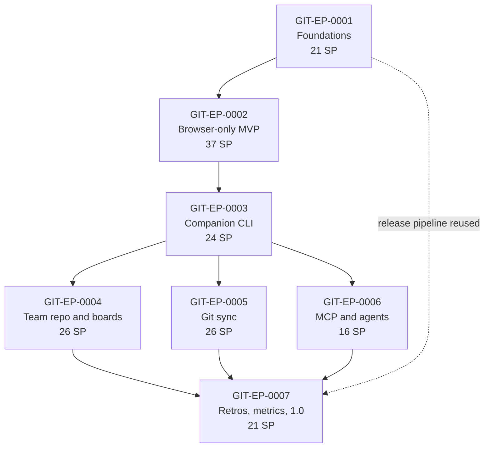
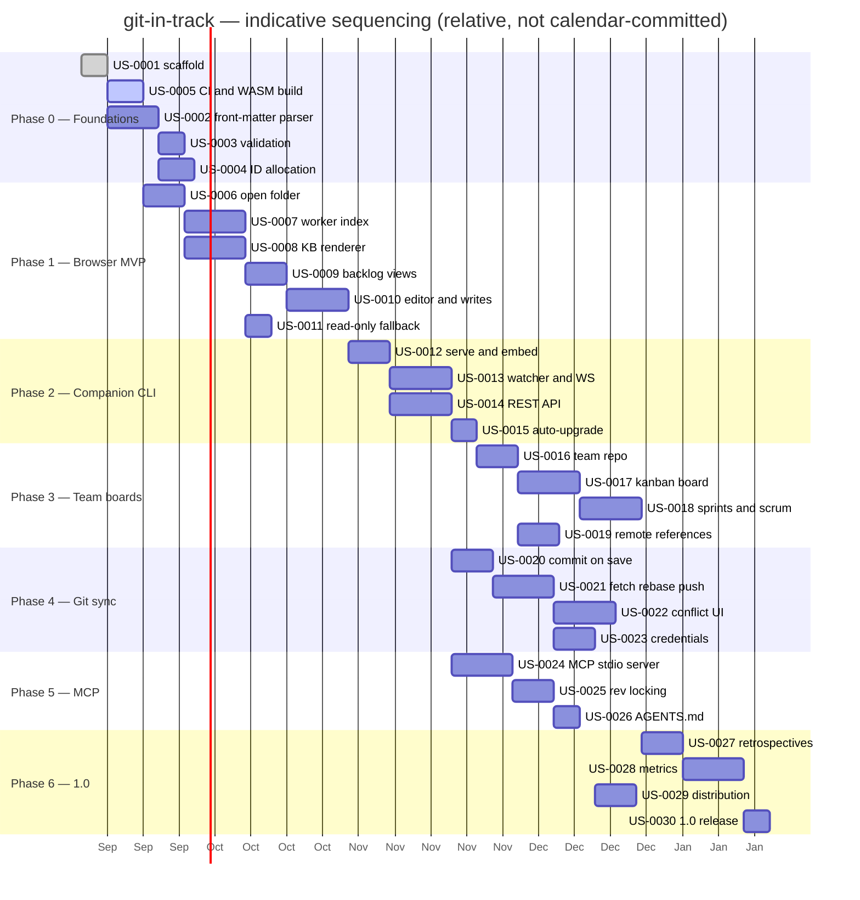

# 11 — Roadmap

The development plan for **git-in-track**: the seven phases from the architecture brief,
expanded into milestones with goals, deliverables and exit criteria, then broken down into
epics and user stories with estimates, dependencies, risks and a working model for a mixed
team of humans and AI agents.

This document is the **sequencing** authority. The backlog under `docs/.pmngr/` is the
**status** authority: same IDs, same titles, kept in sync (see
[10-development-guidelines.md](./10-development-guidelines.md) §11). We manage this project
with the tool we are building, from the first story onwards.

- Project key: `GIT`
- Epics: `GIT-EP-0001` … `GIT-EP-0007` (one per phase)
- Milestones: `GIT-M-0001` … `GIT-M-0007`
- Stories: `GIT-US-0001` … `GIT-US-0030`
- Total estimated: **171 story points**

---

## 1. Milestones at a glance

| Milestone     | Phase | Epic          | Theme                          | Version  | Points |
| ------------- | ----- | ------------- | ------------------------------ | -------- | ------ |
| `GIT-M-0001` | 0     | `GIT-EP-0001` | Foundations                    | `v0.1.0` | 21     |
| `GIT-M-0002` | 1     | `GIT-EP-0002` | Browser-only MVP               | `v0.2.0` | 37     |
| `GIT-M-0003` | 2     | `GIT-EP-0003` | Companion CLI                  | `v0.3.0` | 24     |
| `GIT-M-0004` | 3     | `GIT-EP-0004` | Team repository and boards     | `v0.4.0` | 26     |
| `GIT-M-0005` | 4     | `GIT-EP-0005` | Git sync                       | `v0.5.0` | 26     |
| `GIT-M-0006` | 5     | `GIT-EP-0006` | MCP server and agent workflows | `v0.6.0` | 16     |
| `GIT-M-0007` | 6     | `GIT-EP-0007` | Retros, metrics and 1.0        | `v1.0.0` | 21     |

Estimates use a modified Fibonacci scale (1, 2, 3, 5, 8, 13). A story larger than 8 points
is split before it is started. No calendar dates are committed here: this is an
open-source project with variable capacity, so the plan is ordered, not scheduled.

---

## 2. Milestones in detail

### Milestone 1 — Foundations (`GIT-M-0001`, Phase 0, `v0.1.0`)

**Goal.** Establish the repository, the shared Go core and the pipeline, so that every
later phase is built on a model and a build that already work. Nothing user-facing ships;
everything user-facing depends on this.

**Deliverables**

- Monorepo scaffold exactly as specified in
  [02-architecture.md](./02-architecture.md): `cmd/gintrack`, `internal/core`,
  `internal/server`, `internal/watcher`, `internal/gitops`, `internal/mcp`, `wasm/`, `web/`,
  `docs/`, `Makefile`, `go.mod`, `.goreleaser.yaml`.
- `internal/core`: item model, YAML front-matter parser and serialiser (round-trip safe),
  schema validation, configurable status workflows from `project.yaml`, ID allocator,
  in-memory index and a first query API, implementing
  [03-data-model.md](./03-data-model.md).
- `core.FS` abstraction with a native implementation, so the core never touches `os`
  directly.
- WASM build target producing `web/public/core.wasm` plus the JS glue contract.
- `ci.yml` and `release.yml` as specified in
  [09-ci-cd-and-releases.md](./09-ci-cd-and-releases.md), plus `.golangci.yaml`,
  ESLint/Prettier/tsconfig, and the Vite + React + Tailwind + shadcn skeleton.
- Fixture repositories `testdata/fixtures/project-basic` and `team-basic`.
- This documentation set and the dogfooded backlog under `docs/.pmngr/`.

**Exit criteria**

- `make build` produces a `gintrack` binary on Linux, macOS and Windows.
- `make test` is green; `internal/core` coverage ≥ 85 %.
- Parser round-trips every fixture file byte-for-byte except for intentional
  normalisation, verified by golden tests.
- The same core compiles to WASM and answers a smoke query from a browser page.
- A tagged `v0.1.0` produces all six archives plus `checksums.txt` through GoReleaser.

**Explicitly out of scope.** Any UI beyond a smoke page, any git operation, any server.

---

### Milestone 2 — Browser-only MVP (`GIT-M-0002`, Phase 1, `v0.2.0`)

**Goal.** A useful product with no installation: open a local project folder in a Chromium
browser, read the knowledge base, and manage a single project's backlog.

**Deliverables**

- Folder picking through the File System Access API, with persisted handles and permission
  re-prompting.
- WASM core hosted in a Web Worker behind a typed adapter interface; index cached in
  IndexedDB and invalidated by content hash.
- Knowledge-base viewer: GFM, task lists, footnotes, callouts, wikilinks `[[Page]]`,
  Mermaid diagrams, optional math; an outline and a backlinks panel from the link graph.
- Backlog views for a single project: list, filters (type, status, label, assignee,
  milestone, priority), full-text search, item detail.
- Create and edit epics, stories, tasks and milestones in a CodeMirror 6 editor with front
  matter edited through a form and the body as Markdown; writes land in the working tree.
- Read-only fallback via `<input webkitdirectory>` for Firefox and Safari, with a clear
  explanation of the limitation.

**Exit criteria**

- A new user opens `testdata/fixtures/project-basic` and creates, edits and reads a story
  without touching a terminal, in under two minutes.
- A 5,000-file vault indexes in under 3 seconds on a mid-range laptop and re-indexes a
  single changed file in under 100 ms.
- The UI thread is never blocked for more than 50 ms during indexing (measured).
- Every write produces a file that the Go native parser reads back identically.
- Firefox and Safari load the vault read-only and say so.

---

### Milestone 3 — Companion CLI (`GIT-M-0003`, Phase 2, `v0.3.0`)

**Goal.** Remove the browser's limits for users who install the binary: native speed, real
file watching, and the same UI served locally.

**Deliverables**

- `gintrack serve` binding `127.0.0.1:7317` and serving the embedded `web/dist` through
  `go:embed`.
- `internal/watcher` over fsnotify with debouncing, recursive watching, ignore rules, and a
  polling fallback for platforms and network drives where events are unreliable.
- REST API for projects, items, KB pages and search, plus a WebSocket channel streaming
  index and file change events; per-run auth token and strict origin checks.
- Native indexer sharing the same `internal/core` code path as the WASM build.
- Companion auto-detection in the web app: `GET /api/health`, automatic upgrade from the
  WASM adapter to the REST adapter with no reload and no loss of state.
- CLI utility commands: `gintrack version`, `init`, `validate`, `index`, `open`.

**Exit criteria**

- Editing a file in an external editor updates the open UI in under 300 ms.
- A 50,000-file vault indexes natively in under 5 seconds.
- The app behaves identically in both modes for every Phase 1 flow (one shared E2E suite,
  run twice).
- The server refuses to bind a non-loopback address without `--allow-remote`, and rejects
  requests with a foreign `Origin`.

---

### Milestone 4 — Team repository and boards (`GIT-M-0004`, Phase 3, `v0.4.0`)

**Goal.** Make the tool work for a team rather than one person: many projects, shared
boards, sprints, and visibility into projects that are not cloned locally.

**Deliverables**

- `team.yaml` model: metadata, members, and the list of project repositories (remote URL,
  default branch, docs folder path, project key).
- Multi-project workspace: open several project repos plus one team repo; unified search
  and cross-project item resolution by `ref: <projectKey>/<itemId>`.
- Kanban boards (`.pmngr/boards/*.md`): columns with mapped statuses, WIP limits, filters,
  card ordering persisted in `order:`, drag and drop with dnd-kit.
- Scrum boards and sprints (`.pmngr/sprints/*.md`): sprint definition, goal, item
  references, board views scoped to the active sprint.
- Remote references: cards for projects that are not cloned render from
  `.pmngr/index/<projectKey>.json`, clearly marked read-only with a link to the remote
  file.
- Index snapshot generation and refresh (`gintrack snapshot`), committed to the team repo.

**Exit criteria**

- A board in `testdata/fixtures/team-basic` shows cards from two projects, one cloned and
  one remote-only.
- Dragging a card between columns rewrites exactly one item file's `status` and the board's
  `order:` list, and nothing else.
- Two people moving different cards produce a mergeable YAML diff (verified by a scripted
  concurrent-edit test).
- WIP limits are enforced visually and cannot be silently exceeded.

---

### Milestone 5 — Git sync (`GIT-M-0005`, Phase 4, `v0.5.0`)

**Goal.** Close the loop: git becomes the sync mechanism from inside the product, in both
operating modes.

**Deliverables**

- `internal/gitops`: go-git wrapper with an optional system-`git` backend, selectable by
  configuration.
- `isomorphic-git` in browser-only mode over File System Access handles, including the
  documented CORS-proxy requirement for hosts that do not send permissive headers.
- Commit on save, off by default, with a configurable message template
  (`{{action}} {{id}}: {{title}}`) and batching of rapid edits.
- Explicit sync: fetch → rebase (or merge, configurable) → push, with a clear status
  indicator and a dry-run preview.
- Conflict handling: detection, a three-way text conflict UI for Markdown bodies, a
  field-level merge helper for YAML front matter, and an always-available "keep mine / keep
  theirs / edit" escape hatch.
- Credentials: native mode delegates to the user's credential helper and SSH agent; browser
  mode holds a per-session token in memory only, never persisted.

**Exit criteria**

- Two clones of the same project, edited concurrently, are reconciled through the UI
  without touching a terminal, including one real conflict.
- No credential is ever written to disk or to `localStorage` by git-in-track (verified by
  test).
- Commit on save produces one commit per logical edit, not one per keystroke.
- A push failure leaves the working tree in a state the user can recover from, with an
  actionable message.

---

### Milestone 6 — MCP server and agent workflows (`GIT-M-0006`, Phase 5, `v0.6.0`)

**Goal.** Make AI agents first-class collaborators, reading and writing the same files
through a well-specified interface rather than by guessing at Markdown.

**Deliverables**

- `gintrack mcp` over stdio, plus streamable HTTP on the companion server.
- Tools: `list_items`, `search_items`, `get_item`, `create_epic`, `create_story`,
  `create_task`, `update_item`, `add_comment`, `move_on_board`, `list_kb_pages`,
  `get_kb_page`, `search_kb`.
- Agent-optimised responses: compact JSON, front matter only unless the body is requested,
  cursor pagination, and a `rev` content hash on every item.
- Optimistic locking: writes carry the `rev` they are based on and are rejected with a
  structured conflict when stale.
- `AGENTS.md` conventions: how an agent picks a story, what it must not touch, how it
  reports progress in comments, and how its PRs are attributed and reviewed.

**Exit criteria**

- An agent connected over MCP picks a `todo` story, moves it to `in_progress`, opens a PR
  and comments on the story — with no human file edits in the loop.
- Two agents writing the same item concurrently produce exactly one success and one
  `rev` conflict, never a lost update.
- The tool schemas are stable and documented; a schema change bumps the MINOR version.

---

### Milestone 7 — Retrospectives, metrics and 1.0 (`GIT-M-0007`, Phase 6, `v1.0.0`)

**Goal.** Complete the agile loop, prove the model with numbers, and ship a release people
can install without reading the repository.

**Deliverables**

- Retrospectives (`.pmngr/retros/*.md`): went well / to improve / actions, participants,
  linked sprint; selected improvements recorded in `actions[]`.
- Promotion of a retro action into a task in a project repository, with a back-link.
- Metrics computed from git history and the index: burndown per sprint, cumulative flow by
  status, cycle and lead time, throughput — all derived, nothing stored redundantly.
- Polish pass: empty states, keyboard shortcuts, command palette, onboarding, accessibility
  audit, dark mode, performance budget.
- Distribution: Homebrew tap, Scoop bucket, Docker image on GHCR, documented `go install`.
- 1.0 release: frozen data model with `schemaVersion: 1`, a migration path from 0.x, a
  written compatibility promise, and complete user documentation.

**Exit criteria**

- A full sprint is planned, run, closed and retrospected entirely inside the tool, by the
  project's own team, using `docs/.pmngr/`.
- Burndown and cumulative flow match a hand-computed reference for a fixture sprint.
- All accessibility checks pass at WCAG 2.1 AA for the primary flows.
- `brew install`, `scoop install`, `docker run` and `go install` each produce a working
  `gintrack`, verified on a clean machine.

---

## 3. Epics and user stories

Every story below exists as a file in `docs/.pmngr/stories/` with the same ID and title.
"SP" is the story-point estimate.

### `GIT-EP-0001` — Foundations (Phase 0, milestone `GIT-M-0001`, 21 SP)

Repository scaffold, the shared Go core, and the pipeline everything else stands on.

| ID            | Title                                            | SP | Priority | Depends on |
| ------------- | ------------------------------------------------ | -- | -------- | ---------- |
| `GIT-US-0001` | Scaffold the monorepo and build toolchain        | 3  | critical | —          |
| `GIT-US-0002` | Parse Markdown front matter into the core model  | 5  | critical | US-0001    |
| `GIT-US-0003` | Validate items against the project workflow      | 3  | high     | US-0002    |
| `GIT-US-0004` | Allocate collision-free item IDs                 | 5  | high     | US-0002    |
| `GIT-US-0005` | Set up the CI pipeline and the WASM build        | 5  | critical | US-0001    |

### `GIT-EP-0002` — Browser-only MVP (Phase 1, milestone `GIT-M-0002`, 37 SP)

Open a folder, read the knowledge base, manage one project's backlog — no install.

| ID            | Title                                                     | SP | Priority | Depends on       |
| ------------- | --------------------------------------------------------- | -- | -------- | ---------------- |
| `GIT-US-0006` | Open a local project folder in the browser                | 5  | critical | US-0005          |
| `GIT-US-0007` | Index a vault in a Web Worker and cache it in IndexedDB   | 8  | critical | US-0006, US-0002 |
| `GIT-US-0008` | Render knowledge base pages with extended Markdown        | 8  | critical | US-0006          |
| `GIT-US-0009` | Browse and filter the backlog                             | 5  | high     | US-0007          |
| `GIT-US-0010` | Create and edit items in the Markdown editor              | 8  | critical | US-0009, US-0004 |
| `GIT-US-0011` | Provide a read-only fallback for non-Chromium browsers    | 3  | medium   | US-0008          |

### `GIT-EP-0003` — Companion CLI (Phase 2, milestone `GIT-M-0003`, 24 SP)

Native speed, real file watching, the same UI served from `127.0.0.1`.

| ID            | Title                                                    | SP | Priority | Depends on       |
| ------------- | -------------------------------------------------------- | -- | -------- | ---------------- |
| `GIT-US-0012` | Serve the embedded web app with `gintrack serve`         | 5  | critical | US-0010          |
| `GIT-US-0013` | Watch the file system and stream changes over WebSocket  | 8  | critical | US-0012          |
| `GIT-US-0014` | Expose the REST API for items and knowledge base pages   | 8  | critical | US-0012          |
| `GIT-US-0015` | Auto-detect the companion and upgrade the web app        | 3  | high     | US-0014          |

### `GIT-EP-0004` — Team repository and boards (Phase 3, milestone `GIT-M-0004`, 26 SP)

Many projects, shared boards, sprints, and remote references.

| ID            | Title                                              | SP | Priority | Depends on       |
| ------------- | -------------------------------------------------- | -- | -------- | ---------------- |
| `GIT-US-0016` | Load a team repository and its projects            | 5  | critical | US-0015          |
| `GIT-US-0017` | Run a Kanban board with drag and drop              | 8  | critical | US-0016          |
| `GIT-US-0018` | Plan and run sprints on a Scrum board              | 8  | high     | US-0017          |
| `GIT-US-0019` | Show remote references from index snapshots        | 5  | high     | US-0016          |

### `GIT-EP-0005` — Git sync (Phase 4, milestone `GIT-M-0005`, 26 SP)

Git as the only sync mechanism, driven from the product.

| ID            | Title                                                | SP | Priority | Depends on       |
| ------------- | ---------------------------------------------------- | -- | -------- | ---------------- |
| `GIT-US-0020` | Commit on save with a configurable message template  | 5  | high     | US-0014          |
| `GIT-US-0021` | Sync a repository with fetch, rebase and push        | 8  | critical | US-0020          |
| `GIT-US-0022` | Resolve text conflicts in the UI                     | 8  | high     | US-0021          |
| `GIT-US-0023` | Handle git credentials safely in both modes          | 5  | critical | US-0021          |

### `GIT-EP-0006` — MCP server and agent workflows (Phase 5, milestone `GIT-M-0006`, 16 SP)

Agents as first-class collaborators over a specified interface.

| ID            | Title                                                    | SP | Priority | Depends on       |
| ------------- | -------------------------------------------------------- | -- | -------- | ---------------- |
| `GIT-US-0024` | Expose backlog tools over an MCP server on stdio         | 8  | critical | US-0014          |
| `GIT-US-0025` | Guard agent writes with rev-based optimistic locking     | 5  | critical | US-0024          |
| `GIT-US-0026` | Document AGENTS.md conventions for agent contributors    | 3  | high     | US-0025          |

### `GIT-EP-0007` — Retrospectives, metrics and 1.0 (Phase 6, milestone `GIT-M-0007`, 21 SP)

Close the agile loop, prove it with numbers, ship 1.0.

| ID            | Title                                                | SP | Priority | Depends on       |
| ------------- | ---------------------------------------------------- | -- | -------- | ---------------- |
| `GIT-US-0027` | Capture retrospectives and improvement actions       | 5  | high     | US-0018          |
| `GIT-US-0028` | Show burndown and cumulative flow metrics            | 8  | medium   | US-0018, US-0021 |
| `GIT-US-0029` | Publish Homebrew, Scoop and Docker distributions     | 5  | medium   | US-0005          |
| `GIT-US-0030` | Ship the 1.0 release                                 | 3  | high     | all              |

---

## 4. Dependencies

### Epic dependency graph

Epics 4, 5 and 6 all depend only on the companion CLI, so once Phase 2 lands they can be
worked in parallel by separate streams. Phase 3 (boards) is sequenced first because it is
the strongest product differentiator; Phase 5 (MCP) can be pulled forward if agent capacity
is available, since it depends on the REST layer rather than on boards.

### Story-level sequencing

Durations are relative sizing hints for ordering only. They are not commitments and no
milestone carries a date until the team has measured its own velocity over two sprints.

---

## 5. Risk register

Risks are scored *likelihood × impact* on a 1–3 scale; the product is the priority. Each
risk names an owner phase, a mitigation and, where the mitigation can fail, a fallback.

### R1 — File System Access API support is Chromium-only (score 6: L3 × I2)

Firefox and Safari do not implement `showDirectoryPicker()`. Roughly a third of desktop
users cannot use browser-only **write** mode at all, and Safari users on macOS are exactly
the audience most likely to try the no-install path first.

*Mitigation.* Ship the read-only fallback (`GIT-US-0011`) from Phase 1 with an honest,
non-nagging explanation and a one-click path to the companion binary. Design the core
adapter so browser-only mode is a plug-in strategy, not a fork: the companion (Phase 2) is
the supported answer for those browsers, and it is a single download. Track the Origin
Private File System and the state of the Web Applications WG proposals; adopt if they
land.

*Fallback.* Position the companion as the default install and the browser as the preview,
inverting the marketing rather than the architecture.

### R2 — WASM performance and payload size (score 6: L2 × I3)

A Go binary compiled to WASM is large (several MB even with `-ldflags "-s -w"`), and
`GOOS=js` has no worker-thread parallelism and a garbage collector that can pause. Indexing
a large vault could be slow enough to make browser-only mode feel broken, and the download
alone could deter first use.

*Mitigation.* Run the core in a dedicated Web Worker so pauses never freeze the UI
(`GIT-US-0007`); stream and cache the index in IndexedDB keyed by content hash so a second
visit is near-instant; index incrementally per file rather than in one pass; serve
`core.wasm` compressed (brotli) and lazily, after first paint. Set an explicit performance
budget in Phase 1 (5,000 files < 3 s, `core.wasm` < 6 MB compressed) and measure it in CI
with a benchmark job that fails on regression.

*Fallback.* If the budget cannot be met, move heavy queries to a TypeScript index built on
top of a thin WASM parser, keeping only parsing (the correctness-critical part) in shared
Go. Evaluate TinyGo for the WASM target, accepting its reflection limits.

### R3 — CORS blocks git operations from the browser (score 6: L3 × I2)

`isomorphic-git` speaks the git smart-HTTP protocol over `fetch`, and almost no git host
sends the CORS headers a browser requires. GitHub does not. Self-hosted Gitea and GitLab
usually do not either. Without a proxy, Phase 4 simply does not work in browser-only mode.

*Mitigation.* Document this as a first-class limitation, not a footnote (it is already
called out in the brief). Support a configurable CORS proxy URL, ship instructions for
self-hosting `cors-proxy` in one command, and never send credentials to a proxy the user
did not explicitly configure. When the companion is present, route git through it, which
removes the problem entirely.

*Fallback.* Make browser-only mode read/write on disk but sync-free: the user syncs with
their own git client. This is an acceptable product, since the working tree is the source
of truth in every mode.

### R4 — ID collisions across concurrent branches (score 6: L3 × I2)

IDs are per-project sequential (`GIT-US-0042`). Two people, or two agents, creating a story
on separate branches will both allocate `0042` and the collision only surfaces at merge —
when both files already exist and are referenced.

*Mitigation.* Allocate against the index of the **whole repository**, not the working
branch, and detect duplicates at load time with a hard validation error naming both files
(`GIT-US-0004`). Provide `gintrack renumber <id>` that rewrites the file and every inbound
reference atomically. Offer an optional `idStrategy: sequential | ulid` in `project.yaml`
for teams with heavy parallelism; ULIDs never collide at the cost of readability. Add a CI
check to the project template that fails a PR introducing a duplicate ID.

*Fallback.* Default new high-parallelism projects to a hybrid: readable sequential ID plus
a short random suffix on collision (`GIT-US-0042b`).

### R5 — Merge conflicts inside YAML front matter (score 6: L3 × I2)

Git merges Markdown files line by line. Two people editing different fields of the same
item, or reordering a board's `order:` list, produce conflicts that are ugly to resolve by
hand and easy to resolve *wrongly* — a bad merge can silently drop an assignee or a label.

*Mitigation.* Keep front matter canonical: fixed key order, stable formatting, one item per
line, no inline flow collections, written by the serialiser and never by hand-editing in
the UI. This makes most concurrent edits touch different lines and merge cleanly. Provide a
field-level three-way merge UI for front matter (`GIT-US-0022`) that works on parsed values
rather than text. Store card order in the board file as one ref per line so reordering
produces a readable diff. Ship a `.gitattributes` with a custom merge driver hint, and
document `merge=union` for append-only lists.

*Fallback.* Detect the conflict, refuse to guess, and present "keep mine / keep theirs /
edit" per field. Never auto-resolve front matter silently.

### R6 — File watching on Windows (and network drives) (score 4: L2 × I2)

`fsnotify` on Windows uses `ReadDirectoryChangesW`, which drops events under load, does not
follow directory renames well, and behaves unpredictably on SMB shares, WSL-mounted paths
and OneDrive-synced folders. A missed event means the UI silently shows stale data — the
worst kind of bug for a tool whose whole promise is that the files are the truth.

*Mitigation.* Debounce and coalesce events, then **verify** rather than trust: after any
event burst, re-stat the affected subtree and compare content hashes, so a missed event
costs a delay, not a wrong answer. Add a periodic low-cost reconciliation sweep (default 30
s) that catches anything the watcher lost. Ship `--watch-mode=events|poll|hybrid` with
`hybrid` as the default on Windows and on any path detected as a network or synced folder.
Run the Phase 2 integration suite on `windows-latest` in CI from the day the watcher lands.

*Fallback.* Polling with an adaptive interval; measurably slower but correct, and
acceptable for vaults of the size this tool targets.

### R7 — Data model churn breaking users' repositories (score 4: L2 × I2)

The on-disk format *is* the product's API. A rename in Phase 4 invalidates vaults created
in Phase 1, and unlike a database there is no central place to migrate.

*Mitigation.* `schemaVersion` in `project.yaml` and `team.yaml` from `v0.1.0`. Every
breaking change ships `gintrack migrate` and a changelog note (see
[09-ci-cd-and-releases.md](./09-ci-cd-and-releases.md) §7). Parsers are permissive on read
and strict on write: unknown front-matter fields are preserved on round-trip, never
dropped. The model is frozen at 1.0 with a written compatibility promise.

### R8 — Scope creep toward "another Jira" (score 6: L3 × I2)

Every project-management feature suggests three more. The differentiator is git-native
plain files, not feature parity.

*Mitigation.* This roadmap is the contract. Anything not in it enters the backlog as
`status: backlog` with no milestone and is reviewed at phase boundaries. The test for
inclusion is: *does this work when the only thing you have is a git repository and a text
editor?* Custom fields, permissions, time tracking, notifications and reporting beyond §2's
metrics are explicitly deferred past 1.0.

### R9 — Single-maintainer bus factor and review latency (score 4: L2 × I2)

An open-source project where one person reviews everything stalls whenever that person is
busy, and mixed human/agent throughput makes it worse: agents can produce PRs faster than
humans can review them.

*Mitigation.* Keep PRs small (§6 of the guidelines) so review is cheap. Automate everything
mechanical — formatting, lint, coverage, conventional-commit checks — so review is about
design, not style. Grow to at least two maintainers before 1.0. Cap agent work in progress
(see §6 below) so the review queue cannot be flooded.

### Risk summary

| ID | Risk                                  | Score | Phase most at risk |
| -- | ------------------------------------- | ----- | ------------------ |
| R1 | File System Access API support        | 6     | 1                  |
| R2 | WASM performance and payload size     | 6     | 1                  |
| R3 | CORS for browser git                  | 6     | 4                  |
| R4 | ID collisions                         | 6     | 0, 5               |
| R5 | YAML front-matter merge conflicts     | 6     | 3, 4               |
| R8 | Scope creep                           | 6     | all                |
| R6 | Windows file watching                 | 4     | 2                  |
| R7 | Data model churn                      | 4     | 0–5                |
| R9 | Bus factor and review latency         | 4     | all                |

Risks are reviewed at every phase boundary and in every retrospective from Phase 6 onwards;
new risks are appended here rather than tracked elsewhere.

---

## 6. Working model: humans and agents

git-in-track is built by a small mixed team, and the way that team works is itself a test
of the product. If picking up a story through MCP is awkward for our own agents, it will be
awkward for our users' agents.

### Roles

- **Maintainers (human, 1–3).** Own the roadmap and the data model, review every PR,
  cut releases, and are the only ones who merge. They write the stories, or at least
  approve them, because a badly specified story is what turns an agent into a liability.
- **Contributors (human).** Pick a story, implement it, open a PR. Community contributors
  are pointed at stories labelled `good-first-issue`, which are deliberately kept stocked in
  every phase.
- **Agents (AI).** Pick stories that are well-bounded and heavily test-covered: parser
  edge cases, table-driven tests, golden-file coverage, component extraction, documentation,
  fixture generation, mechanical refactors, dependency bumps. From Phase 5 they do this
  through the MCP server against `docs/.pmngr/`.
- **Reviewers.** Any maintainer, plus contributors with context on the area. **Every agent
  PR is reviewed by a human before merge, without exception** — this is a hard rule, not a
  default.

### How an agent picks up work (from Phase 5)

1. `list_items` with `type: story`, `status: todo`, ordered by priority, filtered to the
   current milestone and to labels the agent is trusted with (`agent-ok`).
2. `get_item` for the full body: description, acceptance criteria, links.
3. `update_item` sets `status: in_progress` and adds itself to `assignees[]`, carrying the
   `rev` it read. A stale `rev` means someone else took it — pick the next story, do not
   retry blindly.
4. Branch as `<type>/<scope>-<slug>` (guidelines §8), implement, keep commits conventional.
5. `add_comment` on the story with the branch name and a short plan, so humans can see what
   is in flight without reading the diff.
6. Open a PR whose title is a Conventional Commit and whose body references
   `Refs: GIT-US-XXXX`.
7. On merge, `update_item` sets `status: done`, ticks the acceptance criteria, sets
   `updated`, and links the PR.

The same seven steps are what a human does; the agent just does them over MCP instead of in
the UI. That symmetry is the point.

### Rules that keep this safe

- **WIP limits apply to agents too.** At most two agent stories `in_progress` at a time, so
  the human review queue stays drainable. This is enforced by the board's WIP limit, not by
  convention.
- **Stories are the unit of trust.** An agent may only act within the story it claimed.
  Anything it notices outside that scope becomes a new story in `backlog`, never a drive-by
  change in the PR.
- **Some areas are human-only until 1.0**: the data model in `internal/core`, the security
  surface (`internal/server` auth, credential handling, path validation), the release
  pipeline, and this roadmap. Agents may propose changes there as stories; they may not
  implement them unsupervised.
- **Definition of Done is not negotiable** (guidelines §10). "The tests pass" is not done.
- **Attribution is explicit.** Agent-authored commits carry a `Co-Authored-By:` trailer
  naming the agent, so `git log` tells the truth about how the project was built.
- **Comments are the audit trail.** Every non-trivial decision an agent makes is recorded
  as a comment on the story in `.pmngr/comments/`, which is version-controlled like
  everything else.

### Cadence

Two-week iterations, tracked on the project's own board once Phase 3 lands (until then, on
a plain list view). Each iteration: a short planning pass on the next stories, continuous
delivery to `main`, and a retrospective recorded in the team repository from Phase 6. The
first retrospective the tool ever stores will be our own — and if writing it is unpleasant,
that is a bug report.
