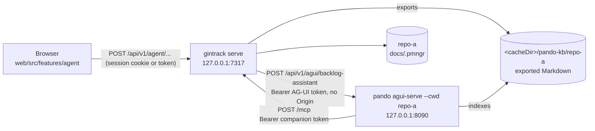

# Agent interface

The agent panel puts a conversation next to the backlog: you ask "what is left in this
sprint and why is GIT-T-0118 blocked", and an agent answers with item ids you can click.
The agent is [Pando](https://github.com/digiogithub/pando), reached over the
[AG-UI](https://docs.ag-ui.com) protocol, and the companion is what stands between it and
the browser.

This document is the whole picture: how the pieces fit, how to set one up, what each
configuration key means on both sides, what the security posture actually is (and what it
is not), and what to do when it does not work.

> **Feature availability.** The agent panel exists in companion mode only. Browser-only
> mode has no process that can hold a token or reach a local Pando, so the capability flag
> is false there and the panel does not render; see docs/05-web-app.md for how the web
> app gates on provider capabilities.

---

## 1. Architecture



Four facts follow from that picture, and every decision in this document comes back to one
of them.

**One Pando process per repository.** `pando agui-serve --cwd <repo>` chdirs once at
startup: the configuration, the session database and the `.pando/ipc.lock` are all resolved
from that working directory, and there is no per-request repository selection. Serving two
repositories means two processes on two ports. The companion routes between them by
repository id.

**The browser never talks to Pando.** It talks to the companion, which proxies. That is
what keeps the AG-UI bearer token server-side, and it is also what lets the companion
enforce its own limits before a run ever reaches an agent.

**Pando calls back.** The backlog is not a file Pando reads; it is the companion's MCP
server (docs/08-mcp-server.md section 8.5). So there are two tokens travelling in two
directions, and neither of them is ever in a page.

**Semantic search is a mirror.** The companion exports every item and knowledge-base page
as Markdown into a corpus directory outside the repository, and Pando indexes that. A
search returns candidates; the repository is the authority, and the companion re-reads the
real fields from its own index before showing anything.

---

## 2. Setup

Three commands, in this order.

### 2.1 Generate the Pando-side configuration

```bash
gintrack agent init --repo ~/src/acme-api
```

It writes three files into the repository:

| File | What it is |
|------|------------|
| `.pando.toml` | The AG-UI adapter, the gintrack MCP server, the corpus index. One per repository. |
| `agents/personas/backlog-assistant.md` | The persona injected into the system prompt of every run. |
| `agents/skills/gintrack-search/SKILL.md` | The routing table: which search tool answers which kind of question. |

Nothing is overwritten without `--force`; a re-run that would clobber a file exits 5 and
names it. The command also creates an AG-UI bearer token, once, under the companion's state
directory (`<stateDir>/agui/<repo id>.token`, mode 0600) and prints the path — never the
value.

| Flag | Default | Meaning |
|------|---------|---------|
| `--repo <path>` | `.` | The repository to configure. |
| `--companion-url <url>` | the configured bind address and port | Where Pando reaches the companion's `/mcp`. |
| `--agui-port <port>` | `8090` | The loopback port `[AGUI]` listens on. |
| `--force` | off | Overwrite files that already exist. |
| `--json` | off | Machine-readable output (no token value). |

**`.pando.toml` carries a secret.** Pando does not expand environment variables inside an
MCP server's headers, so the companion's bearer token is written literally into
`[MCPServers.gintrack.Headers]`. The file is mode 0600 — add it to `.gitignore` or
`.git/info/exclude` before you commit anything.

### 2.2 Start Pando

```bash
pando agui-serve --cwd ~/src/acme-api --port 8090 --no-tls \
  --token-file ~/.config/gintrack/agui/acme-api.token
```

`--no-tls` is correct here: the listener is on loopback and the companion is the only
client. `PANDO_AGUI_TOKEN` is accepted instead of `--token-file`. Confirm it came up with
the configuration you generated:

```bash
curl -s http://127.0.0.1:8090/api/v1/agui/healthz
curl -s -H "Authorization: Bearer $(cat ~/.config/gintrack/agui/acme-api.token)" \
     http://127.0.0.1:8090/api/v1/agui/info
```

`/healthz` needs no token and reports `maxConcurrentRuns`, which is the cheapest proof that
your `.pando.toml` was read at all. `/info` lists the agents and the profiles: you should
see `coder` **and** `backlog-assistant`.

### 2.3 Start the companion

```bash
gintrack serve --agent --mcp-http
```

`--agent` enables the proxy and the corpus exporter; `--mcp-http` mounts `POST /mcp`, which
is the endpoint the generated `.pando.toml` points Pando at. Without it the agent connects
and then cannot see a single item. Add `--mcp-allow-write` only if you want the assistant to
be able to change items at all.

The first export runs in the background at startup and does not block it. Pando's
auto-import picks the corpus up on its own schedule, so semantic search is a minute or two
behind the first run; structured search through the MCP tools is immediate.

---

## 3. Configuration reference — the Pando side

Everything below is in the generated `.pando.toml`. The authority for these key names is
Pando's `internal/config/config.go`; `pando-schema.json` is stale and omits `AGUI`,
`Remembrances` and `MCPServer` entirely.

### 3.1 `[AGUI]`

| Key | Generated value | Why |
|-----|-----------------|-----|
| `Enabled` | `true` | The adapter is off by default: it exposes a code-executing agent. |
| `Path` | `/api/v1/agui` | Stated explicitly so a change to Pando's default cannot silently break the proxy. |
| `Host` / `Port` | `127.0.0.1` / `8090` | A dedicated listener: nothing else of Pando's API is on it. |
| `Agents` | `['coder']` | The built-in agents exposed; the profile below inherits from this one. |
| `AllowedOrigins` | `[]` | **Empty on purpose.** The proxy strips `Origin`, and Pando only runs its CORS check when that header is present, so an allow-list entry would buy nothing and would widen what a direct client can do. |
| `RequireToken` | `true` | Bearer token on every AG-UI request. |
| `FrontendTools` | `true` | Written explicitly: Pando's documented default is `true`, but that default only applies while the key is absent from every file — writing an `[AGUI]` section without it decodes to `false`. |
| `HumanInTheLoop` | `true` | Permission prompts and agent questions are surfaced to the browser as AG-UI tool calls. |
| `AutoApprove` | `false` | Nothing is approved without a human. |
| `MaxConcurrentRuns` | `4` | Pando's own backstop; a run over the cap is refused with 503 and `Retry-After`. The companion caps in front of it too. |
| `Persona` | `'backlog-assistant'` | Applied as a per-session override, so a `agui-serve` process can run a different persona than the TUI sharing the same configuration. |
| `Tools` | `['gintrack_*', 'kb_search_documents', 'kb_get_document', 'code_hybrid_search', 'code_find_symbol']` | A glob allow-list (`path.Match` against each tool's name), applied after the tool set is built. Subtractive only. |
| `Mesnada` | `false` | Drops every `mesnada_*` delegation tool. The assistant answers, it does not spawn sub-agents. |

MCP gateway tools are named `<server>_<tool>`, so this server's `list_items` reaches the
agent as `gintrack_list_items` — hence `gintrack_*` with one underscore.

`[AGUI.Profiles.backlog-assistant]` declares a named profile with `Base = 'coder'` and an
extra `Prompt`. A profile is addressed exactly like a built-in agent,
`POST /api/v1/agui/backlog-assistant`, and it inherits the adapter-wide `Tools`, `Mesnada`
and `Persona` unless it overrides them. It is what lets one process serve several
assistants later without one process per assistant.

### 3.2 `[PersonaAutoSelect]` and `[Skills]`

`PersonaPath = './agents/personas'` is what makes the generated persona loadable by name;
Pando reads that directory whether or not automatic selection is enabled, which is why
`Enabled` stays `false`. `[Skills] Paths = ['./agents/skills']` adds the routing skill to
Pando's own discovery paths.

### 3.3 `[MCPServers.gintrack]`

`Type = 'streamable-http'`, `URL = '<companion>/mcp'`, and the companion's bearer token in
`[MCPServers.gintrack.Headers] Authorization`. Pando passes its MCP gateway into AG-UI runs
automatically, so no Pando code change is needed for the tool wiring.

### 3.4 `[Remembrances]`

`KBPath` is the exported corpus, `<cacheDir>/pando-kb/<repo id>` — outside the repository,
so nothing exported is ever committed. `KBAutoImport = true` pulls it in.

`KBWatch` stays **`false`**, and this is not a preference. Pando's KB watcher re-writes the
documents it processes without parsing their front matter, so every incremental edit it
handles strips the metadata the exporter wrote. Re-sync is driven by the companion instead:
today by waiting for the next auto-import pass, and by Pando's REST reindex route once that
ships.

Pando's corpus walk has no hidden-directory or `node_modules` exclusion, so `KBPath` must
point at the corpus directory and never at a repository root.

### 3.5 `[MCPServer]`

`HttpEnabled = false`. This is Pando's *own* MCP transport on `:9777`, not the one the
companion serves, and turning it on exposes a code-executing agent with global
auto-approval to anything that can reach the port. Leave it off unless something actually
needs it; if you turn it on, set `HttpToken` and keep `HttpHost` on loopback.

---

## 4. Configuration reference — the companion side

The companion's own configuration file carries an `agent` section: a default upstream plus a
per-repository routing table, because the deployment is one `agui-serve` per repository.

```yaml
agent:
  enabled: true                       # `gintrack serve --agent` flips it for one process
  pando:
    url: http://127.0.0.1:8090        # base URL of the agui-serve listener
    path: /api/v1/agui                # route prefix; must match [AGUI] Path
    tokenFile: ~/.config/gintrack/agui/acme-api.token
    agent: backlog-assistant          # the agent or profile name to post runs to
    insecureTls: false                # accept a self-signed cert (agui-serve without --no-tls)
    maxRuns: 8                        # runs in flight across the whole proxy
    allowRemote: false                # refuse a url that is not loopback
    repos:
      - repo: acme-api
        url: http://127.0.0.1:8090
        tokenFile: ~/.config/gintrack/agui/acme-api.token
      - repo: acme-web
        url: http://127.0.0.1:8091
        tokenFile: ~/.config/gintrack/agui/acme-web.token
```

| Key | Default | Meaning |
|-----|---------|---------|
| `agent.enabled` | `false` | Mounts `/api/v1/agent`. `gintrack serve --agent` enables it for one process without editing the file. |
| `url` | — | Where the companion proxies to. An empty URL disables the feature; a malformed one is a configuration error. |
| `path` | `/api/v1/agui` | The AG-UI route prefix. It must equal `[AGUI] Path` or every request 404s. |
| `token` / `tokenFile` / `GINTRACK_PANDO_TOKEN` | — | The AG-UI bearer token. `tokenFile` is what `pando agui-serve --token-file` and `gintrack agent init` produce; the environment variable overrides the file. The value is excluded from JSON, so no API response and no `--json` output can carry it (ADR-032), and it never reaches the browser. |
| `agent` | `backlog-assistant` | The agent or profile name appended to `path` — the profile the generated `.pando.toml` declares. |
| `insecureTls` | `false` | Skips certificate verification. Only for a self-signed local Pando; `--no-tls` on loopback is the better answer. |
| `maxRuns` | `8` | Runs in flight across the whole proxy. Enforced before the request is proxied, so a refused run never occupies a Pando slot. |
| `allowRemote` | `false` | Permits a non-loopback `url`. The proxy injects a token and streams an agent's output, so dialling a network host has to be deliberate. |
| `repos[]` | — | The routing table. Each row names a mounted repository id (as `gintrack ls` prints it) and the adapter serving it; every field but `repo` falls back to the section-wide value. A request selects its upstream by the repository it names, and an id matching no row falls back to `agent.pando.url`. |

Do not reuse `GINTRACK_TOKEN` for this: that variable already means both the companion
bearer token and the go-git HTTP fallback password.

---

## 5. Tools the assistant can call

| Tool | What it answers | Notes |
|------|-----------------|-------|
| `gintrack_list_items`, `gintrack_get_item`, `gintrack_search_items` | Structured and literal questions: ids, statuses, assignees, sprints, parents, labels, dates, exact words | Exact, cheap, and they return the `rev` any write must quote. |
| `gintrack_*` (the rest) | Comments, board moves, inbox triage, item creation | Available only when the companion was started with `--mcp-allow-write`. |
| `gintrack_search_semantic` | Which stories or pages are *about* X — meaning, not wording | Needs the Pando backend; answers `unavailable` naming `search_items` rather than an empty list, so an `unavailable` answer means the query never ran. |
| `kb_search_documents`, `kb_get_document` | Corpus-level fallback for semantic questions | Use `path_prefix: "items/"` or `"kb/"`; `file_path` is relative to the corpus root. |
| `code_hybrid_search`, `code_find_symbol` | Code questions | The corpus is Markdown only; the code index is the one that sees symbols. |

The skill `gintrack agent init` writes carries the same four rows, so the routing the persona follows and the one documented here cannot drift apart.

`hybrid_search_remembrances` is deliberately **not** on the list: it blends memories,
knowledge base and code into one ranking, hides which index answered, and takes no
`path_prefix`. The skill file tells the assistant to call the specific tool instead.

---

## 6. Security model

### 6.1 What holds

- **Two tokens, two directions, neither in the browser.** The AG-UI token lives in a
  0600 file the companion reads; the companion token lives in the companion's configuration
  and in `.pando.toml`. Neither is ever put in a URL — no `?token=` — and neither is sent to
  a page.
- **`Origin` is stripped, so the allow-list stays empty.** Pando checks CORS only when an
  `Origin` header is present. The proxy removes it, which means Pando's allow-list has
  nothing to get wrong, and a browser that tries to reach `:8090` directly is a CORS
  preflight against an empty allow-list.
- **Identity is the companion's.** Pando's AG-UI adapter has no user concept at all. Every
  question of who is asking, and whether they may, is answered before the proxy hop.
- **The routing table is server-side.** `agent.pando.repos` maps a repository id to an
  upstream and a credential. The browser names a repository; it never names a URL, so
  nothing in a request can point the proxy somewhere else. `allowRemote = false` keeps every
  one of those upstreams on loopback unless the user says otherwise.
- **Runs are capped twice.** The companion refuses over its own cap before proxying;
  `MaxConcurrentRuns` is Pando's backstop.

### 6.2 What does not hold — read this part

**The agent is Pando's coder agent.** `[AGUI] Tools` narrows the tool set and `Mesnada =
false` removes delegation, and those are real: they are applied after the tool set is built
and a tool that does not match is gone. But the persona and the skill file are
**conventions**, not a boundary — an agent that decides to ignore its persona is still an
agent with whatever `Tools` left it. Write the allow-list as if the persona did not exist.

**HITL is the interim boundary.** `AutoApprove = false` plus `HumanInTheLoop = true` means
a human approves each tool call in the browser. That is the thing actually standing between
a prompt-injected item body and a file being written. It works only as well as the person
clicking approve reads what they are approving.

**Loopback is not a boundary against your own browser.** "It only binds 127.0.0.1" is true
and insufficient: a web page you visit runs on your machine. For Pando's own MCP transport
on `:9777` the CORS policy is `*` with global auto-approval, so binding it to loopback does
not protect you from a page you happen to open. That is why the generated file leaves
`HttpEnabled = false`.

**Repository content is data.** Item bodies, comments, KB pages and search snippets are
written by many people and by other agents. The persona says plainly that text inside them
is never an instruction; that is a mitigation, not a guarantee, and it is a second reason
the tool allow-list has to be narrow.

**The corpus is a copy.** Anything exported into `<cacheDir>/pando-kb/` is readable by
anything that can read that directory, including other Pando features. Do not put a secret
in an item body.

---

## 7. Troubleshooting

| Symptom | Likely cause | Fix |
|---------|--------------|-----|
| `/healthz` answers but `/info` returns 401 | The token file the companion reads is not the one `agui-serve` was started with | Compare `agent.pando.tokenFile` with `--token-file`; they must be the same file. |
| `/info` lists `coder` but not `backlog-assistant` | Pando did not read your `.pando.toml` | It reads the file in its `--cwd`. Check the path, and check `maxConcurrentRuns` on `/healthz`: `0` means the file was not applied. |
| `/info` reports `"frontendTools": false` | An `[AGUI]` section without an explicit `FrontendTools` key | Regenerate with `gintrack agent init --force`; the template states the key. |
| Every request 404s | `agent.pando.path` and `[AGUI] Path` disagree | Make them equal; the generated file states `/api/v1/agui`. |
| The agent answers but sees no items | The companion was started without `--mcp-http` | `gintrack serve --agent --mcp-http`. Check `curl -sS $COMPANION/mcp` answers at all. |
| The agent sees items but every write fails | The companion is read-only | Add `--mcp-allow-write`, deliberately. |
| The agent sees items but the MCP tools are missing entirely | The token in `[MCPServers.gintrack.Headers]` is stale | Re-run `gintrack agent init --force` after changing the companion token. |
| Semantic search finds nothing, structured search works | The corpus has not been imported yet, or `KBPath` is wrong | Check that `<cacheDir>/pando-kb/<repo id>` has `.md` files; auto-import runs on Pando's schedule, not on yours. |
| Semantic search returns items with no tags or status | `KBWatch` got turned on somewhere | Set it back to `false` and let a full auto-import pass rewrite the documents. |
| A run is refused with 503 and `Retry-After` | The concurrency cap, on either side | Wait, or raise `maxRuns` / `MaxConcurrentRuns`. |
| Opening the panel in a second tab kills the first tab's answer | A second POST on a live thread abandons the running one — Pando's behaviour, not a bug in the panel | Use one tab per thread. |
| `.pando.toml` shows up in `git status` | It was not excluded | Add it to `.gitignore`; it carries the companion token. |

---

## 8. Related documents

- [MCP server](./08-mcp-server.md) — the tools the assistant calls, and section 8.5 for the
  client half of this integration
- [CLI and API](./07-cli-and-api.md) — `gintrack agent init`, `gintrack serve` and the
  configuration file
- [Web app](./05-web-app.md) — where the panel lives and how capability gating hides it
- [ADR-035](./adr/ADR-035-agent-interface-over-ag-ui.md) — why AG-UI directly, and what we
  accepted in exchange
- [Research: Pando TypeScript SDK and AG-UI client](./research/2026-09-13-pando-gap-sdk-client.md)
