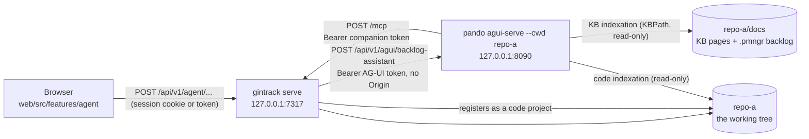

# Agent interface

The agent panel puts a conversation next to the backlog: you ask "what is left in this
sprint and why is GIT-T-0118 blocked", and an agent answers with item ids you can click.
The agent is [Pando](https://github.com/digiogithub/pando), reached over the
[AG-UI](https://docs.ag-ui.com) protocol, and the companion is what stands between it and
the browser.

This document is the whole picture: how the pieces fit, how to set one up, what each
configuration key means on both sides, what the security posture actually is (and what it
is not), and what to do when it does not work.

> **Feature availability.** The agent panel exists in companion mode only. Browser-only
> mode has no process that can hold a token or reach a local Pando, so the capability flag
> is false there and the panel does not render; see docs/05-web-app.md for how the web
> app gates on provider capabilities.

---

## 1. Architecture



Four facts follow from that picture, and every decision in this document comes back to one
of them.

**One Pando process per repository.** `pando agui-serve --cwd <repo>` chdirs once at
startup: the configuration, the session database and the `.pando/ipc.lock` are all resolved
from that working directory, and there is no per-request repository selection. Serving two
repositories means two processes on two ports. The companion routes between them by
repository id.

**The browser never talks to Pando.** It talks to the companion, which proxies. That is
what keeps the AG-UI bearer token server-side, and it is also what lets the companion
enforce its own limits before a run ever reaches an agent.

**Pando calls back.** The backlog is not a file Pando reads; it is the companion's MCP
server (docs/08-mcp-server.md section 8.5). So there are two tokens travelling in two
directions, and neither of them is ever in a page.

**Semantic search reads the repository itself.** Nothing is copied. Pando's knowledge-base
indexation is pointed at the repository's documentation folder — which holds the backlog
under `.pmngr/` and the knowledge-base pages — and the repository root is registered as a
Pando code project when the companion starts (docs/21, ADR-036). Both indexations are
read-only. A search returns candidates; the repository is the authority, and the companion
re-reads the real fields from its own index before showing anything.

---

## 2. Setup

Three commands, in this order.

### 2.1 Generate the Pando-side configuration

```bash
gintrack agent init --repo ~/src/acme-api
```

It writes three files into the repository:

| File | What it is |
|------|------------|
| `.pando.toml` | The AG-UI adapter with its tool allow-list, the gintrack MCP server, and `[Remembrances]` pointing at this repository's documentation folder. One per repository. |
| `agents/personas/backlog-assistant.md` | The persona injected into the system prompt of every run. |
| `agents/skills/gintrack-search/SKILL.md` | The routing table: which search tool answers which kind of question. |

**Re-running is the normal way to pick up a change** — a new companion URL, a new token, a
newer template — so nothing already in place is an error. `.pando.toml` is a Pando-wide
configuration file that a repository may well have owned before this feature existed, so
**an existing one is merged into** (see *Merging into an existing `.pando.toml`* below). The
persona and the skill are gintrack's own files and may have been edited by hand, so an
existing one is **left untouched and named on stdout**, with the note that `--force`
overwrites it; the run carries on and exits 0. The command also creates an AG-UI bearer token, once, under
the companion's state directory (`<stateDir>/agui/<repo id>.token`, mode 0600) and prints
the path — never the value.

| Flag | Default | Meaning |
|------|---------|---------|
| `--repo <path>` | `.` | The repository to configure. |
| `--companion-url <url>` | the configured bind address and port | Where Pando reaches the companion's `/mcp`. |
| `--agui-port <port>` | `8090` | The loopback port `[AGUI]` listens on. |
| `--force` | off | Replace all three files wholesale, `.pando.toml` included, instead of merging. |
| `--json` | off | Machine-readable output (no token value; `tokenEncrypted` says which form was written). |
| `--pando <path>` | the `pando` on `PATH` | The binary used to encrypt the companion token. |
| `--age-keys <set>` | Pando's default set | Passed to `pando secret --age-keys`; selects the key set under `~/.config/pando/keys/`. |
| `--plaintext-token` | off | Write the token as a literal `Authorization` header instead of encrypting it. |

**`.pando.toml` carries the companion's bearer token, encrypted.** Pando cannot expand
environment variables inside an MCP server's configuration, but it does decrypt an
`age1:`-prefixed value on load, so `gintrack agent init` runs `pando secret <token>` and
writes the ciphertext into `[MCPServers.gintrack.Auth]` (`Type = 'bearer'`). Only the
machine holding those age keys can read it. If `pando` cannot be found or `pando secret`
fails, the command refuses with exit 5 and writes nothing rather than putting a clear
secret in the working tree; `--plaintext-token` is the deliberate escape hatch and falls
back to `[MCPServers.gintrack.Headers] Authorization`. Either way the file is mode 0600 —
add it to `.gitignore` or `.git/info/exclude` before you commit anything.

One caveat of the encryption path: `pando secret` takes its value as a command-line
argument and reads nothing from stdin, so during that one call the companion token is
visible in the local machine's process list. Nothing is printed: neither the token nor the
ciphertext ever reaches stdout, only the file.

#### Merging into an existing `.pando.toml`

A `.pando.toml` is Pando's configuration, not gintrack's artifact: this repository's own is
450-odd lines of settings that predate the agent panel. So `gintrack agent init` folds its
configuration into the file that is there instead of refusing or replacing it (GIT-T-0227).

The merge is a **line-level text edit**, never a decode/re-encode round trip. No TOML library
available to this repository preserves comments — `go-toml/v2` and `BurntSushi/toml` have no
comment API, and `go-toml` v1's `SetWithComment` is never populated by its parser — and the
template's comments carry the reasoning for nearly every key it writes. The merge therefore
finds a table by its header line, rewrites only the lines of the keys gintrack owns, and
inserts a missing block verbatim from the rendered template, comments included.

What that guarantees:

- Every table, key, comment, blank line and `[[array.of.tables]]` entry the file already had
  and gintrack does not own survives byte for byte, including root-level keys written before
  the first table header and sections whose keys are lower-cased.
- `[MCPServers.gintrack]` (with its `Auth` and `Headers` sub-tables) and
  `[AGUI.Profiles.backlog-assistant]` are gintrack's outright: they are replaced whole, at
  the position the first of them had. That is also what keeps the three mutually exclusive
  token branches — encrypted `Auth`, plaintext `Headers`, commented-out stub — from piling up
  when a re-run changes the token mode.
- In the tables gintrack shares with the user — `[AGUI]`, `[ToolDiscovery]`, `[MCPGateway]`,
  `[PersonaAutoSelect]`, `[Skills]`, `[Remembrances]`, `[MCPServer]` — a key gintrack owns
  and the file lacks is added with the template's comment above it.
- **`[AGUI]` is the one exception to that.** Pando rewrites the section with every key at
  its zero value the moment anything touches it, so a key there that is `''`, `0`, `false`
  or `[]` is the absence of a choice rather than a choice: it counts as unset, the
  template's value is written in place and nothing is reported. Only warning about them
  would leave `Enabled = false` and the panel broken. The rule stops at that table: a
  `false` in `[ToolDiscovery]`, `[MCPGateway]` or `[MCPServer]` is a setting somebody
  relies on.
- **A key that is already there with another value is left alone**, and reported on stdout
  with the recommended value and a one-line reason. This is the conflict policy: warn, do not
  overwrite. In a live configuration these values are load bearing — a deployment that turned
  the gateway on did so for a reason, and imposing the template's values would break a working
  setup. Read the report and decide key by key.
- A copy of the previous version is written as `.pando.toml.<timestamp>.bak` before the first
  edit, and its path is printed. `.pando.toml` is git-ignored, so git is not a safety net.
- The merged file keeps mode 0600.
- A line that opens a table and cannot be parsed aborts the whole run with exit 5, naming the
  line number and the line. Nothing is written, not even the backup: guessing would move the
  user's keys into the wrong table.

`--force` bypasses all of it and writes the template over all three files, as it always did.

### 2.2 Start Pando

```bash
pando agui-serve --cwd ~/src/acme-api --port 8090 --no-tls \
  --token-file ~/.config/gintrack/agui/acme-api.token
```

`--no-tls` is correct here: the listener is on loopback and the companion is the only
client. `PANDO_AGUI_TOKEN` is accepted instead of `--token-file`. Confirm it came up with
the configuration you generated:

```bash
curl -s http://127.0.0.1:8090/api/v1/agui/healthz
curl -s -H "Authorization: Bearer $(cat ~/.config/gintrack/agui/acme-api.token)" \
     http://127.0.0.1:8090/api/v1/agui/info
```

`/healthz` needs no token and reports `maxConcurrentRuns`, which is the cheapest proof that
your `.pando.toml` was read at all. `/info` lists the agents and the profiles: you should
see `coder` **and** `backlog-assistant`.

### 2.3 Start the companion

```bash
gintrack serve --agent --mcp-http
```

`--agent` enables the proxy; `--mcp-http` mounts `POST /mcp`, which is the endpoint the
generated `.pando.toml` points Pando at. Without it the agent connects and then cannot see a
single item. Add `--mcp-allow-write` only if you want the assistant to be able to change
items at all.

Starting the server also **registers the repository root with Pando as a code project**, in a
goroutine after the listener is up, so a fresh clone becomes searchable by whoever starts the
companion rather than by one person remembering a command. It never blocks startup, and what
happened is stated per repository in `GET /api/v1/search/settings` → `indexed[].code` and
rendered by the settings card. The first full index of this repository — 937 files — took
about 62 s. The knowledge-base half needs nothing: Pando's watcher follows the documentation
folder and reindexes an edit as it happens. Structured search through the MCP tools is
immediate either way.

---

## 3. Configuration reference — the Pando side

Everything below is in the generated `.pando.toml`. The authority for these key names is
Pando's `internal/config/config.go`; `pando-schema.json` is stale and omits `AGUI`,
`Remembrances` and `MCPServer` entirely.

### 3.1 `[AGUI]`

| Key | Generated value | Why |
|-----|-----------------|-----|
| `Enabled` | `true` | The adapter is off by default: it exposes a code-executing agent. |
| `Path` | `/api/v1/agui` | Stated explicitly so a change to Pando's default cannot silently break the proxy. |
| `Host` / `Port` | `127.0.0.1` / `8090` | A dedicated listener: nothing else of Pando's API is on it. |
| `Agents` | `['coder']` | The built-in agents exposed; the profile below inherits from this one. |
| `AllowedOrigins` | `[]` | **Empty on purpose.** The proxy strips `Origin`, and Pando only runs its CORS check when that header is present, so an allow-list entry would buy nothing and would widen what a direct client can do. |
| `RequireToken` | `true` | Bearer token on every AG-UI request. |
| `FrontendTools` | `true` | Written explicitly: Pando's documented default is `true`, but that default only applies while the key is absent from every file — writing an `[AGUI]` section without it decodes to `false`. |
| `HumanInTheLoop` | `true` | Permission prompts and agent questions are surfaced to the browser as AG-UI tool calls. |
| `AutoApprove` | `false` | Nothing is approved without a human. |
| `MaxConcurrentRuns` | `4` | Pando's own backstop; a run over the cap is refused with 503 and `Retry-After`. The companion caps in front of it too. |
| `Persona` | `'backlog-assistant'` | Applied as a per-session override, so a `agui-serve` process can run a different persona than the TUI sharing the same configuration. |
| `Tools` | `['gintrack_*', 'kb_search_documents', 'kb_get_document', 'kb_related_documents', 'code_hybrid_search', 'code_find_symbol']` | A glob allow-list (`path.Match` against each tool's name), applied after the tool set is built. Subtractive only. **Only the KB tools that read are listed**: `kb_add_document`, `kb_delete_document` and the memory `remember`/`forget` path mirror a document to disk and would rewrite a repository file with Pando's typed keys alone (§6.2, ADR-036). |
| `[ToolDiscovery] Enabled = false`, `Mode = 'off'`; `[MCPGateway] Enabled = false` | written explicitly | Keeps Pando's MCP gateway off. With an `[MCPServers]` entry present, ToolDiscovery (default `true`) would activate the gateway, and MCP tools would stop being registered as `gintrack_<tool>`: they would sit behind `tool_search` or the generic `mcp_call_tool` proxy, which the allow-list strips and the per-tool permission prompt never sees. Found on the first live run (GIT-T-0118). |
| `Mesnada` | `false` | Drops every `mesnada_*` delegation tool. The assistant answers, it does not spawn sub-agents. |

MCP gateway tools are named `<server>_<tool>`, so this server's `list_items` reaches the
agent as `gintrack_list_items` — hence `gintrack_*` with one underscore.

`[AGUI.Profiles.backlog-assistant]` declares a named profile with `Base = 'coder'` and an
extra `Prompt`. A profile is addressed exactly like a built-in agent,
`POST /api/v1/agui/backlog-assistant`, and it inherits the adapter-wide `Tools`, `Mesnada`
and `Persona` unless it overrides them. It is what lets one process serve several
assistants later without one process per assistant.

### 3.2 `[PersonaAutoSelect]` and `[Skills]`

`PersonaPath = './agents/personas'` is what makes the generated persona loadable by name;
Pando reads that directory whether or not automatic selection is enabled, which is why
`Enabled` stays `false`. `[Skills] Paths = ['./agents/skills']` adds the routing skill to
Pando's own discovery paths.

### 3.3 `[MCPServers.gintrack]`

`Type = 'streamable-http'`, `URL = '<companion>/mcp'`, and the companion's bearer token —
age-encrypted by `pando secret` — in `[MCPServers.gintrack.Auth]` (`Type = 'bearer'`,
`Token = 'age1:…'`), which Pando decrypts on load and turns into `Authorization: Bearer
<token>`. `[MCPServers.gintrack.Headers]` is only written by `--plaintext-token`. Pando
passes its MCP gateway into AG-UI runs automatically, so no Pando code change is needed for
the tool wiring.

### 3.4 `[Remembrances]`

`KBPath` is **this repository's own documentation folder** — `<repo>/docs` by default, or
whatever the registration declares — so Pando indexes the committed files themselves. Under
it lie the knowledge-base pages and the backlog in `.pmngr/`, which is exactly the half
Pando's code indexer cannot reach (it skips dot-directories). `KBAutoImport = true` does the
initial pass. `--kb-path` overrides the directory for a layout `agent init` cannot guess.

`KBWatch` is **`true`**, which is Pando's own default: an edit to an item or a page is
reindexed as it happens.

> **A correction.** Earlier versions of this document, of the generated `.pando.toml` and of
> the code comments said `KBWatch` had to stay `false` because *"Pando's KB watcher re-writes
> the documents it processes without parsing their front matter"*. **That is false for the
> installed version and the warning is withdrawn.** Verified at Pando commit `710a39281`:
> `internal/rag/kb/watcher.go` contains no write call at all — it stats, reads, and updates
> the database. The bug behind the warning was real, is documented in Pando's own
> `internal/rag/kb/repair.go:22-40`, damaged **database metadata rather than files on disk**,
> and was fixed under PANDO-US-0003/0004. See docs/21 §5 and ADR-036.

`KBPath` still must not be the repository **root**: the KB walk is a bare `filepath.WalkDir`
filtered only by extension, with no hidden-directory and no `node_modules` exclusion
(`internal/rag/kb/sync.go:125`), so a root would be indexed whole and, with the watcher on,
would exhaust the host's inotify watches. That exclusion-free walk is the KB walk only — the
**code** indexer skips every dot-directory, `node_modules`, `vendor`, `dist`, `build`,
`__pycache__` and `.git` (`internal/rag/code/indexer.go:234-240`), which is what makes
registering the repository root as a code project safe.

The tools that *do* write to disk are `kb_add_document`, `kb_delete_document` and the memory
`remember`/`forget` path. The `[AGUI] Tools` allow-list above admits none of them; that is
the only thing keeping them off repository files (§6.2).

### 3.5 `[MCPServer]`

`HttpEnabled = false`. This is Pando's *own* MCP transport on `:9777`, not the one the
companion serves, and turning it on exposes a code-executing agent with global
auto-approval to anything that can reach the port. Leave it off unless something actually
needs it; if you turn it on, set `HttpToken` and keep `HttpHost` on loopback.

---

## 4. Configuration reference — the companion side

The companion's own configuration file carries an `agent` section: a default upstream plus a
per-repository routing table, because the deployment is one `agui-serve` per repository.

```yaml
agent:
  enabled: true                       # `gintrack serve --agent` flips it for one process
  pando:
    url: http://127.0.0.1:8090        # base URL of the agui-serve listener
    path: /api/v1/agui                # route prefix; must match [AGUI] Path
    tokenFile: ~/.config/gintrack/agui/acme-api.token
    agent: backlog-assistant          # the agent or profile name to post runs to
    insecureTls: false                # accept a self-signed cert (agui-serve without --no-tls)
    maxRuns: 8                        # runs in flight across the whole proxy
    allowRemote: false                # refuse a url that is not loopback
    repos:
      - repo: acme-api
        url: http://127.0.0.1:8090
        tokenFile: ~/.config/gintrack/agui/acme-api.token
      - repo: acme-web
        url: http://127.0.0.1:8091
        tokenFile: ~/.config/gintrack/agui/acme-web.token
```

| Key | Default | Meaning |
|-----|---------|---------|
| `agent.enabled` | `false` | Mounts `/api/v1/agent`. `gintrack serve --agent` enables it for one process without editing the file. |
| `url` | — | Where the companion proxies to. An empty URL disables the feature; a malformed one is a configuration error. |
| `path` | `/api/v1/agui` | The AG-UI route prefix. It must equal `[AGUI] Path` or every request 404s. |
| `token` / `tokenFile` / `GINTRACK_PANDO_TOKEN` | — | The AG-UI bearer token. `tokenFile` is what `pando agui-serve --token-file` and `gintrack agent init` produce; the environment variable overrides the file. The value is excluded from JSON, so no API response and no `--json` output can carry it (ADR-032), and it never reaches the browser. |
| `agent` | `backlog-assistant` | The agent or profile name appended to `path` — the profile the generated `.pando.toml` declares. |
| `insecureTls` | `false` | Skips certificate verification. Only for a self-signed local Pando; `--no-tls` on loopback is the better answer. |
| `maxRuns` | `8` | Runs in flight across the whole proxy. Enforced before the request is proxied, so a refused run never occupies a Pando slot. |
| `allowRemote` | `false` | Permits a non-loopback `url`. The proxy injects a token and streams an agent's output, so dialling a network host has to be deliberate. |
| `repos[]` | — | The routing table. Each row names a mounted repository id (as `gintrack ls` prints it) and the adapter serving it; every field but `repo` falls back to the section-wide value. A request selects its upstream by the repository it names, and an id matching no row falls back to `agent.pando.url`. |

Do not reuse `GINTRACK_TOKEN` for this: that variable already means both the companion
bearer token and the go-git HTTP fallback password.

---

## 5. Tools the assistant can call

| Tool | What it answers | Notes |
|------|-----------------|-------|
| `gintrack_list_items`, `gintrack_get_item`, `gintrack_search_items` | Structured and literal questions: ids, statuses, assignees, sprints, parents, labels, dates, exact words | Exact, cheap, and they return the `rev` any write must quote. |
| `gintrack_*` (the rest) | Comments, board moves, inbox triage, item creation | Available only when the companion was started with `--mcp-allow-write`. |
| `gintrack_search_semantic` | Which stories or pages are *about* X — meaning, not wording | Needs the Pando backend; answers `unavailable` naming `search_items` rather than an empty list, so an `unavailable` answer means the query never ran. |
| `kb_search_documents`, `kb_get_document`, `kb_related_documents` | Direct fallback for semantic questions, over Pando's knowledge-base indexation | It covers the documentation folder: `path_prefix: ".pmngr/"` narrows to the backlog, and `file_path` is relative to `KBPath`. Read-only. |
| `code_hybrid_search`, `code_find_symbol` | Code questions | The knowledge-base indexation sees the documentation folder only; the code index is the one that sees Go, TypeScript and their symbol graph. It cannot see `.pmngr/`, which is a dot-directory. |

The skill `gintrack agent init` writes carries the same rows, so the routing the persona follows and the one documented here cannot drift apart.

`hybrid_search_remembrances` is deliberately **not** on the list: it blends memories,
knowledge base and code into one ranking, hides which index answered, and takes no
`path_prefix`. The skill file tells the assistant to call the specific tool instead.

---

## 6. Security model

### 6.1 What holds

- **Two tokens, two directions, neither in the browser.** The AG-UI token lives in a
  0600 file the companion reads; the companion token lives in the companion's configuration
  and, as an age ciphertext, in `.pando.toml`. Neither is ever put in a URL — no `?token=` —
  and neither is sent to a page.
- **The generated `.pando.toml` holds no clear secret.** `gintrack agent init` encrypts the
  companion token with Pando's own age keys (`pando secret`, keys under
  `~/.config/pando/keys/<set>`) and refuses to write anything when it cannot, so a leaked
  copy of the file is useless without the key. `--plaintext-token` opts out of that, and
  says so in the file, in the banner and on stdout. The residual exposure is the argv of the
  one `pando secret` call, which is local and momentary.
- **`Origin` is stripped, so the allow-list stays empty.** Pando checks CORS only when an
  `Origin` header is present. The proxy removes it, which means Pando's allow-list has
  nothing to get wrong, and a browser that tries to reach `:8090` directly is a CORS
  preflight against an empty allow-list.
- **Identity is the companion's.** Pando's AG-UI adapter has no user concept at all. Every
  question of who is asking, and whether they may, is answered before the proxy hop.
- **The routing table is server-side.** `agent.pando.repos` maps a repository id to an
  upstream and a credential. The browser names a repository; it never names a URL, so
  nothing in a request can point the proxy somewhere else. `allowRemote = false` keeps every
  one of those upstreams on loopback unless the user says otherwise.
- **Runs are capped twice.** The companion refuses over its own cap before proxying;
  `MaxConcurrentRuns` is Pando's backstop.

### 6.2 What does not hold — read this part

**The agent is Pando's coder agent.** `[AGUI] Tools` narrows the tool set and `Mesnada =
false` removes delegation, and those are real: they are applied after the tool set is built
and a tool that does not match is gone. But the persona and the skill file are
**conventions**, not a boundary — an agent that decides to ignore its persona is still an
agent with whatever `Tools` left it. Write the allow-list as if the persona did not exist.

**HITL is the interim boundary.** `AutoApprove = false` plus `HumanInTheLoop = true` means
a human approves each tool call in the browser. That is the thing actually standing between
a prompt-injected item body and a file being written. It works only as well as the person
clicking approve reads what they are approving.

**Loopback is not a boundary against your own browser.** "It only binds 127.0.0.1" is true
and insufficient: a web page you visit runs on your machine. For Pando's own MCP transport
on `:9777` the CORS policy is `*` with global auto-approval, so binding it to loopback does
not protect you from a page you happen to open. That is why the generated file leaves
`HttpEnabled = false`.

**Repository content is data.** Item bodies, comments, KB pages and search snippets are
written by many people and by other agents. The persona says plainly that text inside them
is never an instruction; that is a mitigation, not a guarantee, and it is a second reason
the tool allow-list has to be narrow.

**The allow-list is the only thing keeping Pando's writing tools off your files.** Now that
Pando indexes the repository itself, `KBPath` names committed files. `kb_add_document`,
`kb_delete_document` and the memory `remember`/`forget` path mirror a document to disk
through a serializer that emits Pando's typed front-matter keys alone, and the path guard
only stops an escape from the base — it does not stop an overwrite. A call against an
existing item file would rewrite it without `id`, `status` or `parent`, and a missing or
mismatched `id` is a hard parse error that drops the item from git-in-track's index until a
human fixes it. What prevents that is `[AGUI] Tools`, which admits none of those tools. It is
a **configuration** boundary, not a code boundary, so the hazard is live for any repository
pointed at Pando with a configuration that did not come from `gintrack agent init`: a
hand-written `.pando.toml`, an entry added to the allow-list later, a Pando TUI session in
the same working directory, or the MCP gateway turned on — which puts every tool behind
`mcp_call_tool`, where the allow-list cannot see it. ADR-036 records this as an accepted
residual risk. The repository is under version control; that is the recovery path.

**Pando reads the whole repository.** The documentation folder through `KBPath`, the working
tree through the code project. Do not put a secret in an item body, or anywhere else in the
tree, and expect a search not to find it.

---

## 7. Troubleshooting

**The agent says it cannot access the gintrack tools, and no `TOOL_CALL_START` names a `gintrack_*` tool.** Pando's MCP gateway is on: check that the repository's `.pando.toml` carries `[ToolDiscovery] Enabled = false` / `Mode = 'off'` and `[MCPGateway] Enabled = false` (files generated before 2026-09-15 lack them; re-run `gintrack agent init`, which merges the two sections in — but note that if you already have them set the other way round the merge reports them and leaves them alone, so flip them by hand). Behind the gateway the tools are reachable only through `tool_search` or `mcp_call_tool`, which the `[AGUI] Tools` allow-list removes on purpose: `mcp_call_tool` is a generic proxy to any server and any tool, and it bypasses the per-tool approval prompt.

**A `gintrack_*` tool call starts and the run never finishes** (`TOOL_CALL_END` and then
keep-alives only, whatever `AutoApprove` says). The Pando instance predates its
`PANDO-US-0031` fix: with the gateway off, MCP tools were cached bound to the process-wide
permission service, so a call from an AG-UI run waited on a terminal prompt that `agui-serve`
cannot show, and no approval ever reached the browser. Upgrade Pando to a build carrying that
fix (commit `38abda0` or later) — nothing in `.pando.toml` works around it, and the
gateway-on configuration that used to complete a turn reached the tools through
`mcp_call_tool`, which asks no per-tool approval.

| Symptom | Likely cause | Fix |
|---------|--------------|-----|
| `/healthz` answers but `/info` returns 401 | The token file the companion reads is not the one `agui-serve` was started with | Compare `agent.pando.tokenFile` with `--token-file`; they must be the same file. |
| `/info` lists `coder` but not `backlog-assistant` | Pando did not read your `.pando.toml` | It reads the file in its `--cwd`. Check the path, and check `maxConcurrentRuns` on `/healthz`: `0` means the file was not applied. |
| `/info` reports `"frontendTools": false` | An `[AGUI]` section without an explicit `FrontendTools` key | Re-run `gintrack agent init`; the template states the key, and a `false` in `[AGUI]` counts as unset, so the merge writes it. |
| Every request 404s | `agent.pando.path` and `[AGUI] Path` disagree | Make them equal; the generated file states `/api/v1/agui`. |
| The agent answers but sees no items | The companion was started without `--mcp-http` | `gintrack serve --agent --mcp-http`. Check `curl -sS $COMPANION/mcp` answers at all. |
| The agent sees items but every write fails | The companion is read-only | Add `--mcp-allow-write`, deliberately. |
| The agent sees items but the MCP tools are missing entirely | The token in `[MCPServers.gintrack.Auth]` is stale, or the age key set that encrypted it is gone | Re-run `gintrack agent init` after changing the companion token or the key set; `[MCPServers.gintrack]` is gintrack's outright, so the merge rewrites it. |
| Semantic search finds nothing, structured search works | `KBPath` does not name this repository's documentation folder, or the first import has not run | Check `[Remembrances] KBPath` against the settings card's `indexed[].docs`; a row reporting 0 items and 0 pages is a misconfigured `KBPath`. Re-run `gintrack agent init`, then `POST /api/v1/search/reindex`. |
| Code search finds nothing; the settings card says `unavailable` or `off` | The repository was never registered as a code project, or Pando refused | The card states the reason in words (`indexed[].code.note`). `off` means no Pando endpoint is configured; `unavailable` means Pando did not answer. Fix the endpoint and restart the companion, or `POST /api/v1/search/reindex`. |
| A hit has no title, no id and no status | The path is neither a backlog file nor a knowledge-base page | Expected: it comes back as a plain `file` result (docs/21 §2). Only a path that is gone from disk is dropped. |
| Items come back with no tags | Nothing is wrong | The exporter that synthesised `tags` is retired. Backlog files carry `labels`, so filtering by tag *inside Pando* is gone on purpose (ADR-036); every field the UI shows is re-read from git-in-track's own index. |
| An item file lost its `id` or `status` and vanished from the backlog | A Pando tool that writes was allowed to reach it | `git diff` / `git checkout` the file, then check `[AGUI] Tools`: `kb_add_document`, `kb_delete_document`, `remember` and `forget` must not be in it, and `[ToolDiscovery]`/`[MCPGateway]` must be off (§6.2). |
| A run is refused with 503 and `Retry-After` | The concurrency cap, on either side | Wait, or raise `maxRuns` / `MaxConcurrentRuns`. |
| Opening the panel in a second tab kills the first tab's answer | A second POST on a live thread abandons the running one — Pando's behaviour, not a bug in the panel | Use one tab per thread. |
| `.pando.toml` shows up in `git status` | It was not excluded | Add it to `.gitignore`; it carries the companion token, encrypted. |

---

## 8. Related documents

- [MCP server](./08-mcp-server.md) — the tools the assistant calls, and section 8.5 for the
  client half of this integration
- [CLI and API](./07-cli-and-api.md) — `gintrack agent init`, `gintrack serve` and the
  configuration file
- [Web app](./05-web-app.md) — where the panel lives and how capability gating hides it
- [Semantic search](./21-semantic-search.md) — the two indexations, how a hit resolves, and
  what the retired corpus was
- [ADR-035](./adr/ADR-035-agent-interface-over-ag-ui.md) — why AG-UI directly, and what we
  accepted in exchange
- [ADR-036](./adr/ADR-036-pando-indexes-the-repository-directly.md) — why Pando indexes the
  repository itself, and the residual risk the allow-list leaves
- [Research: Pando TypeScript SDK and AG-UI client](./research/2026-09-13-pando-gap-sdk-client.md)
